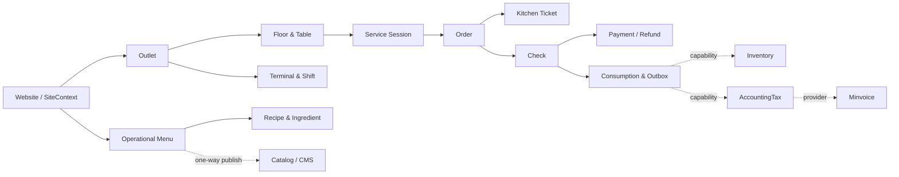
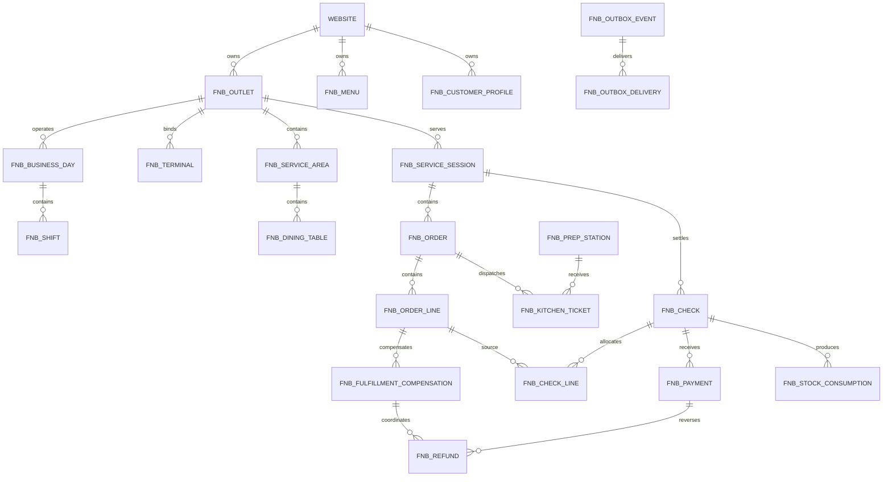

# Product Specification & Architecture — F&B POS / Quản lý quán Cafe

> Trạng thái: **Đã được Sếp duyệt triển khai; các release gate phải được kiểm chứng trước phát hành**
> Phiên bản tài liệu: `0.1.0`
> Module key: `fnb-pos`
> Phiên bản module mục tiêu đầu tiên: `0.1.0`
> Cập nhật: `2026-09-05`
> Phạm vi chuẩn: engine F&B, preset Cafe/Trà sữa, cài qua App Store AIO.

Ngày 2026-09-05, Sếp đã yêu cầu triển khai toàn bộ kế hoạch này. Baseline thiết kế được dùng để phát triển và kiểm thử; các xác nhận vận hành, chính sách dữ liệu, thiết bị và hợp đồng provider vẫn được ghi nhận riêng trước rollout tương ứng. Tiến độ thực tế được theo dõi tại `docs/architecture/fnb-pos-implementation-status.md`; không suy từ đặc tả rằng một tính năng đã hoàn thành.

Tài liệu này là nguồn chuẩn cho việc thiết kế và triển khai module F&B POS. Khi tài liệu mâu thuẫn với runtime, ưu tiên source code, migration và test hiện hành, sau đó cập nhật lại tài liệu bằng một quyết định kiến trúc rõ ràng.

Các tài liệu nền phải đọc cùng:

- `docs/ai-session-bootstrap-prompt.md`;
- `docs/architecture/admin-access-control.md`;
- `docs/architecture/accounting-tax-module.md`;
- `docs/architecture/hrm-and-payroll-modules.md`.

Nguồn benchmark nghiệp vụ công khai:

- [KiotViet F&B](https://www.kiotviet.vn/bar-cafe-nha-hang/);
- [KiotViet Cafe/Trà sữa](https://www.kiotviet.vn/quan-ly-cafe-tra-sua/);
- [KiotViet — màn hình bếp](https://www.kiotviet.vn/huong-dan-su-dung-kiotviet/fnb-che-bien/man-hinh-bep/);
- [KiotViet — gọi món qua QR](https://www.kiotviet.vn/huong-dan-su-dung-kiotviet/fnb-thuc-don-dien-tu/goi-mon-qua-ma-qr/).

Benchmark chỉ dùng để xác định độ đầy đủ nghiệp vụ. Không sao chép tên sản phẩm, bố cục màn hình, màu sắc, icon, câu chữ, asset hoặc trade dress của KiotViet.

## 0. Ma trận truy xuất benchmark

`Confirmed` nghĩa là hành vi được mô tả trên nguồn công khai; `Inferred` là thiết kế AIO suy ra để bảo đảm correctness; `Deferred` là đã nhận diện nhưng chưa nằm trong lát cắt phát hành tương ứng.

| Hành vi benchmark | Nguồn | Requirement AIO | Pha | Trạng thái/khác biệt |
| --- | --- | --- | --- | --- |
| Bán tại quầy, tại bàn, mang đi | Trang F&B và Cafe/Trà sữa | `FNB-ORD-01…03` | Pilot | Confirmed; UI AIO thiết kế độc lập |
| Size, topping, ghi chú món | Trang Cafe/Trà sữa | `FNB-MNU-01…02`, POS line note | Pilot | Confirmed |
| Chuyển/gộp bàn, tách hóa đơn | Trang F&B | `FNB-ORD-04…06` | Pilot/Parity increment | Confirmed; gộp session hoãn sau pilot core |
| Màn hình bếp/bar theo trạng thái | Hướng dẫn màn hình bếp | `FNB-KDS-01…05` | Pilot | Confirmed; delta cursor/idempotency là thiết kế AIO inferred |
| Món không thể hoàn tất sau khi đã thu tiền | Correctness gap suy ra từ luồng POS/KDS | `FNB-ORD-10` | Pilot | Inferred; compensation/refund/reversal giữ lịch sử bất biến, không tuyên bố parity trực tiếp |
| Gọi món bằng QR tại bàn | Hướng dẫn gọi món QR | `FNB-QR-*` | P1 | Confirmed, Deferred |
| Định lượng và liên kết kho | Trang F&B/Cafe | `FNB-MNU-06…07`, `FNB-INT-02` | Pilot/`0.1.2`/P1 | Confirmed; recipe snapshot ở Pilot, mapping bridge ở `0.1.2`, tồn thực sâu qua Inventory v2 ở P1 |
| Nhiều phương thức thanh toán/báo cáo ca | Trang F&B | `FNB-PAY-*`, `FNB-RPT-*` | Pilot | Confirmed; approval/outbox là hardening riêng của AIO |
| Chuỗi cửa hàng, thiết bị/offline | Trang F&B | multi-outlet/offline workstream | P1/P2 | Confirmed, Deferred; MVP online-first |
| Nhân viên/chấm công/lương | Trang F&B | `FNB-WFM-01…02` qua HRM/Payroll capability | P1 | Confirmed, Deferred; F&B phát facts, không tự tính lương/đọc bảng HRM |
| Booking/waitlist | Chưa có nguồn chi tiết trong bộ benchmark hiện tại | `FNB-RES-01` | P1 | Inferred/Deferred; không tuyên bố parity cho tới khi research P1 |
| Loyalty/điểm/voucher/promotion | Trang F&B chỉ xác nhận nhu cầu rộng; semantics cần research riêng | `FNB-LOY-01`, `FNB-PRO-01` | P1 | Partially confirmed/Deferred |
| Delivery provider | Trang F&B chỉ xác nhận kênh bán rộng; contract từng provider chưa có | `FNB-DLV-01` | P1 | Deferred tới khi có hợp đồng/sandbox |
| Loyalty tier, dự báo KDS, recipe versioning | Không xác nhận là parity trực tiếp từ các trang trên | AIO growth/correctness design | Pilot/P1/P2 | Inferred; không tuyên bố là sao chép KiotViet |

## 1. Quyết định nền đề xuất

| ID | Quyết định | Lý do |
| --- | --- | --- |
| ADR-FNB-001 | Tên hiển thị **Quản lý quán Cafe**, module key `fnb-pos` | Không khóa domain vào một mô hình quán; có thể thêm preset nhà hàng/F&B về sau |
| ADR-FNB-002 | Module độc lập, không có hard dependency | POS vẫn bán được khi CMS, Catalog, Inventory, Accounting hoặc provider bị tắt |
| ADR-FNB-003 | App Store v1 cài package đã bundle cùng release | Registry hiện chỉ quét package trong `modules/`, chưa phải marketplace tải artifact từ xa |
| ADR-FNB-004 | MVP online-first; xây idempotency/version/outbox từ đầu | Full offline cần local database và conflict protocol riêng, không phải một màn hình bổ sung |
| ADR-FNB-005 | MVP có UI một outlet, schema hỗ trợ nhiều outlet | Giảm phạm vi UI nhưng tránh phải viết lại dữ liệu khi triển khai chuỗi |
| ADR-FNB-006 | Không tái sử dụng bảng `orders`/`order_items` hiện có | Order storefront không đủ table session, modifier, KDS, split bill, multi-tender, shift và refund |
| ADR-FNB-007 | Tiêu hao bán hàng được chốt khi check đóng; món đã làm nhưng hủy tạo waste | Giữ bill và kho nhất quán, phân biệt bán hàng với hao hụt |
| ADR-FNB-008 | Chưa thêm `website_type=food_beverage` ở MVP | `website_type` hiện chủ yếu là metadata; dùng `backoffice`, `service`, `ecommerce` trước |
| ADR-FNB-009 | Không thêm scope `outlet` vào core RBAC ở MVP | MVP một outlet; dùng permission global/website + membership outlet. P1 chỉ mở rộng core sau ADR/security test riêng |
| ADR-FNB-010 | Giao dịch đã chốt là bất biến | Sai sót sau thanh toán được xử lý bằng void, refund hoặc reversal, không sửa/xóa lịch sử |

## 2. Tầm nhìn sản phẩm

### 2.1. Product statement

F&B POS là module điều hành bán hàng tại quán, kết nối nhân viên phục vụ, thu ngân, bar/bếp, ca tiền, khách hàng và nguyên liệu trong một luồng giao dịch nhất quán. Module phải phục vụ được quán độc lập ngay khi cài, đồng thời có ranh giới rõ để kết nối các module AIO khác.

### 2.2. Mục tiêu

- Từ lúc cài App Store đến bill đầu tiên không quá 30 phút với preset Cafe.
- Phục vụ đầy đủ quầy, bàn và mang đi.
- Không mất hoặc tạo trùng order, ticket, payment, refund hay stock event khi retry.
- Đóng ca và đối soát được từng phương thức thanh toán.
- Biết món bán chạy, doanh thu, giá trị bill, giờ cao điểm, giảm/hủy và chênh lệch quỹ.
- Có công thức/định lượng và kết nối kho theo cơ chế tùy chọn, retry-safe.
- Có thể mở rộng QR self-order, chuỗi cửa hàng, provider thanh toán và offline mà không phá aggregate lõi.

### 2.3. North-star và KPI

North-star: **tỷ lệ ca được đóng và đối soát thành công mà không cần sửa tay**.

KPI dictionary cho Pilot; Product Owner và Operations chịu trách nhiệm duyệt lại target sau hai tuần dữ liệu thật:

| KPI | Target Pilot | Cách đo/loại trừ | Nguồn và owner |
| --- | --- | --- | --- |
| Ca đóng không cần sửa tay | `>= 98%` | Ca `closed/reconciled` không có manual data repair; không loại ca lệch hợp lệ | Shift ledger; Operations |
| Bill đầu tiên sau enable | `<= 30 phút` | Từ module enabled + website được chọn đến check đầu tiên closed; dùng preset hoặc import mẫu | Lifecycle/onboarding events; Product |
| Order commit → KDS first render | P95 `< 2 giây` | Từ DB commit server đến browser KDS render event; loại client offline có telemetry rõ | Kitchen event + browser telemetry; Engineering |
| Duplicate/lost financial command | `0` | Mọi payment/refund command có creation/idempotency identity | Payment/refund ledger; Engineering/Finance |
| Sai lệch tổng split/multi-tender | `0` đơn vị tiền nhỏ nhất | So tổng source với allocation/payment/refund sau rounding | Check ledger; Finance |
| Chênh lệch két không được giải trình | `< 0,2%` doanh thu cash | Tổng absolute variance chưa reconcile / cash sales | Shift ledger; Operations |
| Outbox quá hạn | `< 0,5%` delivery quá 15 phút; `0` mất event | Chỉ destination được bật; outage đã công bố vẫn hiển thị riêng | Outbox metrics; Engineering |
| Void/refund bất thường | Baseline 2 tuần, sau đó alert theo outlet | Tỷ lệ trên effective lines/closed checks; không trộn test/training | Domain ledger; Operations |

Các chỉ số food cost, tiêu hao thực tế và cảnh báo tồn chỉ trở thành KPI chính thức khi Inventory v2 hoạt động; Pilot chỉ hiển thị theoretical consumption và trạng thái readiness của integration.

### 2.4. Ngoài phạm vi MVP

- Full offline và đồng bộ nhiều thiết bị.
- Marketplace tải package động từ xa.
- Native mobile app.
- Tích hợp GrabFood/ShopeeFood khi chưa có hợp đồng và sandbox.
- Print agent cho USB/LAN và ma trận phần cứng lớn.
- Loyalty/promotion rule engine đầy đủ.
- Booking/waitlist, central kitchen, forecast và fraud analytics.
- Buffet, karaoke hoặc tính tiền theo giờ.

## 3. Persona và mục tiêu công việc

| Persona | Mục tiêu chính | Màn hình chính |
| --- | --- | --- |
| Chủ quán/chủ chuỗi | Pilot: theo dõi doanh thu, tiền thực nhận và bất thường; P1: lãi gộp/tồn thực khi có Inventory v2 | Dashboard, báo cáo, audit, cấu hình |
| Quản lý ca | Điều phối bàn/bếp, duyệt ngoại lệ, xử lý lệch quỹ | POS, KDS, ca, approval |
| Thu ngân | Mở ca, lập/tách/gộp bill, thu nhiều phương thức, in receipt | POS, thanh toán, ca |
| Phục vụ | Xem bàn, gọi món nhiều đợt, chuyển bàn, theo dõi món | Sơ đồ bàn, POS |
| Barista/Bếp | Nhận đúng món theo trạm, cập nhật tiến độ, báo hết/còn món | KDS fullscreen |
| Thủ kho | Pilot: quản lý định lượng, theoretical consumption và waste; `0.1.2`: mapping Inventory; P1: tồn thực/cảnh báo kho sâu | Công thức/nguyên liệu |
| Kế toán | Đọc doanh số/ca đã khóa, xuất báo cáo và theo dõi bridge | Báo cáo, tích hợp, audit |
| Khách hàng | P1: tự gọi món QR, theo dõi trạng thái, yêu cầu thanh toán | Public QR menu |

## 4. Phạm vi sản phẩm theo giai đoạn

Để tránh biến “MVP” thành toàn bộ sản phẩm, `0.1.x` được chia làm hai lát cắt:

- **Pilot core — Must, M0–M5:** một outlet, item/variant/modifier, recipe/UOM + theoretical consumption, quầy/bàn/mang đi, gọi nhiều đợt, KDS, chuyển bàn, split theo món/số lượng, multi-tender, refund, ca/két, customer lookup/attach và báo cáo/export lõi.
- **Parity increment — Should, sau gate Pilot trong cùng nhánh `0.1.x`:** combo nâng cao, merge session, price book theo lịch/kênh, waste workflow mở rộng và UX quản trị hàng loạt. `0.1.1` là release cộng dồn; có thể bỏ qua việc deploy riêng M5.1, nhưng upgrade thẳng `0.1.0→0.1.2` vẫn chạy migration/security map `0.1.1`. Các mục này không chặn gate Pilot.
- **P1/P2:** QR, loyalty, tồn thực, provider, multi-outlet nâng cao và offline như bảng dưới.

| Nhóm | MVP `0.1.x` | P1 `0.2.x` | P2 `0.3+` |
| --- | --- | --- | --- |
| Điểm bán | Outlet, terminal, giờ hoạt động, business day | UI đa outlet, price/menu rollout | Nhượng quyền, vùng vận hành |
| Menu | Nhóm món, món, size, topping, availability, bảng giá cơ bản; combo và lịch/kênh ở parity increment | Promotion, voucher, rule stacking | Gợi ý giá/menu |
| POS | Quầy, bàn, mang đi; hold/resume | QR self-order, delivery nội bộ | Buffet/tính giờ |
| Bàn/check | Phiên bàn, gọi nhiều đợt, chuyển bàn, tách check; merge ở parity increment | Booking/waitlist | Tối ưu xếp bàn |
| KDS | Route theo trạm, waiting/preparing/ready/served, elapsed time, cancel delta | Recall/remake có permission, reason và ledger riêng | Grouping, SLA alert, capacity/forecast tải bếp |
| Thanh toán | Cash, transfer/manual QR, card record, multi-tender | Payment provider thực | Auto settlement |
| Ca/két | Open/close, opening float, cash in/out, count, variance | Bàn giao ca nâng cao | Fraud/anomaly |
| Công thức | Ingredient, UOM conversion, versioned recipe, theoretical use | Stocktake/waste workflow sâu | Central kitchen/forecast |
| Khách hàng | Quick lookup/create/attach; lịch sử bill scoped | Loyalty, tier, voucher | Marketing automation |
| Báo cáo | Doanh thu, bill, AOV, item/channel/hour, discount/void, variance | Food cost, chuỗi | Forecast/root-cause |
| Tích hợp | `0.1.0`: capability/outbox; `0.1.2`: adapter optional khi destination ready | Inventory workflow sâu, HRM/Payroll mapping, delivery provider đầu tiên | Multi-provider/settlement analytics |
| Thiết bị | KDS web, browser receipt | Local print agent | Device matrix |
| Resilience | Idempotency, optimistic version, outbox | Full offline một thiết bị | Multi-device conflict sync |

## 5. Functional requirements

### 5.1. App Store và onboarding

| ID | Yêu cầu | Acceptance chính |
| --- | --- | --- |
| FNB-INS-01 | Cài, bật, tắt, nâng cấp qua Module Manager | Core migration không tạo bảng F&B; install lifecycle mới tạo schema |
| FNB-INS-02 | Không cho uninstall qua App Store | `lifecycle.uninstall=false`; disable giữ nguyên schema và dữ liệu |
| FNB-INS-03 | Onboarding theo website sau khi enable | Không seed outlet vào `website-main` trong lifecycle global |
| FNB-INS-04 | Preset Cafe/Trà sữa | Wizard tạo có chủ đích 1 outlet, 1 khu vực, 5 bàn, trạm Bar, Cash/Chuyển khoản và 5 món mẫu hoặc import CSV; chạy lặp an toàn |
| FNB-INS-05 | Hiển thị readiness của app tùy chọn | Phân biệt absent, installed, enabled, configured, healthy và ready |
| FNB-INS-06 | Timed first-bill smoke | Đồng hồ bắt đầu sau khi module enabled và website được chọn; System/Platform Owner hoàn tất preset, mở ca và đóng check đầu tiên trong 30 phút |

### 5.2. Outlet, terminal và floor

| ID | Yêu cầu | Acceptance chính |
| --- | --- | --- |
| FNB-OUT-01 | Quản lý outlet, timezone, currency, giờ hoạt động | Code duy nhất trong website; archive thay vì xóa khi đã có giao dịch |
| FNB-OUT-02 | Quản lý terminal POS/KDS | Terminal bị khóa vào đúng website + outlet; có heartbeat và trạng thái |
| FNB-OUT-03 | Khu vực/bàn | Code bàn duy nhất trong outlet, capacity, trạng thái active/paused |
| FNB-OUT-04 | Membership outlet | Permission lấy từ RBAC; membership chỉ thu hẹp outlet được truy cập |
| FNB-OUT-05 | Business day | Hỗ trợ ca qua nửa đêm; mỗi outlet chỉ có một business day mở |
| FNB-OUT-06 | Phân công nhân viên | Owner/Manager xem và gán admin đang active vào preset role website + outlet trong privilege ceiling; tạo tài khoản admin mới vẫn là thao tác global ở MVP |
| FNB-OUT-07 | Đóng/reconcile business day | Chỉ đóng khi không còn shift/session/check/compensation active hoặc payment/refund non-terminal; phát closing snapshot và event idempotent |

### 5.3. Menu, modifier và công thức

| ID | Yêu cầu | Acceptance chính |
| --- | --- | --- |
| FNB-MNU-01 | Category dạng cây, item, variant/size | Không lưu size trong JSON; variant có identity và giá riêng |
| FNB-MNU-02 | Modifier group/option | Enforce min/max/free quantity ở server |
| FNB-MNU-03 | Combo có nhóm lựa chọn | Enforce số lượng lựa chọn; snapshot thành phần vào order |
| FNB-MNU-04 | Bảng giá và trạng thái bán theo outlet | Giá canonical do server resolve; client không được tự quyết giá |
| FNB-MNU-05 | Route món tới prep station | Mỗi item/variant có station mặc định theo outlet |
| FNB-MNU-06 | Versioned recipe | Recipe published không sửa; phát hành version mới |
| FNB-MNU-07 | UOM conversion | Không có cycle; mọi line quy đổi được về base unit |
| FNB-MNU-08 | Sold-out | KDS/manager cập nhật và POS nhận trạng thái mới qua cursor |

### 5.4. Session, order và bàn

| ID | Yêu cầu | Acceptance chính |
| --- | --- | --- |
| FNB-ORD-01 | Mở service session cho table/counter/takeaway | Một bàn chỉ thuộc một session hoạt động tại một thời điểm |
| FNB-ORD-02 | Thêm/sửa/xóa line trước submit | Mọi command có idempotency key và expected version |
| FNB-ORD-03 | Gửi món nhiều đợt | Mỗi đợt sinh delta ticket đúng station, không gửi lại line cũ |
| FNB-ORD-04 | Chuyển bàn | Lưu lịch sử session-table và active slot; không re-parent order |
| FNB-ORD-05 | Gộp session từ `0.1.1` | Không làm mất/re-parent order hoặc payment; chặn khi đã finalized/paid |
| FNB-ORD-06 | Tách bill/check | Phân bổ theo line/số lượng, bảo toàn tiền và rounding |
| FNB-ORD-07 | Void/cancel | Sau submit cần reason/quyền; sau chế biến cần approval và waste |
| FNB-ORD-08 | Immutable transaction | Paid/closed không update/delete; dùng refund/reversal |
| FNB-ORD-09 | Settle/close/cancel session | Settle ngừng nhận order mới; close khi check đóng và line hoàn tất; cancel chỉ khi chưa submit/paid |
| FNB-ORD-10 | Hủy fulfillment sau khi đã thu tiền | Tạo compensation + refund theo check-line; giữ bill/payment bất biến, line kết thúc bằng compensated cancel và stock được reverse/reclassify waste idempotent |

### 5.5. KDS

| ID | Yêu cầu | Acceptance chính |
| --- | --- | --- |
| FNB-KDS-01 | Ticket theo station | Ticket persist cùng transaction submit; queue không nằm trên correctness path |
| FNB-KDS-02 | State machine line | `waiting → preparing → ready → served`; transition sai trả conflict |
| FNB-KDS-03 | Delta polling | Cursor theo outlet/station/sequence, trả thay đổi mới sau lần đọc trước |
| FNB-KDS-04 | Cancel delta | Không sửa lịch sử ticket; hủy sau submit hoặc compensated cancel sau paid tạo event mới có reason. Remake là P1 |
| FNB-KDS-05 | Sold-out signal | KDS có thể báo hết/còn món; server kiểm permission và outlet |

### 5.6. Check, payment và shift

| ID | Yêu cầu | Acceptance chính |
| --- | --- | --- |
| FNB-PAY-01 | Finalize check | Khóa pricing components và `grand_total`; settlement fields được set-once khi chọn payment plan |
| FNB-PAY-02 | Multi-tender | Tổng payment thành công bằng `settlement_total` tới minor unit; mixed tender không cash-round ở Pilot |
| FNB-PAY-03 | Refund | Tạo aggregate mới; không sửa/xóa payment gốc |
| FNB-PAY-04 | Open/close shift | `closing` drain tender/movement mới; chỉ khóa expected/count/variance khi payment/refund cũ đã terminal |
| FNB-PAY-05 | Cash movement | Cash sale/refund và movement ghi cùng transaction |
| FNB-PAY-06 | Approval | Critical action cần re-auth/approval server-side, không tin cờ client |
| FNB-PAY-07 | Receipt | Browser-printable, lưu `generated/print_requested/user_confirmed` và reprint count; browser không tuyên bố máy in đã in thành công |
| FNB-PAY-08 | Đóng/void check | Final payment auto-close check và ghi consumption/outbox cùng transaction; zero-total close/void có command + guard riêng |

### 5.7. Khách hàng

| ID | Yêu cầu | Acceptance chính |
| --- | --- | --- |
| FNB-CUS-01 | Quick lookup | Tìm theo phone/code trong website hiện tại; kết quả tối thiểu, rate-limited và không rò PII sang KDS/waiter |
| FNB-CUS-02 | Quick create/update | Cashier có thể tạo hồ sơ tối thiểu; chỉ Manager/Owner được sửa trường nhạy cảm theo policy |
| FNB-CUS-03 | Attach vào session/check | Gắn identity + snapshot cần thiết vào giao dịch, không làm thay đổi bill cũ khi profile đổi |
| FNB-CUS-04 | Lịch sử mua | Chỉ đọc closed checks đúng website/outlet được phép; không trả tender/provider secret |
| FNB-CUS-05 | Merge hồ sơ | Chỉ Manager/Owner, có reason, survivor mapping và audit; không xóa lịch sử nguồn |

### 5.8. Reporting và integration

| ID | Yêu cầu | Acceptance chính |
| --- | --- | --- |
| FNB-RPT-01 | Dashboard ca/ngày | Chỉ đọc dữ liệu đúng website/outlet và business date |
| FNB-RPT-02 | Báo cáo core | Revenue, net sales, AOV, item, channel, hour, discount, void/compensation, refund, payment mix, variance |
| FNB-RPT-03 | Export | Queue/private storage/checksum; chống CSV formula injection |
| FNB-INT-01 | Durable outbox | Event ghi cùng transaction; retry không tạo side effect trùng |
| FNB-INT-02 | Inventory | F&B sở hữu consumption; Inventory sở hữu stock document/balance/cost |
| FNB-INT-03 | Accounting | Check/refund đã chốt tạo document/reversal idempotent |
| FNB-INT-04 | Minvoice | Chỉ đi qua AccountingTax, F&B không gọi provider trực tiếp |
| FNB-INT-05 | Optional-module safety | Module đích vắng/tắt không làm POS/KDS/payment thất bại |

### 5.9. Requirement release map và P1 contracts

Nguồn pha duy nhất:

| Introduced | Requirement |
| --- | --- |
| `0.1.0` | `FNB-INS-01…06`, `FNB-OUT-01…07`, `FNB-MNU-01…02`, `FNB-MNU-04…08`, `FNB-ORD-01…04`, `FNB-ORD-06…10`, `FNB-KDS-01…05`, `FNB-PAY-01…08`, `FNB-CUS-01…05`, `FNB-RPT-01…03`, `FNB-INT-01`, `FNB-INT-05` |
| `0.1.1` | `FNB-MNU-03`, `FNB-ORD-05`, scheduled/channel price-book enhancements và parity increment đã chọn |
| `0.1.2` | `FNB-INT-02…04` chỉ cho destination có capability/readiness; dispatcher/reconcile/production runbook |
| `0.2.x` | Các contract P1 dưới đây, phát hành theo workstream độc lập |

| ID P1 | Contract/acceptance tối thiểu |
| --- | --- |
| FNB-QR-01 | Token guest ký/rotate theo bàn/outlet; order request idempotent, rate-limited và phải qua policy accept của quán |
| FNB-RES-01 | Reservation/waitlist/arrival/no-show; table hold có expiry, không double-book qua timezone/DST |
| FNB-KDS-06 | Recall/remake tạo attempt/event mới, permission + reason + consumption/waste policy riêng |
| FNB-LOY-01 | Points append-only; replay không nhân điểm, correction là ledger entry mới |
| FNB-PRO-01 | Voucher/promotion rule versioned; bill cũ giữ snapshot và abuse cases có test |
| FNB-WFM-01 | Map `admin_id`/shift sang capability HRM; F&B chỉ phát work/shift facts, không sở hữu hồ sơ/chấm công chuẩn |
| FNB-WFM-02 | Payroll chỉ nhận dữ liệu đã chuẩn hóa từ HRM/Payroll contract; F&B không tự tính lương hay đọc bảng module trực tiếp |
| FNB-DLV-01 | Adapter provider có normalized order, idempotent accept/cancel/status và settlement reconcile |
| FNB-OFF-01 | Local identity/store, sync/conflict protocol và chaos tests; không double order/payment sau reconnect |

## 6. Luồng người dùng chuẩn

### 6.1. Khởi tạo quán

`Cài app → bật app → chọn website → chạy preset/import → kiểm tra outlet/area/table/station/menu/payment → phân công admin có sẵn nếu cần → mở business day/ca → bill đầu tiên`

Phép đo 30 phút dùng cùng một fixture chuẩn: tài khoản System/Platform Owner đã đăng nhập, website đã tồn tại, không tính thời gian tạo tài khoản admin mới hay cấu hình provider bên ngoài.

### 6.2. Bán tại quầy

`Mở ca → tạo session counter → chọn món/variant/modifier → submit → KDS → thu tiền → đóng check/session`

### 6.3. Phục vụ tại bàn

`Chọn bàn → mở session → gọi món đợt 1 → submit → gọi món đợt 2 → KDS cập nhật → chuyển bàn → split check → multi-payment → đóng bàn`; gộp session được bật từ `0.1.1`.

### 6.4. Hủy sau chế biến

`Yêu cầu void → kiểm quyền/threshold → manager re-auth/approve → line chuyển voided → tạo waste snapshot → cập nhật check → audit`

### 6.5. Đóng ca

`Dừng nhận cash mới trên shift → tính expected theo tender → nhập số đếm → tính variance → approve nếu vượt tolerance → khóa snapshot → reconcile/outbox`

## 7. Information architecture và màn hình

| Route dự kiến | Màn hình | Permission vào |
| --- | --- | --- |
| `/admin/fnb/dashboard` | Tổng quan | `fnb.dashboard.view` |
| `/admin/fnb/pos` | POS touch-first | `fnb.order.create` |
| `/admin/fnb/floor` | Khu vực và bàn | `fnb.floor.view` |
| `/admin/fnb/kitchen` | KDS fullscreen | `fnb.kitchen.view` |
| `/admin/fnb/menu` | Menu, size, topping; combo khi installed `>=0.1.1` và flag `combo` bật | `fnb.menu.view` |
| `/admin/fnb/recipes` | Công thức/nguyên liệu | `fnb.recipe.view` |
| `/admin/fnb/staff` | Phân công nhân viên theo outlet | `fnb.staff.view` |
| `/admin/fnb/shifts` | Ca và két | `fnb.shift.view` |
| `/admin/fnb/customers` | Khách hàng | `fnb.customer.view` hoặc `fnb.customer.lookup` theo màn hình |
| `/admin/fnb/reports` | Báo cáo/export | `fnb.report.operations.view` hoặc `fnb.report.financial.view`; tab/API gate riêng |
| `/admin/fnb/integrations` | Readiness/outbox; mapping khi installed `>=0.1.2` | `fnb.integration.view` |
| `/admin/fnb/settings` | Outlet/terminal/policy | `fnb.settings.view`; từng tab/API gate bằng `outlet.manage`, `terminal.manage` hoặc `settings.manage` |

Nguyên tắc UI:

- POS và KDS là workspace toàn màn hình, tối ưu cảm ứng và thao tác ít bước.
- Form quản trị menu/cấu hình theo pattern React + Ant Design hiện hữu; chia component theo domain, không tạo một god component.
- Ẩn nút theo permission chỉ là UX; backend luôn quyết định cuối cùng.
- `fnb.dashboard.view` chỉ mở shell; card operations/financial vẫn cần permission report tương ứng, Cashier chỉ thấy ca của chính terminal theo policy.
- KDS/waiter DTO không chứa phone, địa chỉ, cost hoặc payment detail nếu không cần.
- Lỗi conflict trả state/version mới nhất để người dùng refresh/merge có chủ đích.

## 8. Non-functional requirements

### 8.1. Correctness và consistency

- Mọi mutation quan trọng nhận `Idempotency-Key` và `expected_versions` cho các aggregate đọc-để-ghi.
- Cùng key + cùng fingerprint trả lại kết quả cũ; cùng key + payload khác trả `409 Conflict`.
- Aggregate update dùng transaction + row lock; unique constraint là lớp bảo vệ cuối.
- Tiền dùng `decimal(18,2)` và tính bằng decimal string/BCMath; không dùng PHP/JavaScript float làm nguồn chuẩn.
- Số lượng/công thức dùng `decimal(18,6)`; conversion factor dùng `decimal(18,8)`.
- Tất cả số tiền, thuế, modifier, recipe và buyer data cần thiết được snapshot khi chốt.

### 8.2. Money, tax và rounding contract đề xuất

Đây là contract mặc định của M0. Quyết định phát triển ngày 2026-09-05 cho phép triển khai và kiểm thử baseline trong bản prerelease; **không đưa pricing vào vận hành thật trước khi Finance/Legal xác nhận thuế suất, tính chịu thuế của service charge và quy tắc làm tròn theo thị trường triển khai**. Việc Sếp duyệt phát triển không được ghi thành bằng chứng đã có xác nhận pháp lý.

Thứ tự canonical cho một lần tính:

1. `gross_line = quantity × (unit_price + tổng modifier unit delta)`; combo được bung thành snapshot nhưng chỉ một nguồn giá được đánh dấu billable.
2. Áp line discount trên line đủ điều kiện, không để net line âm.
3. Áp order discount trên tổng net line đủ điều kiện, rồi phân bổ lại từng line theo tỷ trọng. Remainder dùng **largest remainder**, tie-break theo `order_line.public_id` tăng dần.
4. Tính service charge trên net item sau discount. Policy snapshot chỉ rõ line/kênh được tính, rate/fixed amount và service charge có chịu thuế hay không.
5. Tính tax theo tax category snapshot của line/service charge:
   - exclusive: `tax = taxable_base × rate`;
   - inclusive: `tax = inclusive_amount - inclusive_amount / (1 + rate)`.
6. Giữ precision trung gian ít nhất 6 chữ số thập phân; khi finalize, lượng tử hóa từng allocation thuế/discount và `grand_total` về minor unit của currency. Chênh lệch pricing allocation được phân bổ largest-remainder, không âm thầm cộng vào line cuối.
7. Finalize khóa pricing snapshot và `grand_total`. Lần chọn payment plan đầu tiên set-once `cash_rounding` và `settlement_total = grand_total + cash_rounding`, kèm `settlement_hash`; sau đó ba trường này bất biến. Cash rounding chỉ áp nếu chưa có payment và cả check được settle bằng một cash command; adjustment và payment cùng transaction. Card/chuyển khoản và mixed tender đặt `cash_rounding=0` ở `0.1.0`.
8. Split check phân bổ từ các amount đã snapshot, theo quantity rồi largest-remainder. Refund dùng allocation gốc của check/payment, cap tổng refund theo từng component và không tính lại bằng menu/tax policy hiện tại.

Cash rounding mode Pilot là `nearest_half_up` trên amount dương với step cấu hình: dưới nửa làm xuống, trên nửa làm lên, đúng nửa làm lên; step phải là bội nguyên của minor unit. Rate được lưu/tính theo fraction (`8% = 0.0800`, `10% = 0.1000`), không trộn với percent integer. Currency contract `0.1.x` hỗ trợ currency có 0–2 minor digits; metadata server quyết định minor unit (`VND=0`, `USD=2`) dù cột lưu `DECIMAL(18,2)`. Không suy minor unit từ số chữ số client gửi. Currency 3 minor digits cần migration/ADR riêng.

Acceptance vectors bắt buộc:

| Case | Input | Kết quả canonical |
| --- | --- | --- |
| Exclusive tax | Item + modifier `110.000`; line discount `10.000`; order discount `10%`; service `5%` chịu VAT `8%` | Net item `90.000`; service `4.500`; tax `7.560`; grand `102.060 VND` |
| Inclusive tax | Giá inclusive VAT `8%` là `108.000` | Tax `8.000`; revenue trước tax `100.000`; grand `108.000 VND` |
| Allocation remainder | Discount `100 VND`, ba line cùng weight | `34/33/33`, phần dư thuộc line có `public_id` nhỏ nhất |
| Cash round down | Grand `102.061 VND`, step `500`, single cash | `cash_rounding=-61`; `settlement_total=102.000` |
| Cash round up | Grand `102.440 VND`, step `500`, single cash | `cash_rounding=+60`; `settlement_total=102.500` |
| Cash round tie | Grand `102.250 VND`, step `500`, single cash | Half-up: `cash_rounding=+250`; `settlement_total=102.500` |
| Full refund cash-round | Payment thành công `102.500` cho case tie | Refund toàn bộ `102.500`; không tính lại từ grand/menu hiện tại |

Mọi vector phải chạy giống nhau trên PHP domain test, API fixture và frontend display fixture; frontend không tự tính lại kết quả canonical.

### 8.3. Security và isolation

- `website_key` lấy từ `SiteContext`, không nhận từ writable payload.
- `outlet_id` lấy từ verified `OutletContext`/route model và membership; không tin header/body đơn độc.
- Mọi query hot path bắt đầu bằng website + outlet.
- Cross-website/outlet ID trả 404/403 mà không rò dữ liệu.
- Credentials, PIN, provider token, QR raw token, PAN/CVV và PII không vào domain event/audit snapshot.
- Critical action dùng re-auth hoặc approval token ngắn hạn gắn với actor, subject và payload hash.

### 8.4. Hiệu năng/SLA baseline để kiểm thử

- 10 terminal đồng thời/outlet.
- 100 bàn/outlet.
- 500 menu item và 2.000 variant/modifier option.
- 5.000 bill/ngày/outlet.
- P95 command POS thông thường dưới 500 ms ở môi trường production mục tiêu, không tính provider ngoài.
- KDS polling tối đa 1 giây ở Pilot; API delta P95 dưới 300 ms ở baseline.
- P95 order commit server đến KDS first render dưới 2 giây; browser gửi render timestamp để đo end-to-end.
- Mục tiêu duplicate/lost financial command bằng 0.

Các con số trên là baseline kỹ thuật, phải điều chỉnh sau khi biết quy mô quán lớn nhất.

### 8.5. Availability và degradation

- Inventory/Accounting/Minvoice unavailable không chặn bán hàng.
- KDS state luôn khôi phục được từ database/cursor sau refresh.
- Queue dừng không làm mất order hoặc kitchen ticket.
- Provider timeout/uncertain không được tự kết luận thành công hoặc retry mutation mù.
- Full offline không nằm trong cam kết MVP; mất kết nối server phải báo rõ và không cho giả lập thanh toán thành công.

## 9. Kiến trúc module và App Store

### 9.1. Manifest contract fragment

Đoạn dưới chỉ khóa identity, dependency, capability, package và lifecycle; **không phải `module.json` copy-paste chạy được**. M1 phải sinh manifest hoàn chỉnh gồm danh sách permission key, hooks và menus theo parser hiện hành. Parser hiện chỉ nhận permission dạng string; risk/policy/preset metadata nằm trong versioned lifecycle config, không nhét object lạ vào manifest.

`version: 0.1.0` là version phát hành Pilot mục tiêu; build M1–M4 inject prerelease `0.1.0-dev.N`, không duy trì nhiều manifest mẫu lệch nhau.

```json
{
  "name": "Quản lý quán Cafe",
  "key": "fnb-pos",
  "version": "0.1.0",
  "website_type": ["backoffice", "service", "ecommerce"],
  "dependencies": [],
  "optional_dependencies": [
    "catalog",
    "cms",
    "inventory",
    "accounting-tax",
    "minvoice-connector",
    "hrm",
    "payroll"
  ],
  "provides": {
    "fnb.menu.read.v1": {},
    "fnb.orders.read.v1": {},
    "fnb.sales.closed.v1": {},
    "fnb.kitchen.status.read.v1": {},
    "fnb.shifts.closed.v1": {}
  },
  "package": {
    "migrations": ["database/migrations"],
    "seeders": [],
    "config": [],
    "assets": []
  },
  "lifecycle": {
    "install": true,
    "enable": true,
    "disable": true,
    "upgrade": true,
    "uninstall": false
  }
}
```

Permission key đầy đủ của package hiện tại được đưa vào manifest khi triển khai. Risk/policy metadata và preset role được lifecycle hook đồng bộ bằng exact version map ở mục 14.1.

### 9.2. Cấu trúc code mục tiêu

```text
modules/FnbPos/
  module.json
  Security/Versions/
  Domain/
  Models/
  Services/
  Http/
  Jobs/
  Hooks/
  database/migrations/
  database/seeders/

resources/admin/src/modules/fnb-pos/
  pages/
  components/
  hooks/
  state/
```

Core chỉ chứa seam dùng chung thật sự. Domain F&B không tiếp tục làm phình `app/Support` nếu không cần.

### 9.3. Lifecycle

- M1 phải bổ sung core seam `VersionedModuleSecuritySynchronizer`. Package cung cấp immutable security map theo từng release trong `Security/Versions/<version>` gồm permission, risk, preset role, critical-policy và feature map; không suy ngược catalog cũ từ manifest mới nhất.
- Trước **mọi** pre-hook/migration, `ModuleLifecycleCoordinator` phải lấy advisory lock theo module và ghi durable operation row với `active_slot='active'` cho mọi operation non-terminal; cột `operation/status` mới phân biệt `installing|upgrading|enabling|disabling`. UQ sentinel ngăn cả hai loại lifecycle khác nhau chạy đồng thời kể cả sau khi advisory lock bị nhả do crash. Mọi lifecycle call cạnh tranh fail `409`; enable/disable và worker/HTTP mutation từ chối khi có install/upgrade active. Crash để lại operation resumable/inspectable, không tự coi là thành công.
- Upgrade atomically chuyển mọi `fnb_site_settings` đang active sang `draining`. Vì mỗi command khóa/kiểm settings row trong transaction, coordinator chỉ bắt đầu DDL sau khi in-flight transaction trước drain đã kết thúc; job cũng kiểm lifecycle operation. Chỉ exact version/security flip thành công mới khôi phục các site trước đó active.
- `install`/`upgrade`: migration phải idempotent, expand-only và backward-compatible với installed version cũ cho tới version flip. Sau khi migration thành công, `ModuleManager` khóa row installation và trong **cùng transaction** đồng bộ exact security map của target version rồi mới ghi version/status. Nếu transaction lỗi, security metadata và trạng thái installation cùng rollback; schema đã tiến tới vẫn bị feature/version gate che, module/site giữ `installing|upgrading`/`draining` cho tới audited resume.
- `enable`: `ModuleManager` khóa row installation `FOR UPDATE`, lấy `installed_version` từ row đã khóa, gọi synchronizer cho đúng version và chỉ sau đó mới đặt `status=enabled` trong **cùng transaction**. Không được gọi `syncPermissions($latestManifest)` trên đường này. Lỗi sync không để lại module enabled hoặc permission mới hơn version.
- Hoàn tất lifecycle clear active slot và đóng operation record sau state/security commit. Recovery kiểm migration ledger + target version rồi resume cùng operation identity; không chạy down migration tự động và không mở traffic trên schema/security nửa chừng.
- `postInstall`/`postUpgrade`/`postEnable` chỉ làm warm-up, telemetry hoặc verify idempotent; hook chạy sau commit không nằm trên correctness path của authorization. Đặc biệt `postEnable` không được dùng để vá permission race.
- Không tạo outlet/menu theo website trong hook global; onboarding tạo dữ liệu khi đã có `SiteContext` rõ ràng.
- Bắt đầu disable phải atomically chuyển `fnb_site_settings.operational_state` sang `draining`; mọi command handler kiểm lock này trong transaction và từ chối mutation mới.
- `preDisable`: chặn khi còn shift mở, session/order/fulfillment compensation hoạt động hoặc payment/refund non-terminal. Delivery external pending/dead-letter không chặn vô hạn: owner phải xem summary và explicit acknowledge trước khi disable; delivery vẫn được giữ để resume/reconcile khi bật lại.
- `postDisable`: đặt operational state `disabled`; dữ liệu/role assignment được giữ, permission do core đánh inactive.
- Enable lại đưa state về `active` và tiếp tục delivery đã giữ; disable thất bại phải trả state về `active` có audit.
- `uninstall=false`; không có purge dữ liệu trong App Store.
- Job/scheduler phải tự kiểm tra module enabled/capability, vì worker không đi qua HTTP middleware.
- Route/command/navigation và permission exposure của tính năng rollout dùng `FnbFeatureVersionGate(required_version, feature_flag)`: merge cần installed `>=0.1.1` **và** flag `session_merge`; integration retry cần `>=0.1.2` và connection ready. Chỉ enable lại `0.1.0` dưới code mới không được lộ permission/route cần schema mới; flag tắt phải fail-closed ở server, không chỉ ẩn UI.

### 9.4. Giới hạn App Store hiện tại

`ModuleRegistry` chỉ quét `base_path('modules')`; `ModuleLifecycleRunner` chạy migration/config/assets/seeder của package. Routes và React page hiện vẫn khai báo lúc build. Vì vậy bản đầu là app đã bundle trong release nhưng được cài/bật qua App Store.

Marketplace tải app từ xa cần dự án nền tảng riêng: signed artifact, checksum, license, compatibility/version constraints, service provider/route registry, frontend asset registry và rollback strategy.

## 10. Bounded contexts và quyền sở hữu dữ liệu



| Context | Sở hữu | Không sở hữu |
| --- | --- | --- |
| F&B POS | Menu vận hành, modifier, recipe, floor, session, order, KDS, check, payment vận hành, shift | Tồn thực tế, chứng từ kế toán, hóa đơn điện tử pháp lý |
| Inventory | Warehouse, balance, stock document, movement, cost layer | Order/KDS/check |
| AccountingTax | Organization, accounting document, period, tax report | Trạng thái bàn/bếp |
| MinvoiceConnector | Provider connection/transmission/artifact | Logic bán hàng |
| HRM/Payroll | Hồ sơ nhân viên, chấm công, lương | Quyền thao tác POS theo ca |
| Catalog/CMS | Nội dung public/storefront | Menu vận hành và giá giao dịch tại quầy |

Không tạo foreign key từ F&B sang bảng của optional module. Dùng stable source reference, capability/readiness và immutable mapping snapshot.

## 11. Domain model và aggregate

```text
Website
└── Outlet
    ├── BusinessDay ── Shift ── CashMovement
    ├── Terminal
    ├── PrepStation
    ├── ServiceArea ── DiningTable
    ├── Menu / PriceBook / Availability
    └── ServiceSession
        ├── SessionTable history
        ├── Order
        │   ├── OrderLine ── ModifierSnapshot / FulfillmentCompensation
        │   ├── Adjustment
        │   ├── KitchenTicket
        │   └── OrderEvent
        └── Check ── CheckLine ── Payment ── Refund

Website
├── MenuItem ── Variant
├── ModifierGroup ── ModifierOption
├── Ingredient ── VersionedRecipe
└── CustomerProfile
```

### 11.1. Aggregate roots

| Aggregate | Trách nhiệm và invariant chính |
| --- | --- |
| Outlet | Cấu hình điểm bán; code duy nhất trong website; archive thay delete |
| BusinessDay | Ranh giới ngày vận hành theo timezone outlet; một bản mở/outlet |
| Shift | Ca/két của terminal; một ca mở/terminal; closing snapshot bất biến |
| Menu | Publish version menu/bảng giá; item hiện hành không làm thay đổi order cũ |
| Recipe | Version recipe; version published không sửa |
| ServiceSession | Một lượt phục vụ; quản lý bàn hiện tại và lịch sử chuyển/gộp |
| Order | Món được gọi và fulfillment; payment/refund chỉ là projection từ check ledger; command tuần tự theo version |
| KitchenTicket | Một đợt gửi bếp cho một station; dispatch key deterministic |
| Check | Phân bổ line để tính tiền; split không copy/mutate economic source |
| Payment | Append-only kết quả thu tiền; succeeded không sửa/xóa |
| Refund | Aggregate đảo tiền riêng, tham chiếu payment/check |
| FulfillmentCompensation | Kết thúc món không thể phục vụ sau khi đã paid; điều phối refund, KDS cancel, consumption reversal/waste mà không sửa economic snapshot |
| CustomerProfile | Hồ sơ F&B theo website, optional link tới core customer |
| StockConsumption | Snapshot tiêu hao sale/waste/reversal và trạng thái bridge |
| OutboxEvent | Reliable delivery của side effect ngoài transaction gốc |

### 11.2. State machines

```text
BusinessDay: open → closing → closed → reconciled

Shift: opening → open → closing
       closing → reconciled                                  (variance trong tolerance)
       closing → closed_pending_reconciliation → reconciled  (variance vượt tolerance)

ServiceSession: open → settling → closed
                open/settling → merged
                open/settling → cancelled (chỉ khi chưa submit/finalize/payment)

Order lifecycle: draft → active → completed
                 draft/active → cancelled theo policy
                 completed → active qua reopen, chỉ khi mọi check/payment guard cho phép

Order fulfillment roll-up: unsubmitted → in_progress → all_ready → completed
                          unsubmitted/in_progress → all_voided khi không còn quantity hiệu lực
                          terminal mixed khi mọi quantity slice là served/voided/cancelled_compensated

Order payment roll-up (derived): unpaid → partial → paid
                                refund_status: none → partial → full

OrderLine/KitchenLine quantity slice: draft → waiting → preparing → ready → served
                                      draft → voided
                                      waiting/preparing/ready → voided có reason/approval
                                      waiting/preparing/ready → compensation_pending → cancelled_compensated (khi check đã paid)
Header line là roll-up từ counters; partial compensation không sửa economic quantity/amount đã khóa.

Check lifecycle: open → finalized → closed
                 open/finalized → voided chỉ khi mọi payment attempt đã terminal non-success và reservation đã nhả
                 finalized → open qua reopen chỉ khi settlement fields còn NULL và chưa từng có Payment row
Check payment roll-up (derived): unpaid → partial → paid
Check refund roll-up (derived): none → partial → full

Payment: created → reserved → processing → succeeded | failed
         created/reserved → cancelled | expired (chỉ trước provider dispatch)
         processing → uncertain → reconciling → succeeded | failed
         cash/manual có thể `reserved→succeeded` trong cùng transaction
         `succeeded` là trạng thái kết thúc, không đổi khi có refund

Refund: requested → approved → reserved → processing → succeeded | failed
        requested → rejected | cancelled | expired
        approved/reserved → cancelled | expired (chỉ trước provider dispatch)
        processing → uncertain → reconciling → succeeded | failed

FulfillmentCompensation: requested → refund_reserved → refund_processing → compensated
                         refund_processing → refund_uncertain → reconciling → compensated | attention
                         refund_reserved/refund_processing → attention khi refund expired/cancelled/authoritative-failed hoặc multi-tender partial outcome
                         attention → refund_reserved | reconciling sau operator resolve/retry đúng identity
                         requested/refund_reserved → cancelled (chỉ trước refund dispatch và khi fulfillment có thể resume)

OutboxDelivery: pending → processing → published
                processing → retry_wait → processing
                processing → uncertain → reconciling → published|retry_wait
                processing/retry_wait/reconciling → dead
```

Tách lifecycle, fulfillment, gross-payment và refund state của order/check để hỗ trợ trường hợp đã thanh toán nhưng món vẫn đang pha, hoặc món đã phục vụ nhưng check chưa thanh toán. `payment_status` dựa trên gross succeeded payment nên không lùi sau refund; `refund_status` là projection riêng.

Terminal-transition contract:

- Payment command hoặc provider-reconcile làm gross succeeded đạt `settlement_total` phải atomically chuyển check `finalized→closed`, ghi sale consumption, outbox và cash movement nếu có. Không close khi còn payment non-terminal.
- Check zero-total dùng explicit close. Void check bị chặn khi có payment `created|reserved|processing|uncertain|reconciling|succeeded`; uncertainty bắt buộc reconcile. Khi mọi Payment row đều `failed|cancelled|expired`, reservation đã nhả và chưa có succeeded payment, check có thể **void** và trả allocation nhưng không được sửa/xóa attempt cũ.
- Reopen check hoặc split một check nguồn là structural mutation nên chỉ hợp lệ khi `settlement_mode/cash_rounding/settlement_total/settlement_hash` còn `NULL` và chưa từng có Payment row. Nếu đã lập plan hoặc từng thử payment, operator phải void check cũ sau terminal guard rồi tạo replacement check với identity/plan mới. Order chỉ reopen sau khi mọi check ảnh hưởng đã void/return allocation; lịch sử check/payment cũ vẫn bất biến.
- Session `open→settling` chặn order mới; `settling→closed` chỉ khi mọi check closed/voided và mọi line `served|voided|cancelled_compensated`. Cancel chỉ khi chưa submit, chưa check finalized và chưa payment.
- Business day `open→closing` lấy drain lock; `closing→closed` chỉ khi không còn shift `opening/open/closing`, session/compensation active, check chưa terminal hoặc payment/refund non-terminal. `closed→reconciled` khóa summary cuối.
- Shift trong tolerance đi `closing→reconciled`; vượt tolerance đi qua `closed_pending_reconciliation`. API reconcile chỉ nhận trạng thái pending này.
- Bắt đầu close shift atomically đổi `open→closing`, chặn payment/refund/cash movement mới vào shift nhưng vẫn cho callback/reconcile hoàn tất attempt cũ. Chỉ khóa expected/count snapshot khi mọi payment/refund của shift đã terminal; provider resolve sau close không được làm thay đổi snapshot.
- User có thể cancel payment/refund trước dispatch nếu có quyền vận hành tương ứng; timeout job explicit website/outlet có thể expire `created|reserved` hoặc `requested|approved|reserved`. Worker phải atomically tạo attempt + đánh dấu `processing/provider_dispatched_at` trước external call; từ đó không được expire/cancel mù, timeout chỉ đi `uncertain`. Mọi cancel/reject/expire ghi reason/actor-or-job/event/audit phù hợp và nhả reservation trong cùng transaction.
- Nếu check đã paid nhưng line `waiting|preparing|ready` không thể phục vụ, không dùng void thường. Command compensated fulfillment cancel khóa line/check/payment/consumption, tạo compensation + một hay nhiều refund allocation theo tender, chuyển line/KDS sang `compensation_pending` và phát cancel delta. Khi mọi refund thành công, cùng transaction chuyển `cancelled_compensated`, append sale-consumption reversal và: không tạo waste nếu còn waiting; tạo waste theo locked recipe/kitchen snapshot nếu preparing/ready. Economic order/check/payment snapshot không đổi. Refund uncertain giữ `compensation_pending`; retry/reconcile dùng identity cũ. Race với `served` được row lock phân xử, và cancel compensation chỉ được phục hồi trạng thái trước dispatch khi chưa có refund/reversal/waste side effect.
- Cancel compensation không được hủy từng Refund rời rạc: command khóa compensation + toàn refund group, revalidate đồng thời `fnb.order.void`/`fnb.payment.refund`, reason + re-auth, rồi cancel reservation, invalidate approval chưa consume, restore exact prior line/KDS state và append domain/audit **cùng kitchen resume event có sequence/cursor mới** trong một transaction. Retry trả cùng resume event, không phát delta thứ hai. Bị cấm nếu bất kỳ refund đã dispatch/succeeded hoặc reversal/waste đã phát sinh.
- Worker/callback tổng hợp toàn refund-group dưới compensation lock. Authoritative failure/expiry/cancel hoặc multi-tender mới thành công một phần chuyển `attention`, vẫn giữ active slot và mọi succeeded Refund bất biến. Resolve command với expected versions chỉ cho `reconcile_uncertain` hoặc `retry_remaining`; lần retry giữ compensation/refund-group identity, tạo/reuse deterministic Refund operation theo tender + resolution sequence và chỉ reserve phần còn thiếu. Không được đánh dấu refund provider failed thành success bằng tay; manual payout nếu được policy cho phép phải là Refund mới có tender/evidence/approval riêng.

### 11.3. Bất biến xuyên aggregate

- Một dining table chỉ có một active session.
- Một terminal chỉ có một open shift; một outlet chỉ có một open business day.
- Submit order sinh tối đa một ticket cho mỗi `dispatch_key`.
- Tổng quantity được phân bổ vào các check không vượt effective order-line quantity.
- Split/merge bảo toàn subtotal, discount, service charge, tax, pricing rounding và grand total. Merge bị chặn nếu một session đã có finalized check hoặc payment thành công; order/check/payment nguồn không bị re-parent.
- `settlement_total = grand_total + cash_rounding`; settlement fields được set đúng một lần trước/cùng payment đầu tiên.
- `gross_paid_total = sum(succeeded payments)`, `refunded_total = sum(succeeded refunds)`, `net_collected_total = gross_paid_total - refunded_total`; tổng payment `reserved|processing|uncertain|reconciling|succeeded` không vượt `settlement_total`.
- Void không chạy trên check có payment non-terminal/succeeded; structural reopen/split còn yêu cầu settlement fields NULL và zero Payment rows. Cancel/expire trước dispatch phải release reservation nguyên tử, còn uncertain luôn reconcile trước quyết định tiếp theo; check từng thử payment đi theo void + replacement.
- Cash payment/refund và cash movement tương ứng được ghi cùng transaction.
- Paid/closed snapshot không mutate; reversal luôn là record mới.
- Paid line không thể fulfill chỉ kết thúc qua compensation: cumulative compensated quantity/money không vượt CheckLine, refund phải thành công trước terminal state, sale consumption được reverse đúng quantity và preparing/ready được reclassify thành waste đúng một lần.
- Financial projection là bảng rebuildable và được phép cập nhật sau close; không phải economic source/snapshot của check/order.
- Integration failure không rollback bill đã thu tiền.
- Worker luôn resolve explicit website/outlet, không dựa vào HTTP SiteContext ngầm.

## 12. Relational schema



### 12.1. Quy ước schema

- Prefix toàn bộ bảng do package F&B sở hữu: `fnb_`; ba core-neutral seam được liệt kê riêng bên dưới.
- Khóa nội bộ: `BIGINT UNSIGNED` qua `$table->id()`.
- Aggregate giao dịch có thêm `public_id UUID UNIQUE` để hỗ trợ client-generated identity/offline về sau.
- Root dùng chung website có `website_key NOT NULL`; root vận hành có thêm `outlet_id NOT NULL`.
- `website_key` không fillable từ client; model/service lấy từ `SiteContext`.
- Tiền: `DECIMAL(18,2)`; quantity/recipe: `DECIMAL(18,6)`; conversion: `DECIMAL(18,8)`; tax/rate: `DECIMAL(7,4)`.
- Trạng thái: `VARCHAR(30)` + PHP enum/validator; không dùng database enum để giữ tương thích SQLite/MySQL.
- Aggregate thay đổi đồng thời có `version UNSIGNED INT DEFAULT 1`.
- Thời điểm lưu UTC; `business_date` tính theo timezone snapshot của outlet.
- JSON chỉ dùng cho settings, snapshot và metadata; không dùng thay quan hệ cần lọc/ràng buộc.
- Master data dùng `archived_at`/status; không cascade-delete giao dịch.
- FK actor tới `admins` dùng `nullOnDelete`; FK transaction dùng `restrictOnDelete`; cascade chỉ dùng cho pivot/cấu hình con thuần sở hữu.
- Không có FK sang `inv_*`, `acct_*`, `catalog_*`, `cms_*` hoặc `hrm_*` vì đó là optional module.
- Bảng outlet-owned có index bắt đầu bằng `(website_key, outlet_id, ...)`.
- Mọi parent website-owned có UQ `(website_key,id)` và child dùng composite FK `(website_key,parent_id)`. Parent outlet-owned có thêm UQ `(website_key,outlet_id,id)`; mọi child outlet-owned bắt buộc dùng composite FK `(website_key,outlet_id,parent_id)` tương ứng. Chỉ external ID của optional module được miễn FK.

Scope FK chưa đủ; các chuỗi giao dịch còn phải khớp business day/parent. Migration bắt buộc tạo các referenced UQ và composite FK sau:

| Child | Composite chain phải khớp |
| --- | --- |
| Shift | `(website,outlet,business_day_id)` tới BusinessDay; UQ parent `(website,outlet,business_day_id,currency,terminal_id,id)` |
| ServiceSession | `(website,outlet,business_day_id)`; merge FK gồm `(website,outlet,business_day_id,currency,merged_into_session_id)` |
| Order | `(website,outlet,business_day_id,currency,session_id)` và `(website,outlet,business_day_id,currency,terminal_id,shift_id)` |
| KitchenTicket | `(website,outlet,business_day_id,order_id)`; line tiếp tục khóa ticket/order-line cùng order scope |
| Check | `(website,outlet,business_day_id,currency,session_id)`; CheckLine khóa source order line thuộc một order/session cùng group được settle |
| Payment | `(website,outlet,business_day_id,currency,check_id)` và `(website,outlet,business_day_id,currency,terminal_id,shift_id)` |
| Refund | Processing day/currency/terminal/shift khớp nhau; original `(website,outlet,original_business_day_id,currency,check_id,payment_id)` khớp độc lập vì có thể refund ngày khác |
| FulfillmentCompensation | Original `(website,outlet,business_day,order,order_line,check,check_line)` và optional kitchen-line đều cùng source chain; Refund link vẫn giữ processing-day chain riêng |
| CashMovement | `(website,outlet,business_day,currency,terminal,shift,payment_or_refund)` phải khớp processing transaction; conditional CHECK theo kind |

Application guard vẫn kiểm các invariant khó biểu diễn bằng FK: merge cùng currency/business day và không cycle; check allocation chỉ lấy order thuộc session/group hợp lệ; business day không close khi còn child active. Negative database tests phải cố tình trộn ID cùng outlet nhưng khác business day.

Ba bảng core-neutral phải được platform migration của M1 tạo **trước** package F&B; chúng không mang prefix `fnb_` vì là seam dùng lại được cho module khác:

| Bảng core | Cột chính | Khóa/index/bất biến |
| --- | --- | --- |
| `module_lifecycle_operations` | `module_key`, `operation_id`, `operation`, from/target version, `status`, `active_slot`, owner token, started/heartbeat/completed times, error hash, recovery metadata | UQ `(module_key,operation_id)`, UQ `(module_key,active_slot)` với active=`active`/terminal=`NULL`; durable companion của advisory lock, crash phải resume/abort có audit |
| `module_role_definitions` | `module_key`, `role_id`, `role_key`, `introduced_version`, optional `retired_version`, `assignment_channel`, timestamps | FK `role_id→roles`; UQ `role_id`, UQ `(module_key,role_key)`; preset F&B có `assignment_channel=fnb_dedicated`, đồng thời `roles.is_assignable=false` |
| `admin_reauth_proofs` | `token_hash`, `nonce`, `admin_id`, `session_id_hash`, `auth_version`, `factor_set`, `scope_type/value`, `action`, `payload_hash`, `expires_at`, `consumed_at`, created IP/actor time | Chỉ lưu hash; UQ token hash/nonce; single-use compare-and-set; revoke theo session hoặc `auth_version` |

Generic core role-assignment API tiếp tục chỉ nhận `roles.is_assignable=true` và còn từ chối mọi role có `module_role_definitions.assignment_channel!=core`. Core `ModulePermissionAssignmentGuard` đọc versioned module policy `custom_role_policy=deny` và chặn create/update role thường nếu permission set chứa `permissions.module_key=fnb-pos`; ngoại lệ duy nhất là hai protected full-access role do core tự đồng bộ. F&B lifecycle ghi exact ownership/version row; dedicated service gọi một internal assignment primitive với explicit module channel, sau post-state ceiling và audit, chứ không mở một HTTP bypass chung.

### 12.2. Điểm bán và cấu hình

| Bảng | Cột chính | Khóa/index/bất biến |
| --- | --- | --- |
| `fnb_site_settings` | `website_key`, `is_active`, `operational_state`, `default_currency`, `default_timezone`, `order_prefix`, `tax_mode`, `service_charge_policy`, `settings`, `version` | PK/UQ `website_key`; default chỉ dùng khi tạo outlet; `operational_state=active/draining/disabled` |
| `fnb_outlets` | `website_key`, `public_id`, `code`, `name`, `timezone`, `currency`, `phone`, `address`, `status`, `settings`, `version`, actor/timestamps | UQ `(website_key,code)`, UQ `(website_key,id)`, IDX `(website_key,status)` |
| `fnb_staff_role_bindings` | `website_key`, `admin_id`, `preset_role_id`, `core_assignment_id`, `status`, assigned/replaced/revoked actor/times, `version` | UQ `(website_key,admin_id)`; một active F&B preset/website, replace dưới row lock |
| `fnb_staff_candidate_grants` | `website_key`, `outlet_id`, `requester_admin_id`, `request_session_hash`, `target_admin_id`, `identifier_hmac`, `token_hash`, `nonce`, `expires_at`, `consumed_at`, timestamps | UQ token hash/nonce; TTL tối đa 2 phút; không lưu identifier thô; consume một lần và revalidate target/scope |
| `fnb_outlet_staff` | `website_key`, `outlet_id`, `admin_id`, `is_active`, `is_default`, `assigned_by`, `expires_at`, `revoked_at/by`, timestamps, `version` | UQ `(outlet_id,admin_id)`; optimistic lock; membership không tự cấp permission; provenance đầy đủ |
| `fnb_outlet_staff_terminals` | `website_key`, `outlet_id`, `outlet_staff_id`, `terminal_id` | UQ `(outlet_staff_id,terminal_id)`; chỉ tạo khi cần giới hạn terminal |
| `fnb_business_days` | `website_key`, `outlet_id`, `business_date`, `currency`, `timezone_snapshot`, `status`, `open_slot`, `opened_at/by`, `closed_at/by`, `reconciled_at/by`, `version` | UQ `(outlet_id,business_date)`, UQ `(outlet_id,open_slot)`, UQ `(website_key,outlet_id,id)`; `open_slot='open'` hoặc `NULL` |
| `fnb_document_sequences` | `website_key`, `outlet_id`, `business_date`, `document_type`, `prefix`, `next_number`, `padding` | UQ `(outlet_id,business_date,document_type)`; cấp số trong row lock |
| `fnb_terminals` | `website_key`, `outlet_id`, `public_id`, `code`, `name`, `type`, `device_uid`, `status`, `settings`, `last_seen_at` | UQ `(outlet_id,code)`, UQ `device_uid`; MVP dùng admin session, `device_uid` không phải credential |
| `fnb_prep_stations` | `website_key`, `outlet_id`, `code`, `name`, `sla_seconds`, `sort_order`, `status`, `settings` | UQ `(outlet_id,code)`, IDX `(outlet_id,status,sort_order)` |
| `fnb_service_areas` | `website_key`, `outlet_id`, `code`, `name`, `sort_order`, `status` | UQ `(outlet_id,code)` |
| `fnb_dining_tables` | `website_key`, `outlet_id`, `service_area_id`, `code`, `name`, `capacity`, `qr_token_hash`, `status`, `sort_order` | UQ `(outlet_id,code)`, UQ `qr_token_hash`; không lưu token QR thô |
| `fnb_payment_methods` | `website_key`, `outlet_id`, `code`, `name`, `kind`, `requires_reference`, `sort_order`, `status`, `settings` | UQ `(outlet_id,code)` |

`open_slot` là khóa nullable để enforce portable “chỉ một bản đang mở”. Truth table:

- Business day giữ slot trong `open|closing`, chỉ clear khi `closed`; chưa được close nếu còn shift chưa xử lý.
- Shift giữ slot trong `opening|open|closing`; clear ở `reconciled|closed_pending_reconciliation` vì cash activity đã khóa. Một ca mới có thể mở trong khi ca cũ chờ reconcile, nhưng ca cũ không được nhận thêm movement.
- Fulfillment compensation giữ `active_slot='active'` ở mọi trạng thái non-terminal, kể cả attention; clear `NULL` atomically tại compensated/cancelled để không bồi hoàn trùng cùng CheckLine.

`fnb_site_settings.default_currency/default_timezone` chỉ là default lúc tạo outlet. Sau đó outlet là source of truth; business day, order và check snapshot currency/timezone cần thiết.

Order/check/ticket/refund lấy `sequence_no` từ cùng `fnb_document_sequences` theo `(outlet,business_date,document_type)`. Số hiển thị canonical gồm prefix + business date + padded sequence; không dùng `MAX()+1`, và uniqueness nghiệp vụ luôn theo outlet + business day + sequence.

### 12.3. Khách hàng

| Bảng | Cột chính | Khóa/index/bất biến |
| --- | --- | --- |
| `fnb_customer_profiles` | `website_key`, `public_id`, `core_customer_id`, `code`, `name`, `phone_normalized`, `email`, `birthday`, `notes`, `status`, consent timestamps | UQ `(website_key,phone_normalized)`, UQ `(website_key,core_customer_id)` khi có; PII chỉ trả theo permission |
| `fnb_customer_events` | `website_key`, `customer_profile_id`, event type, actor, changed-field names + redacted/hash evidence, reason, request ID, occurred_at | Append-only; không lưu raw PII cũ/mới trong event payload |

Không dùng trực tiếp `customers` làm customer master F&B vì bảng core không website-scoped và email đang unique toàn deployment. `core_customer_id` chỉ là liên kết nullable; profile F&B là nguồn nghiệp vụ theo website.

Các bảng P1:

- `fnb_loyalty_accounts`;
- `fnb_loyalty_ledger` append-only;
- `fnb_customer_segments` và membership;
- `fnb_vouchers`, `fnb_promotion_campaigns`, `fnb_promotion_rules`.

### 12.4. Menu, modifier, combo và bảng giá

| Bảng | Cột chính | Khóa/index/bất biến |
| --- | --- | --- |
| `fnb_menus` | `website_key`, `code`, `name`, `status`, `version`, `published_at/by`, `archived_at` | UQ `(website_key,code)`; `version` dùng optimistic locking |
| `fnb_menu_publications` | `website_key`, `menu_id`, `revision`, immutable `snapshot`, `snapshot_hash`, `published_at/by`, `current_slot` | UQ `(menu_id,revision)`, UQ `(menu_id,current_slot)`; current dùng slot cố định, bản cũ `NULL` |
| `fnb_menu_outlets` | `website_key`, `menu_id`, `outlet_id`, `channel`, `default_slot`, `active_from/to`, `status` | UQ `(menu_id,outlet_id,channel)`, UQ `(outlet_id,channel,default_slot)` |
| `fnb_menu_categories` | `website_key`, `menu_id`, `parent_id`, `code`, `name`, `sort_order`, `status` | UQ `(menu_id,code)`; parent cùng menu |
| `fnb_menu_items` | `website_key`, `public_id`, `code`, `sku`, `name`, `description`, `item_type`, `tax_category`, `tax_rate`, `tax_inclusive`, `image_url`, `status`, `archived_at`, `version` | UQ `(website_key,code)`, IDX `(website_key,status,name)` |
| `fnb_menu_category_items` | `website_key`, `menu_id`, `category_id`, `item_id`, `sort_order`, `status` | Composite FKs cùng website; UQ `(menu_id,category_id,item_id)` |
| `fnb_item_variants` | `website_key`, `item_id`, `code`, `name`, `base_price`, `is_default`, `default_slot`, `sort_order`, `status`, `version` | UQ `(item_id,code)`, UQ `(item_id,default_slot)`; default dùng slot cố định |
| `fnb_modifier_groups` | `website_key`, `code`, `name`, `min_select`, `max_select`, `free_quantity`, `status` | UQ `(website_key,code)`; `0 <= min <= max` |
| `fnb_modifier_options` | `website_key`, `group_id`, `code`, `name`, `base_price_delta`, `sort_order`, `status` | UQ `(group_id,code)` |
| `fnb_item_modifier_groups` | `website_key`, `item_id`, `group_id`, `min_select_override`, `max_select_override`, `sort_order` | Composite FKs cùng website; UQ `(item_id,group_id)` |
| `fnb_combo_groups` (`0.1.1`) | `website_key`, `combo_item_id`, `code`, `name`, `min_select`, `max_select`, `sort_order` | Composite FK cùng website; UQ `(combo_item_id,code)` |
| `fnb_combo_choices` (`0.1.1`) | `website_key`, `combo_group_id`, `variant_id`, `quantity`, `price_delta`, `sort_order` | Composite FKs cùng website; UQ `(combo_group_id,variant_id)` |
| `fnb_price_books` | `website_key`, `code`, `name`, `currency`, `status`, `valid_from/to`, `version` | UQ `(website_key,code)` |
| `fnb_price_book_outlets` | `website_key`, `outlet_id`, `price_book_id`, `channel`, `priority`, `default_slot` | Composite FKs cùng website; UQ `(outlet_id,channel,default_slot)` |
| `fnb_price_book_variant_prices` | `website_key`, `price_book_id`, `variant_id`, `amount` | Composite FKs cùng website; UQ `(price_book_id,variant_id)` |
| `fnb_price_book_modifier_prices` | `website_key`, `price_book_id`, `modifier_option_id`, `amount` | Composite FKs cùng website; UQ `(price_book_id,modifier_option_id)` |
| `fnb_outlet_item_states` | `website_key`, `outlet_id`, `item_id`, `is_available`, `sold_out_until`, `reason`, `version` | UQ `(outlet_id,item_id)`; chỉ là availability, không chứa station |
| `fnb_item_station_routes` | `website_key`, `outlet_id`, `item_id`, `variant_id nullable`, `variant_key default 0`, `prep_station_id`, `priority` | UQ `(outlet_id,item_id,variant_key)`; route là nguồn station duy nhất |

Giá ghi trên order luôn do pricing service resolve từ bảng giá, modifier, tax và policy server-side. Request POS chỉ gửi identity, quantity, note và expected version; giá phía client chỉ dùng để phát hiện UI stale, không phải nguồn chuẩn.

Nullable-slot contract cụ thể: publication published hiện hành giữ `current_slot='current'`; variant mặc định giữ `default_slot='default'`; menu outlet và price-book outlet đang mặc định giữ `default_slot='default'`; mọi record khác để `NULL`. Set slot mới và clear slot cũ trong cùng transaction/lock, unique index là lớp bảo vệ cuối.

### 12.5. Công thức và mapping Inventory

| Bảng | Cột chính | Khóa/index/bất biến |
| --- | --- | --- |
| `fnb_ingredients` | `website_key`, `code`, `name`, `base_unit`, `status`, `version` | UQ `(website_key,code)` |
| `fnb_unit_conversions` | `website_key`, `ingredient_id`, `from_unit`, `to_unit`, `multiplier` | UQ `(ingredient_id,from_unit,to_unit)`; multiplier > 0; không cycle |
| `fnb_recipes` | `website_key`, `code`, `recipe_version`, `name`, `yield_quantity`, `yield_unit`, `status`, `current_slot`, `published_at/by` | UQ `(website_key,code,recipe_version)`, UQ `(website_key,code,current_slot)` |
| `fnb_recipe_lines` | `website_key`, `recipe_id`, `ingredient_id`, `quantity`, `unit`, `base_quantity`, `loss_rate`, `sort_order` | Composite FKs cùng website; UQ `(recipe_id,ingredient_id)`; quantity > 0 |
| `fnb_variant_recipes` | `website_key`, `variant_id`, `recipe_id`, `multiplier`, `current_slot` | Composite FKs cùng website; UQ `(variant_id,current_slot)` |
| `fnb_modifier_option_recipes` | `website_key`, `modifier_option_id`, `recipe_id`, `multiplier`, `current_slot` | Composite FKs cùng website; UQ `(modifier_option_id,current_slot)` |
| `fnb_outlet_inventory_mappings` (`0.1.2`) | `website_key`, `outlet_id`, external warehouse/location refs, `mapping_snapshot`, `mapping_hash`, `status`, `verified_at` | UQ `outlet_id`; không FK optional module |
| `fnb_ingredient_inventory_mappings` (`0.1.2`) | `website_key`, `ingredient_id`, external inventory item ref/unit, `conversion_factor`, `mapping_snapshot`, `mapping_hash`, `status` | UQ `ingredient_id`; revalidate khi post |

Recipe đã publish không sửa. Khi submit order, copy recipe identity/version và thành phần cần thiết vào snapshot của order line/modifier; thay đổi công thức sau đó không làm sai lịch sử hoặc consumption.

### 12.6. Shift, service session và approval

| Bảng | Cột chính | Khóa/index/bất biến |
| --- | --- | --- |
| `fnb_shifts` | `website_key`, `outlet_id`, `public_id`, `business_day_id`, `terminal_id`, `currency`, `status`, `open_slot`, `opening_float`, `expected_cash`, `counted_cash`, `variance`, `closing_snapshot`, `closing_hash`, actor/timestamps, `version` | UQ `(terminal_id,open_slot)`, UQ `(website_key,outlet_id,business_day_id,currency,terminal_id,id)`, IDX `(outlet_id,business_day_id,status)` |
| `fnb_service_sessions` | `website_key`, `outlet_id`, `public_id`, permanent `creation_key`, `business_day_id`, `currency`, `timezone_snapshot`, `service_type`, `source_channel`, `customer_profile_id`, `status`, `guest_count`, `merged_into_session_id`, customer snapshot, actor/timestamps, `version` | UQ `(outlet_id,creation_key)`, UQ `(website_key,outlet_id,business_day_id,currency,id)`, IDX `(outlet_id,status,opened_at)` |
| `fnb_service_session_tables` | `website_key`, `outlet_id`, `session_id`, `table_id`, `joined_at`, `left_at`, `active_slot` | UQ `(table_id,active_slot)`; giữ lịch sử chuyển/gộp |
| `fnb_approvals` | `website_key`, `outlet_id`, `public_id`, `policy_key/version`, module installed version, `action`, `subject_type/id`, requester/approver, `required_permissions`, requester/approver authority hashes/revisions, `status`, reason/note, `policy_snapshot`, `payload_hash`, `token_hash`, request/idempotency IDs, expiry/consume timestamps, `version` | Mutable state machine có optimistic lock; token dùng một lần và invalid khi authority/policy/module version đổi |
| `fnb_approval_events` | `website_key`, `outlet_id`, `approval_id`, event type, from/to status, actor, payload, occurred_at | Append-only evidence của mọi transition |

MVP không có PIN F&B riêng. Approver re-auth bằng password/2FA hiện hữu và phải có permission hiệu lực tại đúng website/outlet. Nếu P1 cần PIN thao tác nhanh, tạo `fnb_staff_credentials` riêng với hash, failed attempts, locked/rotated/revoked metadata; không dùng `token_hash` approval làm PIN lâu dài.

Merge chọn một canonical session đích và đánh dấu session nguồn `merged_into_session_id`, nhưng không re-parent order/check/payment nguồn. Billing đọc group session đã merge. Target phải là root chưa merged; service khóa toàn bộ source/target theo ID, flatten mapping và cấm self/cycle. Merge bị chặn nếu bất kỳ session nào đã có finalized check hoặc payment thành công.

### 12.7. Order và event ledger

| Bảng | Cột chính | Khóa/index/bất biến |
| --- | --- | --- |
| `fnb_orders` | `website_key`, `outlet_id`, `public_id`, permanent `creation_key`, `session_id`, `business_day_id`, `shift_id`, `terminal_id`, `sequence_no`, `order_no`, lifecycle + fulfillment status, `currency`, `timezone_snapshot`, subtotal/discount/tax/service_charge/pricing-rounding/grand snapshots, note, actor/timestamps, `version` | UQ `(outlet_id,creation_key)`, UQ `(outlet_id,business_day_id,sequence_no)`, UQ `(website_key,outlet_id,business_day_id,id)`, UQ `(website_key,outlet_id,business_day_id,currency,session_id,id)`, UQ `(website_key,outlet_id,business_day_id,currency,terminal_id,shift_id,id)`, hot indexes theo day/shift/status |
| `fnb_order_financial_projections` | `website_key`, `outlet_id`, `order_id`, gross paid/refunded/net collected totals, payment/refund status, source watermark, `version`, updated_at | UQ `order_id`; rebuildable projection, không phải immutable economic record |
| `fnb_order_lines` | `website_key`, `outlet_id`, `business_day_id`, `public_id`, `order_id`, `parent_line_id`, item/variant refs + immutable snapshots, ordered/voided/fulfilled/compensated quantity, original/unit price, subtotal/discount/tax/total, status roll-up, station/recipe refs + snapshot, note, sort, timestamps | UQ `(website_key,outlet_id,business_day_id,order_id,id)`; composite self-FK `(scope,business_day,order_id,parent_line_id)` giữ parent cùng order; quantity counters không âm và tổng terminal không vượt ordered; economic amounts finalized không mutate |
| `fnb_order_line_modifiers` | `website_key`, `outlet_id`, `order_line_id`, group/option refs + immutable code/name/price/quantity/total/recipe snapshots | Composite FK tới line cùng scope; child bất biến sau submit |
| `fnb_order_adjustments` | `website_key`, `outlet_id`, `business_day_id`, `order_id`, optional `line_id`, `kind`, `method`, rate/value/amount, reason, actor, approval ID | Composite FK order cùng day; nullable composite FK `(scope,business_day,order_id,line_id)` giữ line cùng order; amount do pricing service tính |
| `fnb_order_events` | `website_key`, `outlet_id`, `order_id`, `event_type`, from/to statuses, `aggregate_version`, actor/approver, reason, payload, request/idempotency IDs, `occurred_at` | Append-only; UQ theo order/event/idempotency |

Hot indexes tối thiểu:

```text
fnb_orders(website_key, outlet_id, business_day_id, lifecycle_status, created_at)
fnb_order_financial_projections(website_key, outlet_id, payment_status, order_id)
fnb_order_lines(order_id, status, sort_order)
fnb_service_sessions(website_key, outlet_id, status, opened_at)
```

### 12.8. Kitchen Display System

| Bảng | Cột chính | Khóa/index/bất biến |
| --- | --- | --- |
| `fnb_kitchen_tickets` | `website_key`, `outlet_id`, `public_id`, `business_day_id`, `order_id`, `prep_station_id`, `sequence_no`, `ticket_no`, `dispatch_key`, derived `status_rollup`, `priority`, fired/started/ready/served/cancelled timestamps, actor, `version` | UQ `dispatch_key`, UQ `(outlet_id,business_day_id,sequence_no)`, UQ `(website_key,outlet_id,business_day_id,order_id,id)`, IDX `(outlet_id,prep_station_id,status_rollup,fired_at)` |
| `fnb_kitchen_ticket_lines` | `website_key`, `outlet_id`, `business_day_id`, `order_id`, `ticket_id`, `order_line_id`, `attempt_no`, `quantity`, served/voided/compensated counters, `status_rollup`, `note`, timestamps | Composite FKs `(scope,business_day,order,ticket)` và `(scope,business_day,order,line)`; counters không âm/tổng không vượt quantity; UQ `(order_line_id,attempt_no)`; Pilot `attempt_no=1` |
| `fnb_kitchen_event_sequences` | `website_key`, `outlet_id`, `next_sequence`, `version` | UQ `outlet_id`; allocator row bị khóa tới transaction commit |
| `fnb_kitchen_events` | `website_key`, `outlet_id`, monotonic `sequence`, station/ticket/line IDs, `event_type`, payload, actor, occurred_at | UQ `(outlet_id,sequence)`, IDX `(outlet_id,prep_station_id,sequence)`; nguồn delta cursor |

`dispatch_key` deterministic theo order/version/station. Retry cùng submit không tạo ticket mới; add/cancel sau submit sinh delta ticket/event mới, không sửa lịch sử đã nhận ở bếp.

Sequence KDS không dùng auto-increment làm commit cursor. Transaction tạo event khóa allocator của outlet, lấy dải sequence và giữ lock tới commit; transaction sau chỉ cấp sequence sau khi transaction trước commit/rollback. Gap do rollback được phép; response cursor chỉ advance tới sequence lớn nhất thực sự trả về và query luôn `sequence > cursor`, nên không bỏ event commit muộn.

Ticket header `status_rollup` là projection từ quantity counters/events: `in_progress` nếu còn slice waiting/preparing/compensation_pending; `all_ready` khi không còn waiting/preparing và còn slice ready; `completed` khi mọi slice terminal và có slice served; `all_voided`, `all_compensated` hoặc `cancelled_mixed` cho các tổ hợp terminal còn lại. Không dùng header mutable độc lập để ẩn quantity chưa hoàn tất.

### 12.9. Check, payment, refund và két

| Bảng | Cột chính | Khóa/index/bất biến |
| --- | --- | --- |
| `fnb_checks` | `website_key`, `outlet_id`, `public_id`, permanent `creation_key`, `business_day_id`, `session_id`, optional `customer_profile_id`, `sequence_no`, `check_no`, lifecycle status, `currency`, timezone snapshot, subtotal/discount/tax/service_charge/pricing_rounding/`grand_total`, set-once `settlement_mode`/`cash_rounding`/`settlement_total`/`settlement_hash`, buyer snapshot, invoice flag, finalized/settlement/paid/closed times, `version` | UQ `(outlet_id,creation_key)`, UQ `(outlet_id,business_day_id,sequence_no)`, UQ `(website_key,outlet_id,business_day_id,currency,id)`, UQ `(website_key,outlet_id,business_day_id,currency,session_id,id)`, IDX `(outlet_id,status,closed_at)`, IDX `(website_key,customer_profile_id,closed_at)` |
| `fnb_check_financial_projections` | `website_key`, `outlet_id`, `check_id`, `gross_paid_total`, `refunded_total`, `net_collected_total`, `payment_status`, `refund_status`, source watermark, `version`, updated_at | UQ `check_id`; rebuildable/materialized read model, được cập nhật sau close |
| `fnb_check_lines` | `website_key`, `outlet_id`, `check_id`, `order_line_id`, `allocated_qty`, allocated subtotal/discount/service charge/tax/rounding/total | UQ `(check_id,order_line_id)`, UQ `(website_key,outlet_id,check_id,id)`; tổng allocation không vượt effective quantity |
| `fnb_check_adjustments` | `website_key`, `outlet_id`, `check_id`, `kind`, amount, policy/reason snapshot, actor, idempotency, occurred_at | Append-only; một `cash_rounding` tối đa, cùng transaction set settlement + single-cash payment |
| `fnb_payments` | `website_key`, `outlet_id`, `public_id`, `business_day_id`, `currency`, check/shift/terminal/method IDs, immutable method code/name/kind snapshot, provider connection key + permanent operation key, `status`, amount, tendered/change amounts, provider reference, permanent request idempotency/fingerprint, `expires_at`, reserved/provider-dispatched/processed/cancelled/expired timestamps + actor/reason, metadata | UQ `(outlet_id,idempotency_key)`, UQ `(provider_connection_key,provider_operation_key)` khi có, UQ `(website_key,outlet_id,check_id,id)`, UQ `(website_key,outlet_id,business_day_id,currency,check_id,id)`, UQ `(website_key,outlet_id,business_day_id,currency,terminal_id,shift_id,id)`, UQ `(provider_connection_key,provider_reference)` khi có |
| `fnb_payment_attempts` | `website_key`, `outlet_id`, `payment_id`, `attempt_no`, status, request/response hashes + scrubbed code, provider trace ref, started/resolved timestamps | Append-only attempt evidence; UQ `(payment_id,attempt_no)`; mọi retry dùng lại operation key trên Payment |
| `fnb_refunds` | `website_key`, `outlet_id`, `public_id`, original + processing business-day IDs, `currency`, processed shift/terminal IDs, payment/check IDs, tender destination snapshot, `sequence_no`, `refund_no`, `status`, amount, reason, permanent idempotency/fingerprint, provider connection key + permanent operation key/reference, `expires_at`, requested/approved/reserved/provider-dispatched/processed/rejected/cancelled/expired actors/times | UQ `(outlet_id,idempotency_key)`, UQ `(outlet_id,processing_business_day_id,sequence_no)`, UQ `(provider_connection_key,provider_operation_key)` khi có, UQ `(provider_connection_key,provider_reference)` khi có, UQ `(website_key,outlet_id,check_id,id)`, UQ `(website_key,outlet_id,processing_business_day_id,currency,processed_terminal_id,processed_shift_id,id)`; composite FKs khóa original payment/check và processing shift/day/currency chain |
| `fnb_refund_attempts` | `website_key`, `outlet_id`, `refund_id`, `attempt_no`, status, request/response hashes + scrubbed code, provider trace ref, started/resolved timestamps | Append-only attempt evidence; UQ `(refund_id,attempt_no)`; mọi retry/reconcile dùng lại Refund operation key |
| `fnb_refund_allocations` | `website_key`, `outlet_id`, `refund_id`, `check_id`, optional `check_line_id`, `allocation_kind=line/cash_rounding`, quantity, allocated subtotal/discount/service charge/tax/pricing-rounding/cash-rounding/total snapshots | FK `(scope,refund_id,check_id)` và line-kind FK `(scope,check_id,check_line_id)`; referenced UQ có cả `(scope,refund,check,id)` và `(scope,refund,check,check_line,id)`; sum vector = refund amount; cash-rounding kind bắt buộc line NULL và chỉ ở refund hoàn tất toàn check |
| `fnb_fulfillment_compensations` | `website_key`, `outlet_id`, `public_id`, original `business_day_id`, order/order-line/check/check-line IDs, optional kitchen-line ID, requested quantity + financial/kitchen/recipe snapshots and hash, `refund_group_key`, status, reason, approval ID, permanent idempotency/fingerprint, `active_slot`, requested/resolved actors/times, `version` | Composite FKs khóa toàn source chain; UQ `(website,outlet,check_id,check_line_id,id)`, UQ `(outlet_id,idempotency_key)`, UQ `(outlet_id,refund_group_key)`, UQ `(check_line_id,active_slot)` với active sentinel; cumulative compensated quantity/components không vượt CheckLine |
| `fnb_fulfillment_compensation_refund_allocations` | `website_key`, `outlet_id`, `compensation_id`, `refund_id`, `refund_allocation_id`, `check_id`, non-null `source_check_line_id`, optional `allocation_check_line_id`, allocation kind, quantity + component vector snapshot | FK `(scope,compensation,check,source_line)` và exact RefundAllocation FKs gồm row ID + allocation line; CHECK line-kind có `allocation_line=source_line`, cash-rounding-kind có allocation line NULL; UQ `refund_allocation_id`, UQ `(compensation_id,refund_allocation_id)` |
| `fnb_cash_movements` | `website_key`, `outlet_id`, `business_day_id`, `currency`, `terminal_id`, `shift_id`, optional payment/refund IDs, `kind`, `direction`, positive amount, reason, actor/approval, idempotency, occurred_at | Composite FK payment/refund cùng `(scope,day,currency,terminal,shift)`; CHECK: cash sale có đúng payment+`in`, cash refund có đúng refund+`out`, manual in/out/adjustment không có cả hai ID và direction khớp kind; UQ `(shift_id,idempotency_key)`, IDX `(shift_id,occurred_at)` |
| `fnb_shift_tender_totals` | `website_key`, `outlet_id`, shift ID, payment method/kind, expected, counted, variance, closing snapshot | UQ `(shift_id,payment_method_id)`; snapshot lúc close |

Cross-row invariant được kiểm trong transaction:

- allocation trên mọi check không vượt quantity hiệu lực;
- rounding remainder được phân bổ deterministic;
- settlement fields chỉ set một lần; cash-round chỉ cho single-cash khi chưa có payment;
- Trước provider call, transaction khóa check/projection, insert Payment `reserved` và kiểm `sum(reserved|processing|uncertain|reconciling|succeeded) <= settlement_total`; failed/cancelled/expired mới nhả reservation. Retry dùng cùng provider operation key; timeout sau dispatch sang `uncertain` và phải query/reconcile trước lần mutation khác;
- projection giữ `gross_paid_total/refunded_total/net_collected_total` đúng ledger;
- succeeded payment giữ nguyên `status=succeeded`; payment/refund status chỉ derive/materialize trong projection rebuildable;
- full refund trả đúng tổng tiền đã thu kể cả cash rounding; partial refund không nhận cash rounding cho tới refund cuối đóng toàn check;
- Trước provider call, transaction khóa payment/check và mọi source CheckLine, insert Refund `reserved`, kiểm tổng refund active/succeeded không vượt Payment và cumulative quantity/subtotal/discount/service/tax/pricing-rounding của từng CheckLine không vượt allocation gốc; `check_line_id=NULL` chỉ hợp lệ cho cash-rounding ở refund cuối. `sum(refund allocations)=refund.amount`; rejected/failed/cancelled/expired mới nhả reservation. Hai refund concurrent phải có test;
- Refund provider dùng permanent `(connection,operation_key)` và append-only attempt ledger giống Payment; retry/reconcile không sinh operation identity mới;
- Compensation khóa CheckLine/KitchenLine, reserve refund theo đúng tender cap và chỉ terminal khi tập exact succeeded `refund_allocation_id` khớp source CheckLine **theo quantity và từng component**, không chỉ tổng tiền. Line allocation bắt buộc cùng `check_id/check_line_id`; cash-rounding allocation có line NULL chỉ được link vào compensation cuối làm check full-refunded, với mọi component khác bằng 0 và đúng phần cash-rounding còn lại. Cumulative quantity/components trên các trạng thái `requested|refund_reserved|refund_processing|refund_uncertain|reconciling|attention|compensated` không vượt source; `cancelled` mới được loại. UQ idempotency/refund-group/refund-allocation ngăn cùng semantic group hoặc allocation bị count hai lần;
- cash payment/refund và cash movement cùng commit; CHECK/FK cấm movement trỏ payment/refund của shift khác hoặc đồng thời trỏ cả hai.

### 12.10. Consumption, integration và reliable delivery

| Bảng | Cột chính | Khóa/index/bất biến |
| --- | --- | --- |
| `fnb_stock_consumptions` | `website_key`, `outlet_id`, `public_id`, `source_type/id/version`, `source_event_id`, optional `reversal_of_id`, `kind=sale/waste/reversal`, `status`, external refs, request idempotency, payload snapshot/hash, attempts/error, posted_at | UQ `(website_key,outlet_id,kind,source_event_id)`; `reversal_of_id` composite-FK cùng scope nhưng không unique để cho partial compensation; source event là semantic identity |
| `fnb_stock_consumption_lines` | `website_key`, `outlet_id`, consumption ID, optional source consumption-line ID, order line, ingredient, external item ref, quantity/base unit, cost snapshot | Composite FK cùng scope; reversal line khóa đúng source line/ingredient; append-only snapshot |
| `fnb_integration_connections` (`0.1.2`) | `website_key`, optional `outlet_id`, non-null `outlet_scope_key` (`0`=website, còn lại=`outlet_id`), `destination`, capability/version snapshot, `vault_secret_ref`, scrubbed config + hash, status/kill-switch, verified/disabled actor/times, `version` | CHECK scope-key/outlet pair, UQ `(website_key,outlet_scope_key,destination)`; secret write-only, database không giữ credential thô |
| `fnb_accounting_links` (`0.1.2`) | `website_key`, `outlet_id`, `source_type/id/version`, `destination`, external organization/document refs, status, request idempotency, payload snapshot/hash, attempts/error, synced_at | UQ `(website_key,outlet_id,source_type,source_id,source_version,destination)` |
| `fnb_external_mappings` (`0.1.2`) | `website_key`, optional `outlet_id`, non-null `outlet_scope_key` (`0`=website, còn lại=`outlet_id`), local type/id, destination module/type/id, snapshot/hash, status, verified_at | CHECK scope-key/outlet pair; UQ `(website_key,outlet_scope_key,local_type,local_id,destination_module,destination_type)`; không FK optional module |
| `fnb_idempotency_requests` | `website_key`, `outlet_id`, terminal/actor metadata, operation, key, request hash, state, response code/body, resource type/id, expiry/completed times | UQ `(website_key,outlet_id,operation,key)`, IDX `(state,expires_at)`; retry từ terminal khác vẫn dedupe; chỉ response cache, không thay permanent domain key |
| `fnb_outbox_events` | `website_key`, `outlet_id`, `event_id`, aggregate type/id/version, event type, `schema_version`, immutable payload, occurred_at | UQ `event_id`, UQ `(website_key,outlet_id,aggregate_type,aggregate_id,aggregate_version,event_type)`; canonical event không chứa destination/state |
| `fnb_outbox_deliveries` | `website_key`, `outlet_id`, event ID, destination, permanent semantic idempotency key, status, attempts/max, available/lease expiry/published times, lock token, external reference, last error | Composite FK cùng scope; UQ `(website_key,outlet_id,outbox_event_id,destination)`, UQ `(website_key,outlet_id,destination,idempotency_key)`, claim index `(status,available_at,id)`; có `uncertain` |
| `fnb_audit_scopes` | `audit_log_id`, `website_key`, `scope_type` (`website` hoặc `outlet`), `scope_value`, created_at | UQ `(audit_log_id,scope_type,scope_value)`, IDX `(website_key,scope_type,scope_value,audit_log_id)` |
| `fnb_report_exports` | website/outlet/requester, report type, filter snapshot/hash, format, status, private path, checksum, attempts/error, idempotency, queued/completed/expires timestamps | UQ `(outlet_id,idempotency_key)`; private/checksummed artifact |
| `fnb_print_jobs` | `website_key`, `outlet_id`, terminal/station, document type/id, template/version, payload snapshot/hash, status, request/reprint counters, error, requested/user-confirmed times | Browser MVP chỉ biết `generated/print_requested/user_confirmed`; delivery thật chỉ có local agent P1 |

Khi tạo partial consumption reversal, service khóa source consumption + source lines và cap cumulative reversed base quantity/cost trên mọi reversal committed không vượt nguồn. Mỗi compensation có stable `source_event_id`; retry trả reversal hiện có. Nếu món đã bắt đầu làm, cùng transaction tạo waste event riêng từ đúng quantity/recipe snapshot, nên stock net vẫn giảm nhưng được phân loại lại từ sale sang waste.

Semantic key được derive từ source/event, không từ request key do client gửi. Vì vậy hai request idempotency khác nhau cho cùng check-close/void/refund version vẫn gặp unique constraint và trả resource hiện có, không tạo consumption/accounting/outbox thứ hai.

Pilot hỗ trợ full hoặc bounded-partial reversal qua source consumption-line allocation nói trên; `reversal_of_id` không unique, còn cumulative line cap + semantic `source_event_id` là lớp chống over-reversal/retry. Không có đường sửa giảm consumption nguồn tại chỗ.

Outbox event và delivery được ghi trong cùng transaction nghiệp vụ. Queue-after-commit không thay thế durable outbox. Worker claim delivery bằng lease/lock token, không giữ DB transaction trong lúc gọi provider, và reconcile `uncertain` trước khi retry mutation.

### 12.11. Bảng P1/P2 dự kiến, chưa tạo ở MVP

- `fnb_reservations`, `fnb_waitlist_entries`;
- `fnb_qr_sessions`, `fnb_qr_order_requests`;
- `fnb_promotion_campaigns`, `fnb_promotion_rules`, `fnb_vouchers`;
- `fnb_loyalty_accounts`, `fnb_loyalty_ledger`;
- `fnb_delivery_orders`, `fnb_provider_settlements`;
- `fnb_device_sync_cursors`, `fnb_offline_commands`, `fnb_sync_conflicts`;
- `fnb_waste_batches`, `fnb_stock_counts` nếu P1 cần aggregate kiểm kê riêng thay vì workflow Inventory; bulk UX `0.1.1` chỉ là command wrapper tạo các ledger hiện có, không cần bảng batch rỗng;
- `fnb_printer_routes`, `fnb_printer_devices` cho local print agent.

Không tạo bảng rỗng “để dành”. Pilot chỉ tạo public ID, version và event seam đang được dùng; bảng mapping/combo được tạo đúng migration release có endpoint tương ứng.

### 12.12. Thứ tự migration package

Đặt trong `modules/FnbPos/database/migrations`:

1. `000001_create_fnb_scope_tables`: site settings, outlets, website preset binding, candidate grants, staff/terminal membership, business days, sequences, terminals, stations, areas, tables, payment methods, customer profiles/events.
2. `000002_create_fnb_menu_tables`: menu, item, variant, category, modifier, base price book, availability, station route.
3. `000003_create_fnb_recipe_tables`: ingredients, conversions và recipes/lines/bindings.
4. `000004_create_fnb_service_tables`: shifts, service sessions, table history, approvals và approval events.
5. `000005_create_fnb_order_tables`: orders, lines, modifiers, adjustments, events và financial projection.
6. `000006_create_fnb_kitchen_tables`: tickets, ticket lines, per-outlet event sequence và append-only kitchen events.
7. `000007_create_fnb_settlement_tables`: checks, financial projection, line/adjustment/refund allocations, payments/refunds + attempt ledgers, fulfillment compensation/refund links, cash movements, tender totals.
8. `000008_create_fnb_integration_tables`: idempotency, outbox/deliveries, stock consumption, audit scopes, report exports và print jobs.
9. `000009_add_fnb_hot_path_indexes`: chỉ index được xác nhận bằng query plan/load test.
10. `000010_create_fnb_parity_increment_tables` (`0.1.1`): combo groups/choices và thay đổi schema đã được gate cho parity increment.
11. `000011_create_fnb_integration_mapping_tables` (`0.1.2`): connection, Inventory/Accounting external mappings và accounting links; chỉ chạy cùng endpoint/permission của release này.

Integrity cần thiết phải có ngay trong migration tạo bảng; không để một migration “harden” sau đó sửa những ràng buộc đã biết trước. Seeder package chỉ chứa lookup/preset tĩnh, idempotent; dữ liệu theo website/outlet do onboarding provision.

## 13. Permission catalog

Quy ước risk:

- `normal`: thao tác vận hành thường ngày;
- `sensitive`: dữ liệu khách hàng, giá, tiền hoặc cấu hình nghiệp vụ; cần domain event/audit phù hợp;
- `critical`: đảo tiền/trạng thái, điều chỉnh quỹ hoặc cấu hình hệ thống; cần re-auth và có thể cần approval.

`risk_level` hiện chỉ là metadata. Việc re-auth/approval phải được thực thi tại domain service, không dựa riêng vào cột permission.

| Permission | Risk | Ý nghĩa |
| --- | --- | --- |
| `fnb.dashboard.view` | normal | Xem dashboard vận hành |
| `fnb.outlet.view` | normal | Xem outlet được phân công |
| `fnb.outlet.manage` | critical | Tạo/sửa/archive outlet |
| `fnb.terminal.manage` | critical | Quản lý terminal/device binding |
| `fnb.staff.view` | sensitive | Xem admin có thể phân công và membership outlet |
| `fnb.staff.assign` | critical | Gán/revoke preset role website + outlet trong privilege ceiling |
| `fnb.floor.view` | normal | Xem khu vực và bàn |
| `fnb.floor.manage` | sensitive | Quản lý khu vực/bàn |
| `fnb.menu.view` | normal | Xem menu vận hành |
| `fnb.menu.manage` | sensitive | Sửa item, size, topping, combo, price book |
| `fnb.menu.publish` | sensitive | Phát hành menu/bảng giá |
| `fnb.menu.availability.update` | sensitive | Báo hết/còn món trong outlet được phân công |
| `fnb.price.override` | critical | Sửa giá trực tiếp trên giao dịch |
| `fnb.order.view` | normal | Xem order trong outlet |
| `fnb.order.create` | normal | Tạo order/session |
| `fnb.order.update` | normal | Sửa line draft/chưa submit |
| `fnb.order.submit` | normal | Gửi món sang KDS |
| `fnb.order.transfer` | normal | Chuyển bàn |
| `fnb.order.merge` | sensitive | Gộp bàn/session/order; thêm từ `0.1.1` |
| `fnb.order.split` | sensitive | Tách check/bill |
| `fnb.order.void` | critical | Hủy món/order đã submit |
| `fnb.order.void.approve` | critical | Duyệt hủy món đang/đã chế biến |
| `fnb.order.reopen` | critical | Mở lại order/check hợp lệ theo policy |
| `fnb.kitchen.view` | normal | Xem KDS |
| `fnb.kitchen.update` | normal | Cập nhật trạng thái chế biến |
| `fnb.kitchen.priority` | sensitive | Đổi ưu tiên ticket |
| `fnb.payment.collect` | sensitive | Ghi nhận payment |
| `fnb.payment.refund` | critical | Refund/đảo payment |
| `fnb.payment.refund.approve` | critical | Duyệt refund theo threshold/ca đã đóng |
| `fnb.discount.apply` | sensitive | Áp dụng discount trong hạn mức |
| `fnb.discount.override` | critical | Vượt hạn mức/miễn phí món |
| `fnb.shift.view` | normal | Xem ca và tender totals |
| `fnb.shift.open` | normal | Mở ca/két |
| `fnb.shift.close` | sensitive | Kiểm đếm và đóng ca |
| `fnb.shift.reconcile` | critical | Duyệt chênh lệch/đối soát |
| `fnb.cash.adjust` | critical | Thu/chi ngoài bán hàng, điều chỉnh két |
| `fnb.recipe.view` | normal | Xem công thức/định lượng |
| `fnb.recipe.manage` | sensitive | Tạo version/publish recipe và UOM |
| `fnb.stock.view` | normal | Xem consumption/readiness; xem mapping và cảnh báo khi feature tương ứng đã cài |
| `fnb.waste.record` | sensitive | Ghi nhận waste có reason/snapshot |
| `fnb.consumption.reverse` | critical | Tạo reversal cho consumption đã chốt |
| `fnb.customer.lookup` | sensitive | Tìm khách bằng dữ liệu tối thiểu |
| `fnb.customer.create` | sensitive | Tạo hồ sơ khách tối thiểu |
| `fnb.customer.attach` | normal | Gắn khách đã chọn vào session/check |
| `fnb.customer.view` | sensitive | Xem PII khách hàng |
| `fnb.customer.update` | sensitive | Sửa hồ sơ/consent khách |
| `fnb.customer.merge` | critical | Gộp hồ sơ, giữ mapping và audit |
| `fnb.report.operations.view` | normal | Xem item mix, prep time, sold-out, theoretical use/waste |
| `fnb.report.financial.view` | sensitive | Xem revenue, net sales, AOV, tender, refund và variance |
| `fnb.report.export` | sensitive | Xuất đúng loại báo cáo mà actor có quyền xem |
| `fnb.integration.view` | normal | Xem readiness/outbox đã scrub secret |
| `fnb.integration.inventory_mapping.manage` | sensitive | Từ `0.1.2`: quản lý mapping outlet/ingredient sang Inventory |
| `fnb.integration.accounting_mapping.manage` | sensitive | Từ `0.1.2`: quản lý mapping outlet/document sang AccountingTax |
| `fnb.integration.connection.manage` | critical | Từ `0.1.2`: quản lý credential/provider/kill switch |
| `fnb.integration.retry` | sensitive | Từ `0.1.2`: retry/reconcile delivery sau khi xem trạng thái |
| `fnb.audit.view` | sensitive | Xem audit F&B đúng website/outlet |
| `fnb.settings.view` | normal | Vào settings và xem cấu hình đã scrub secret |
| `fnb.settings.manage` | critical | Cấu hình tiền, thuế, numbering và policy |

Permission P1 chỉ đưa vào manifest khi chức năng tồn tại: `fnb.kitchen.remake`, `fnb.reservation.*`, `fnb.promotion.*`, `fnb.loyalty.*`, `fnb.qr.manage`, `fnb.device.manage`, `fnb.delivery.manage`.

## 14. Default roles và permission matrix

Preset role:

- `fnb-owner` — toàn bộ F&B permissions đang được cài ở version hiện tại;
- `fnb-manager` — quản lý vận hành, không mặc định được đổi cấu hình nền/platform integration;
- `fnb-cashier` — bán hàng, payment, discount trong hạn mức và ca;
- `fnb-waiter` — bàn, order và theo dõi KDS;
- `fnb-kitchen` — KDS tối thiểu, không nhận PII/giá/payment;
- `fnb-stockkeeper` — recipe, consumption/waste và report vận hành; nhận thêm Inventory mapping từ `0.1.2`, không được reverse consumption;
- `fnb-accountant` — order/shift read, report/export, audit và integration status;
- `fnb-viewer` — dashboard/report read-only.

| Nhóm quyền | Owner | Manager | Cashier | Waiter | Kitchen | Stockkeeper | Accountant | Viewer |
| --- | :---: | :---: | :---: | :---: | :---: | :---: | :---: | :---: |
| Dashboard | ✓ | ✓ | ✓ | — | — | — | ✓ | ✓ |
| Outlet view | ✓ | ✓ | ✓ | ✓ | ✓ | ✓ | ✓ | ✓ |
| Outlet/terminal manage | ✓/✓ | —/— | —/— | —/— | —/— | —/— | —/— | —/— |
| Settings view/manage | ✓/✓ | ✓/— | —/— | —/— | —/— | —/— | —/— | —/— |
| Staff view/assign | ✓/✓ | ✓/✓ | —/— | —/— | —/— | —/— | —/— | —/— |
| Floor view/manage | ✓/✓ | ✓/✓ | ✓/— | ✓/— | —/— | —/— | —/— | —/— |
| Menu view/manage/publish/availability | ✓/✓/✓/✓ | ✓/✓/✓/✓ | ✓/—/—/— | ✓/—/—/— | ✓/—/—/✓ | ✓/—/—/✓ | ✓/—/—/— | ✓/—/—/— |
| Order create/update/submit | ✓ | ✓ | ✓ | ✓ | — | — | — | — |
| Transfer table | ✓ | ✓ | ✓ | ✓ | — | — | — | — |
| Split `0.1.0` / merge `0.1.1` | ✓/✓ | ✓/✓ | ✓/✓ | —/— | —/— | —/— | —/— | —/— |
| Void/approve/reopen | ✓ | ✓ | — | — | — | — | — | — |
| KDS view/update | ✓/✓ | ✓/✓ | ✓/— | ✓/— | ✓/✓ | —/— | —/— | —/— |
| Kitchen priority | ✓ | ✓ | — | — | — | — | — | — |
| Collect payment | ✓ | ✓ | ✓ | — | — | — | — | — |
| Refund/approve | ✓/✓ | ✓/✓ | —/— | —/— | —/— | —/— | —/— | —/— |
| Discount apply/override | ✓/✓ | ✓/✓ | ✓/— | —/— | —/— | —/— | —/— | —/— |
| Price override | ✓ | ✓ | — | — | — | — | — | — |
| Shift view/open/close | ✓ | ✓ | ✓ | — | — | — | ✓/—/— | — |
| Reconcile/cash adjust | ✓ | ✓ | — | — | — | — | — | — |
| Recipe view/manage | ✓/✓ | ✓/✓ | —/— | —/— | ✓/— | ✓/✓ | —/— | —/— |
| Stock view/waste/reverse | ✓/✓/✓ | ✓/✓/✓ | —/—/— | —/—/— | —/—/— | ✓/✓/— | ✓/—/— | —/—/— |
| Customer lookup/create/attach | ✓/✓/✓ | ✓/✓/✓ | ✓/✓/✓ | —/—/— | —/—/— | —/—/— | —/—/— | —/—/— |
| Customer full view/update/merge | ✓/✓/✓ | ✓/✓/✓ | —/—/— | —/—/— | —/—/— | —/—/— | —/—/— | —/—/— |
| Report operations/financial/export | ✓/✓/✓ | ✓/✓/✓ | —/—/— | —/—/— | —/—/— | ✓/—/— | —/✓/✓ | —/✓/— |
| Audit view | ✓ | ✓ | — | — | — | — | ✓ | — |
| Integration view / inventory-map / accounting-map / connection / retry (`view` từ `0.1.0`, bốn quyền còn lại từ `0.1.2`) | ✓/✓/✓/✓/✓ | ✓/✓/✓/—/✓ | —/—/—/—/— | —/—/—/—/— | —/—/—/—/— | ✓/✓/—/—/— | ✓/—/—/—/— | —/—/—/—/— |

### 14.1. Exact preset role contract

Danh sách dưới là nguồn machine-readable của preset base `0.1.0` để tạo `module.json`/lifecycle test; grouped matrix phía trên chỉ phục vụ đọc nhanh.

```json
{
  "fnb-owner": [
    "fnb.dashboard.view", "fnb.outlet.view", "fnb.outlet.manage", "fnb.terminal.manage",
    "fnb.staff.view", "fnb.staff.assign", "fnb.floor.view", "fnb.floor.manage",
    "fnb.menu.view", "fnb.menu.manage", "fnb.menu.publish", "fnb.menu.availability.update",
    "fnb.price.override",
    "fnb.order.view", "fnb.order.create", "fnb.order.update", "fnb.order.submit",
    "fnb.order.transfer", "fnb.order.split", "fnb.order.void",
    "fnb.order.void.approve", "fnb.order.reopen", "fnb.kitchen.view", "fnb.kitchen.update",
    "fnb.kitchen.priority", "fnb.payment.collect", "fnb.payment.refund",
    "fnb.payment.refund.approve",
    "fnb.discount.apply", "fnb.discount.override", "fnb.shift.view", "fnb.shift.open",
    "fnb.shift.close", "fnb.shift.reconcile", "fnb.cash.adjust", "fnb.recipe.view",
    "fnb.recipe.manage", "fnb.stock.view", "fnb.waste.record", "fnb.consumption.reverse",
    "fnb.customer.lookup", "fnb.customer.create", "fnb.customer.attach", "fnb.customer.view",
    "fnb.customer.update", "fnb.customer.merge", "fnb.report.operations.view",
    "fnb.report.financial.view", "fnb.report.export",
    "fnb.integration.view", "fnb.audit.view",
    "fnb.settings.view", "fnb.settings.manage"
  ],
  "fnb-manager": [
    "fnb.dashboard.view", "fnb.outlet.view", "fnb.staff.view", "fnb.staff.assign",
    "fnb.floor.view", "fnb.floor.manage", "fnb.menu.view", "fnb.menu.manage",
    "fnb.menu.publish", "fnb.menu.availability.update", "fnb.price.override", "fnb.order.view", "fnb.order.create",
    "fnb.order.update", "fnb.order.submit", "fnb.order.transfer", "fnb.order.split",
    "fnb.order.void", "fnb.order.void.approve", "fnb.order.reopen",
    "fnb.kitchen.view", "fnb.kitchen.update", "fnb.kitchen.priority",
    "fnb.payment.collect", "fnb.payment.refund", "fnb.payment.refund.approve", "fnb.discount.apply",
    "fnb.discount.override", "fnb.shift.view", "fnb.shift.open", "fnb.shift.close",
    "fnb.shift.reconcile", "fnb.cash.adjust", "fnb.recipe.view", "fnb.recipe.manage",
    "fnb.stock.view", "fnb.waste.record", "fnb.consumption.reverse",
    "fnb.customer.lookup", "fnb.customer.create", "fnb.customer.attach", "fnb.customer.view",
    "fnb.customer.update", "fnb.customer.merge", "fnb.report.operations.view",
    "fnb.report.financial.view", "fnb.report.export",
    "fnb.integration.view",
    "fnb.audit.view", "fnb.settings.view"
  ],
  "fnb-cashier": [
    "fnb.dashboard.view", "fnb.outlet.view", "fnb.floor.view", "fnb.menu.view",
    "fnb.order.view", "fnb.order.create", "fnb.order.update", "fnb.order.submit",
    "fnb.order.transfer", "fnb.order.split", "fnb.kitchen.view",
    "fnb.payment.collect", "fnb.discount.apply", "fnb.shift.view", "fnb.shift.open",
    "fnb.shift.close", "fnb.customer.lookup", "fnb.customer.create", "fnb.customer.attach"
  ],
  "fnb-waiter": [
    "fnb.outlet.view", "fnb.floor.view", "fnb.menu.view", "fnb.order.view",
    "fnb.order.create", "fnb.order.update", "fnb.order.submit", "fnb.order.transfer",
    "fnb.kitchen.view"
  ],
  "fnb-kitchen": [
    "fnb.outlet.view", "fnb.menu.view", "fnb.menu.availability.update",
    "fnb.kitchen.view", "fnb.kitchen.update", "fnb.recipe.view"
  ],
  "fnb-stockkeeper": [
    "fnb.outlet.view", "fnb.menu.view", "fnb.menu.availability.update",
    "fnb.recipe.view", "fnb.recipe.manage",
    "fnb.stock.view", "fnb.waste.record", "fnb.report.operations.view", "fnb.integration.view"
  ],
  "fnb-accountant": [
    "fnb.dashboard.view", "fnb.outlet.view", "fnb.menu.view", "fnb.order.view",
    "fnb.shift.view", "fnb.report.financial.view", "fnb.report.export", "fnb.audit.view",
    "fnb.integration.view"
  ],
  "fnb-viewer": [
    "fnb.dashboard.view", "fnb.outlet.view", "fnb.menu.view", "fnb.report.financial.view"
  ]
}
```

Delta manifest `0.1.1` thêm `fnb.order.merge` vào catalog và đúng ba preset `fnb-owner`, `fnb-manager`, `fnb-cashier`; không cấp cho Waiter. Delta `0.1.2` thêm: `fnb.integration.inventory_mapping.manage` cho Owner/Manager/Stockkeeper; `fnb.integration.accounting_mapping.manage` cho Owner/Manager; `fnb.integration.connection.manage` cho Owner; và `fnb.integration.retry` cho Owner/Manager. Permission/role của các phase sau chỉ được thêm cùng version có endpoint tương ứng.

```json
{
  "0.1.1": {
    "permissions_added": ["fnb.order.merge"],
    "roles_add": {
      "fnb-owner": ["fnb.order.merge"],
      "fnb-manager": ["fnb.order.merge"],
      "fnb-cashier": ["fnb.order.merge"]
    }
  },
  "0.1.2": {
    "permissions_added": [
      "fnb.integration.inventory_mapping.manage",
      "fnb.integration.accounting_mapping.manage",
      "fnb.integration.connection.manage",
      "fnb.integration.retry"
    ],
    "roles_add": {
      "fnb-owner": [
        "fnb.integration.inventory_mapping.manage",
        "fnb.integration.accounting_mapping.manage",
        "fnb.integration.connection.manage",
        "fnb.integration.retry"
      ],
      "fnb-manager": [
        "fnb.integration.inventory_mapping.manage",
        "fnb.integration.accounting_mapping.manage",
        "fnb.integration.retry"
      ],
      "fnb-stockkeeper": ["fnb.integration.inventory_mapping.manage"]
    }
  }
}
```

Versioned security synchronizer tạo preset role với `is_system=true`, `is_assignable=false`, ghi ownership vào `module_role_definitions`, rồi dùng exact `sync()` để permission cũ không tích lũy sau upgrade. Các preset F&B không được gán qua generic core role endpoint; chỉ dedicated F&B assignment service (và System/Platform override đã audit) được dùng. `0.1.x` **không hỗ trợ custom role chứa quyền F&B**: create/edit/duplicate role qua core bị `ModulePermissionAssignmentGuard` từ chối fail-closed. Không tự gán role nghiệp vụ khi install; System Owner và Platform Owner đã nhận permission active theo invariant core.

### 14.2. Phân công nhân viên an toàn

- `fnb.staff.view/assign` chỉ thao tác trên admin active đã tồn tại; tạo admin mới vẫn dùng API core global và không được module hạ scope giả tạo.
- Dedicated endpoint gán **role ở scope website hiện tại** và `fnb_outlet_staff` trong cùng transaction; không gán preset vận hành ở scope global. Mỗi admin chỉ có một active F&B preset/website; thay role là replace, không union preset.
- Trước commit, service tải toàn bộ role global + website hiện hữu của target, mọi F&B permission residue từ dữ liệu legacy và mọi outlet membership, mô phỏng **post-state effective union** sau role/membership change, rồi mới gọi `AdminPrivilegeGuard`. Không chỉ kiểm role nằm trong request.
- Post-state không được chứa permission F&B nào ngoài ceiling thực của actor. Nếu target đã giữ `fnb-owner/fnb-manager` hoặc legacy custom role sai policy, Manager không thể “gán cashier + membership” để vô tình kích hoạt union quyền cao; residue làm flow fail-closed.
- Vì thay website role tác động mọi membership trong website, actor phải có `fnb.staff.assign` trên tất cả outlet bị ảnh hưởng; nếu không thì chỉ System/Platform Owner được thực hiện.
- Generic core role assignment API kiểm cả `roles.is_assignable` lẫn `module_role_definitions`; mọi preset `module_key=fnb-pos` là non-assignable và bị chuyển sang dedicated service. Chỉ internal module channel được bypass sau post-state check; contract test gọi cả endpoint legacy và scoped để chống bypass.
- Generic role create/update/permission-sync API gọi `ModulePermissionAssignmentGuard`; không thể thêm một quyền `module_key=fnb-pos` vào role thường, sửa role đang có assignee hoặc duplicate preset. Nếu phát hiện dữ liệu legacy lệch policy, authorization fail-closed và System/Platform Owner phải chạy audited reconcile thay vì tự động kích hoạt quyền.
- `fnb_staff_role_bindings` và core website role assignment được ghi/replace trong cùng transaction dưới row lock; UQ `(website_key,admin_id)` ngăn hai preset. Lifecycle reconcile fail-closed nếu binding và core assignment lệch, không âm thầm union thêm role.
- Assignment/revoke/replace increment `admins.auth_version`, binding/membership authority revision và xóa permission cache của target trong cùng transaction; re-auth proof cũ không sống qua thay đổi quyền.
- System/Platform Owner có thể gán mọi preset F&B. `fnb-owner` chỉ gán `manager` trở xuống; `fnb-manager` chỉ gán `cashier`, `waiter`, `kitchen`, `stockkeeper`, `accountant`, `viewer`.
- Revoke đóng membership/terminal binding, giữ provenance và audit; hết `expires_at` bị từ chối ngay cả khi cache RBAC chưa hết hạn.

## 15. Authorization và outlet scope

MVP không thêm scope mới vào `admin_role_assignments`.

Điều kiện truy cập một resource outlet:

```text
module fnb-pos đang enabled
AND (
  admin là System/Platform Owner
  OR (
    permission đến từ exact F&B preset website assignment
    AND fnb_staff_role_bindings active khớp assignment/role/version
    AND có fnb_outlet_staff active tại outlet
  )
)
AND resource.website_key = SiteContext.website_key
AND resource.outlet_id = verified OutletContext.outlet_id
```

`FnbOutletAccessService` và `OutletContext` là lớp policy bắt buộc. Service vẫn kiểm permission key active trong core RBAC, nhưng còn xác minh provenance của permission qua exact preset binding; custom/legacy F&B permission không có binding hợp lệ bị fail-closed. `fnb_outlet_staff` chỉ thu hẹp phạm vi, không chứa permission key và không thay thế RBAC.

Không có khái niệm “global F&B role tự động qua mọi outlet”: ngay cả khi một preset vận hành bị gán nhầm ở scope global, actor vẫn phải có membership outlet. Chỉ System Owner/Platform Owner core được bypass. Contract test phải bao phủ trường hợp global `fnb-manager` không có membership và bị từ chối.

Custom F&B role và role khác nhau theo outlet đều nằm ngoài `0.1.x`. Khi P1 mở nhu cầu này, phải lập ADR riêng để chọn một trong hai:

1. mở rộng core RBAC bằng scope generic `outlet` và sửa đầy đủ Admin, privilege ceiling, `/me`, middleware, UI assignment, audit và regression; hoặc
2. giữ RBAC website + xây module-scoped role assignment có cùng privilege ceiling.

Không chỉ thêm giá trị `outlet` vào config rồi coi là hoàn tất; runtime hiện mới hiểu global/website/organization.

## 16. Approval matrix

Mọi threshold lấy từ policy của outlet và được tính server-side.

| Tình huống | Quyền thao tác | Quyền duyệt/điều kiện |
| --- | --- | --- |
| Discount trong hạn mức | `fnb.discount.apply` | Không approval; lưu policy/rule snapshot |
| Discount vượt hạn mức, miễn phí món | `fnb.discount.apply` | Approver có `fnb.discount.override`, re-auth cá nhân |
| Manual price override | `fnb.price.override` | Reason + re-auth; có thể yêu cầu người thứ hai theo threshold |
| Xóa line draft | `fnb.order.update` | Không approval |
| Void line/order đã gửi KDS | `fnb.order.void` | Reason bắt buộc + re-auth |
| Void món đang/đã làm | `fnb.order.void` | Approver khác có `fnb.order.void.approve`; tự sinh waste, Stockkeeper không được duyệt chỉ nhờ quyền waste |
| Không thể fulfill món đã paid | `fnb.order.void` + `fnb.payment.refund` | Compensation bắt buộc; áp đồng thời void-approval theo kitchen state và refund-approval theo amount/ca; không sửa bill/payment |
| Hủy compensation trước refund dispatch | `fnb.order.void` + `fnb.payment.refund` | Reason + re-auth; cancel toàn refund group, invalidate approval và restore fulfillment atomically |
| Refund trong ca mở | `fnb.payment.refund` | Re-auth; vượt threshold cần approver khác có `fnb.payment.refund.approve` |
| Refund sau khi đóng ca | `fnb.payment.refund` | Dual approval bởi `fnb.payment.refund.approve`; payment gốc bất biến |
| Reopen order/check | `fnb.order.reopen` | Check chỉ khi chưa có settlement plan/Payment row; nếu từng thử payment phải void terminal check + tạo replacement, paid dùng refund |
| Lệch ca dưới tolerance | `fnb.shift.close` | Khóa counted snapshot và auto transition `closing→reconciled` |
| Lệch ca vượt tolerance | `fnb.shift.close` | `fnb.shift.reconcile` duyệt; pending reconciliation |
| Cash in/out/adjustment | `fnb.cash.adjust` | Reason; vượt threshold cần approver khác cũng có `fnb.cash.adjust` |
| Reverse consumption | `fnb.consumption.reverse` | Approver khác có `fnb.consumption.reverse`; sinh reversal mới, không sửa nguồn |
| Publish menu/recipe | `fnb.menu.publish`/`fnb.recipe.manage` | Version + audit; không dual approval mặc định |
| Settings/provider connection | `fnb.settings.manage`/`fnb.integration.connection.manage` | Recent password/2FA; secret write-only, không dùng PIN chung |

Approval rules:

- Approver là admin active, có quyền tại đúng website/outlet.
- MVP không có PIN F&B; re-auth dùng primitive core ở mục 16.2.
- Approval token mặc định hết hạn sau 90 giây, hard maximum 5 phút và chỉ được cấu hình giảm; token dùng một lần, khóa theo requester, approver, website/outlet, action, subject, amount/payload hash, policy/module version và authority revision.
- Khi consume, server revalidate caller đúng requester; requester/approver còn active, không locked; permission + outlet membership còn hiệu lực; authority hash/revision, policy version và installed module version chưa đổi. Thu hồi role/membership, disable hoặc upgrade policy làm token cũ vô hiệu.
- Client không thể tự gửi `approved=true` hoặc `approved_by` làm bằng chứng.
- Owner override cho mô hình quán một người phải là policy tường minh và audit rõ.

### 16.1. Registry bắt buộc cho permission critical

| Policy key | Executor permission | Approver permission | Re-auth/dual-control mặc định |
| --- | --- | --- | --- |
| `outlet.change` | `fnb.outlet.manage` | — | Recent auth; archive còn dữ liệu có guard |
| `terminal.bind_or_revoke` | `fnb.terminal.manage` | — | Recent auth; revoke session/device ngay |
| `staff.assign` | `fnb.staff.assign` | — | Recent auth + post-state privilege ceiling |
| `price.override` | `fnb.price.override` | `fnb.price.override` khi vượt threshold | Reason + recent auth; dual theo threshold |
| `order.void` | `fnb.order.void` | `fnb.order.void.approve` khi preparing/ready | Reason + recent auth; dual sau chế biến |
| `order.void.approve` | — | `fnb.order.void.approve` | Approver-only capability, không tự tạo void |
| `fulfillment.compensate` | `fnb.order.void` + `fnb.payment.refund` | `fnb.order.void.approve` + `fnb.payment.refund.approve` theo policy | Recent auth; paid line luôn refund, preparing/ready reclassify waste |
| `fulfillment.compensate.cancel` | `fnb.order.void` + `fnb.payment.refund` | — | Recent auth + reason; chỉ trước mọi refund dispatch/side effect |
| `fulfillment.compensate.resolve` | `fnb.order.void` + `fnb.payment.refund` | `fnb.payment.refund.approve` theo remaining amount/ca | Recent auth + live policy; reconcile trước retry, manual payout là Refund evidence mới |
| `order.reopen` | `fnb.order.reopen` | — | Recent auth; zero settlement plan/Payment rows, nếu không void + replacement |
| `payment.refund` | `fnb.payment.refund` | `fnb.payment.refund.approve` theo threshold/ca đóng | Recent auth; dual theo policy |
| `payment.refund.approve` | — | `fnb.payment.refund.approve` | Approver-only capability |
| `discount.override` | `fnb.discount.apply` | `fnb.discount.override` | Recent auth; dual khi vượt actor limit |
| `shift.reconcile` | `fnb.shift.close` | `fnb.shift.reconcile` | Dual khi variance vượt tolerance |
| `cash.adjust` | `fnb.cash.adjust` | `fnb.cash.adjust` khi vượt threshold | Reason + recent auth; dual theo threshold |
| `consumption.reverse` | `fnb.consumption.reverse` | `fnb.consumption.reverse` | Reason + dual control mặc định |
| `customer.merge` | `fnb.customer.merge` | — | Recent auth + survivor/reason preview |
| `integration.connection` | `fnb.integration.connection.manage` | — | Recent auth; secret write-only; từ `0.1.2` |
| `settings.change` | `fnb.settings.manage` | — | Recent auth + policy diff preview |

CI contract test fail nếu một permission `critical` trong catalog không xuất hiện ít nhất một lần ở registry executor/approver, hoặc policy thiếu re-auth/threshold rule. Dấu `—` nghĩa là không dual mặc định, không có nghĩa bỏ authorization/audit.

### 16.2. Re-auth proof contract

`POST /admin/api/fnb/reauth/proofs` nhận `action`, `subject`, `payload_hash` và credential qua body HTTPS; credential bị loại khỏi application/access log. Server không nhận PIN dùng chung và không trả password/OTP/recovery secret.

- Tài khoản chưa bật 2FA: bắt buộc password hiện tại. Tài khoản đã xác nhận 2FA: bắt buộc password **và** một second factor hợp lệ; recovery code nếu được phép sẽ bị rotate/consume theo core policy.
- Proof mặc định sống 5 phút, hard maximum 10 phút và cấu hình chỉ được giảm. Response chỉ trả opaque `reauth_proof` và `expires_at`; database giữ token hash trong `admin_reauth_proofs`.
- Proof gắn với `admin_id`, admin session hiện tại, `auth_version`, factor set, website/outlet, action, subject, payload hash và nonce. Target command compare-and-set `consumed_at` trong cùng transaction mutation/audit; replay, scope/payload khác hoặc session khác trả `409/403`.
- `auth_version` phải tăng khi đổi/reset password, bật/tắt/reset 2FA, dùng/reset recovery mechanism, thay role/scope assignment, revoke-all-sessions hoặc Security khóa tài khoản. Session revoke riêng làm proof của session đó vô hiệu; outlet membership/module-policy version vẫn được target command revalidate độc lập.
- Tối đa 5 lần re-auth thất bại trong 15 phút trên cả `(admin,session)` và `(admin,IP)`; vượt ngưỡng khóa tạo proof 15 phút, phát audit/security event và không tiết lộ credential nào sai. Tạo approval tối đa 10 request/5 phút cho mỗi actor/outlet/action; provider có thể đặt ngưỡng thấp hơn.
- Approval endpoint dùng re-auth proof của chính approver. Approval token và re-auth proof là hai capability khác nhau, đều opaque, single-use và không thay thế permission/outlet check tại thời điểm consume.

M0 phải ký TTL/factor/rate-limit này trong threat model; M1 triển khai primitive và contract tests. Không milestone nghiệp vụ nào được tự đặt một khái niệm “recent auth” khác.

## 17. Audit policy

Dùng hai tầng:

1. `fnb_order_events` và domain ledgers ghi state transition tần suất cao;
2. core `AuditLogger` hash-chain chỉ ghi thay đổi cấu hình, tiền và ngoại lệ nhạy cảm/critical.

Không ghi từng click hoặc mỗi bước KDS vào core audit chain vì chain head toàn cục là điểm khóa tuần tự.

Các action bắt buộc vào audit chain:

```text
fnb.outlet.created|updated|archived
fnb.terminal.bound|revoked
fnb.staff.assigned|revoked|expired
fnb.floor.updated
fnb.menu.published
fnb.recipe.published|archived
fnb.order.merged|split|voided|reopened
fnb.fulfillment.compensation_requested|compensated|cancelled|attention|resolve_requested
fnb.kitchen.remade
fnb.discount.applied|overridden
fnb.price.overridden
fnb.payment.refunded
fnb.shift.opened|closing_snapshot_locked|reconciliation_pending|reconciled
fnb.cash.adjusted
fnb.waste.recorded
fnb.consumption.reversed
fnb.customer.created|updated|consent_changed|archived|merged
fnb.report.exported
fnb.integration.configured|disabled|retried
fnb.settings.updated
fnb.approval.requested|approved|rejected|consumed
fnb.security.reauth_locked
```

`fnb.kitchen.remade` chỉ phát sinh từ P1 khi permission/feature tương ứng được cài.

Critical mutation, approval consume, domain ledger/outbox, core audit row và `fnb_audit_scopes` phải tham gia cùng outer database transaction. Failure-injection test tại từng bước phải chứng minh rollback toàn bộ; không chấp nhận business mutation thành công nhưng thiếu approval/audit evidence.

Audit snapshot chỉ giữ các trường cần điều tra: website/outlet/terminal/business day, actor/approver, reason, status trước/sau, subtotal/discount/tax/total/tender, request ID và idempotency key. Không dump toàn model hoặc PII/provider secret.

Mọi code F&B ghi core audit qua `FnbAuditLogger`, luôn truyền `moduleKey='fnb-pos'`; không gọi thẳng default inference của `AuditLogger` vì action `fnb.*` sẽ bị suy thành module `fnb`. Wrapper nhận explicit `website_key` và `scope_type/scope_value`. Core nên thêm tham số website tường minh tương thích ngược; worker tuyệt đối không dựa vào ambient `SiteContext`, và contract test chứng minh job của website A không ghi sang `website-main`.

`fnb_audit_scopes` nối một audit log tới scope `website` hoặc một/nhiều `outlet`. Scope tuple đồng thời nằm trong payload được hash của core audit; mapping là append-only, ghi cùng transaction và verifier cross-check mapping với hashed tuple để không thể đổi scope nhằm che/hiện log. Thay đổi menu/site-level dùng scope website; publish/mapping tác động nhiều outlet snapshot tất cả link outlet liên quan. Endpoint audit F&B yêu cầu `fnb.audit.view`, luôn filter `module_key=fnb-pos`, website hiện tại và giao của các outlet được phép; không dùng API audit global làm nguồn trực tiếp cho module user.

## 18. Integration contracts

### 18.1. Capability cung cấp

- `fnb.menu.read.v1` — đọc menu published/snapshot-safe;
- `fnb.orders.read.v1` — đọc order theo scope;
- `fnb.sales.closed.v1` — stream/read closed check và refund;
- `fnb.kitchen.status.read.v1` — trạng thái KDS đã scrub;
- `fnb.shifts.closed.v1` — closing snapshot đã khóa ở `reconciled` hoặc `closed_pending_reconciliation`, kèm trạng thái rõ ràng.

### 18.2. Inventory

F&B sở hữu recipe và theoretical consumption; Inventory sở hữu balance, document, movement và cost layer.

Inventory hiện chưa đủ an toàn để F&B gọi blind trên retry: warehouse chưa website-scoped, stock service dùng float, document chưa có first-class source idempotency. Trước khi tích hợp production cần một capability mới như `inventory.documents.write.v2` với:

- `source_module`, `source_type`, `source_id` unique;
- decimal-string contract;
- verified website/outlet-to-warehouse mapping;
- proposal/post/reverse rõ ràng;
- retry/idempotency và stale mapping check.

Nếu v2 chưa sẵn sàng, consumption ở trạng thái `pending/attention_required`; POS vẫn đóng bill bình thường.

### 18.3. AccountingTax và Minvoice

- Mỗi closed check tạo tối đa một accounting draft theo source identity.
- Refund sinh correction/reversal riêng.
- Website được map sang organization server-side; không nhận organization từ payload.
- F&B không gọi Minvoice trực tiếp; hóa đơn điện tử đi qua AccountingTax và readiness gate hiện hữu.
- Integration failure không mutate check/payment và không rollback giao dịch tại quán.

### 18.4. Catalog/CMS và HRM

- Operational menu là nguồn chuẩn cho POS; publish/mapping một chiều sang Catalog/CMS khi cần storefront.
- Không dual-write không xác định ownership.
- HRM mapping qua `admin_id`/capability khi có contract phù hợp; không đọc bảng HRM trực tiếp chỉ vì bảng tồn tại.

## 19. API/command contract

Namespace: `/admin/api/fnb/*`. Tất cả route đi qua authentication, `admin.active`, `admin.website`, `module.enabled:fnb-pos`, granular permission và outlet policy.

Các command quan trọng là endpoint hành vi, không phải CRUD generic:

| Command | Permission | Aggregate/version bắt buộc | Idempotency/domain identity |
| --- | --- | --- | --- |
| `GET /outlets/{outlet}/staff` | `fnb.staff.view` | outlet membership | Không mutation; chỉ minimal identity/role/expiry |
| `POST /outlets/{outlet}/staff-candidates/resolve` | `fnb.staff.assign` | exact identifier trong body + current website/outlet/session | No-store; trả opaque one-time candidate token, không trả admin ID |
| `POST /outlets/{outlet}/staff-assignments` | `fnb.staff.assign` | candidate token + admin/role active + role-binding/membership versions + post-state ceiling | key + consume grant + UQ role binding/membership |
| `DELETE /outlets/{outlet}/staff-assignments/{assignment}` | `fnb.staff.assign` | membership + role-binding versions | key + revoke event |
| `POST /outlets/{outlet}/business-days/open` | `fnb.shift.open` | outlet state | key + business date slot |
| `POST /business-days/{day}/close` | `fnb.shift.close` | day + mọi shift/session/check/compensation active và payment/refund non-terminal | key + closing snapshot/outbox |
| `POST /business-days/{day}/reconcile` | `fnb.shift.reconcile` | closed day | key + final summary event |
| `POST /outlets/{outlet}/shifts/open` | `fnb.shift.open` | business day + terminal | key + terminal open slot |
| `POST /sessions` | `fnb.order.create` | table/shift nếu có | permanent `creation_key` |
| `POST /sessions/{session}/settle` | `fnb.order.update` | session + orders/checks | key; chặn order mới |
| `POST /sessions/{session}/close` | `fnb.order.update` | session + terminal checks/lines | key + close event |
| `POST /sessions/{session}/cancel` | `fnb.order.update` | session + order/check/payment absence | key + cancel event |
| `POST /sessions/{session}/orders` | `fnb.order.create` | session | permanent `creation_key` |
| `POST /orders/{order}/lines` | `fnb.order.update` | order | key + client line public ID |
| `POST /orders/{order}/adjustments` | `fnb.discount.apply`/`override` hoặc `fnb.price.override` theo kind | order + affected lines | key + policy/reason/approval snapshot |
| `POST /orders/{order}/submit` | `fnb.order.submit` | order + recipe/menu publication | key + deterministic dispatch key |
| `POST /sessions/{session}/transfer-table` | `fnb.order.transfer` | session + source/destination table | key + table history event |
| `POST /sessions/{session}/merge` (`0.1.1`, flag `session_merge`) | `fnb.order.merge` | mọi source session/table/order | key + merge event; chặn finalized/payment |
| `POST /orders/{order}/void` | `fnb.order.void` | order + affected lines/checks/payment attempts | key + reason + approval; chặn source có payment active/succeeded |
| `POST /order-lines/{line}/fulfillment-compensations` | `fnb.order.void` + `fnb.payment.refund` | paid CheckLine + KitchenLine + payments/consumption + processing shift | permanent compensation/refund-group key; reason + dual policies; economic snapshot bất biến |
| `POST /fulfillment-compensations/{compensation}/cancel` | `fnb.order.void` + `fnb.payment.refund` | compensation + toàn refund group, trước mọi provider dispatch/succeeded refund | key + reason + re-auth; cancel group, invalidate approval và restore fulfillment atomically |
| `POST /fulfillment-compensations/{compensation}/resolve` | `fnb.order.void` + `fnb.payment.refund` | attention/refund-group + every Refund/attempt + new processing shift | key + expected versions; `reconcile_uncertain` hoặc `retry_remaining`, giữ group identity/cap |
| `POST /orders/{order}/reopen` | `fnb.order.reopen` | order + checks + mọi payment attempt | key + policy/reason; affected check phải void và đã return allocation |
| `POST /sessions/{session}/checks` | `fnb.order.split` | session + order/line allocations | permanent check `creation_key`; default full allocation hoặc partial |
| `POST /sessions/{session}/checks/split` | `fnb.order.split` | session + mọi order/line/check/payment nguồn | permanent key; source settlement fields NULL + zero Payment rows, nếu không dùng void + replacement |
| `POST /checks/{check}/finalize` | `fnb.payment.collect` | check + source orders | key + finalized snapshot hash |
| `POST /checks/{check}/settlement-plan` | `fnb.payment.collect` | finalized check chưa payment | key + set-once mode/rounding/settlement hash; có thể gộp atomically vào single-cash payment |
| `POST /checks/{check}/payments` | `fnb.payment.collect` | check + shift + terminal; reserve cap dưới lock | permanent request key + provider operation key |
| `POST /payments/{payment}/cancel` | `fnb.payment.collect` | payment `created\|reserved`, chưa provider dispatch | key + reason; release reservation cùng event/audit |
| `POST /checks/{check}/close` | `fnb.payment.collect` | finalized zero-total check | key + consumption/outbox; paid non-zero check auto-close ở final payment/reconcile |
| `POST /checks/{check}/void` | `fnb.order.void` | check + allocations + mọi payment attempt | key + reason; chỉ khi terminal non-success và reservation đã nhả |
| `POST /payments/{payment}/refunds` | `fnb.payment.refund` | payment + check + processing shift | permanent refund idempotency/fingerprint + provider operation key + approval |
| `POST /refunds/{refund}/cancel` | `fnb.payment.refund` | refund `requested\|approved\|reserved`, chưa provider dispatch, không thuộc compensation group | key + reason; linked compensation bắt buộc dùng group-cancel endpoint |
| `POST /checks/{check}/reopen` | `fnb.order.reopen` | check + source orders + mọi payment attempt | key + policy/reason; settlement fields NULL + zero Payment rows |
| `POST /kitchen/tickets/{ticket}/transition` | `fnb.kitchen.update` | ticket + affected lines | key + kitchen event sequence |
| `POST /kitchen/tickets/{ticket}/priority` | `fnb.kitchen.priority` | ticket | key + reason/event |
| `POST /outlets/{outlet}/items/{item}/availability` | `fnb.menu.availability.update` | item state | key + availability event |
| `POST /shifts/{shift}/close` | `fnb.shift.close` | shift + all payment/refund; drain rồi tender snapshot | key + closing hash/approval; reject non-terminal attempts |
| `POST /shifts/{shift}/reconcile` | `fnb.shift.reconcile` | pending shift | key + reconcile event |
| `POST /shifts/{shift}/cash-movements` | `fnb.cash.adjust` | open shift | permanent movement idempotency + reason/approval |
| `POST /waste-records` | `fnb.waste.record` | order line/recipe/shift nếu có | permanent identity + reason/snapshot |
| `POST /consumptions/{consumption}/reversals` | `fnb.consumption.reverse` | source consumption | permanent reversal identity + approval |
| `POST /customers/{customer}/merge` | `fnb.customer.merge` | survivor + source profiles | key + reason/survivor mapping/audit |
| `POST /reports/exports` | `fnb.report.export` + matching operations/financial view | report scope/filter snapshot | permanent export idempotency + checksum job |
| `POST /integrations/connections/{destination}/configure` (`0.1.2`) | `fnb.integration.connection.manage` | re-auth proof + capability + connection version | key; secret write-only, lưu vault reference + config hash |
| `POST /integrations/connections/{destination}/disable` (`0.1.2`) | `fnb.integration.connection.manage` | re-auth proof + connection/delivery state | key + kill-switch event; không xóa pending evidence |
| `PUT /integrations/inventory-mappings/{localType}/{localId}` (`0.1.2`) | `fnb.integration.inventory_mapping.manage` | destination capability/readiness + mapping version | key + immutable verification snapshot/hash |
| `PUT /integrations/accounting-mappings/{localType}/{localId}` (`0.1.2`) | `fnb.integration.accounting_mapping.manage` | destination capability/readiness + mapping version | key + immutable verification snapshot/hash |
| `POST /integrations/deliveries/{delivery}/retry` (`0.1.2`) | `fnb.integration.retry` | delivery | key; uncertain phải reconcile trước |

`settlement_mode` Pilot chỉ gồm `single_cash`, `single_non_cash`, `mixed`. Chỉ `single_cash` được round và payment phải thu toàn bộ `settlement_total`; hai mode còn lại khóa `cash_rounding=0`. Nếu payment đầu tiên fail, plan vẫn giữ nguyên để không đổi số phải thu theo kết quả thử tender.

Staff candidate resolve không proxy API admin global: chỉ nhận exact normalized email/username/invitation token trong JSON body, đặt `Cache-Control: no-store`, scrub toàn bộ identifier/credential khỏi URL, access log, trace và audit payload. Thành công trả display name tối thiểu, masked identifier, opaque random `candidate_token` và `expires_at`; token sống tối đa 2 phút, gắn requester session + website + outlet + target `admin_id` nội bộ + nonce, và server chỉ lưu hash/HMAC. Không khớp, protected hoặc khác tenant dùng cùng response không-enumerating. Resolver giới hạn 5 request/phút theo actor+IP và identifier HMAC. Assignment consume token một lần và revalidate target active/not-protected, requester, outlet, role version và privilege ceiling. Nếu chưa có admin, UI chỉ hướng dẫn System/Platform Owner tạo/invite qua luồng core.

Approval API:

| Command | Quy tắc |
| --- | --- |
| `POST /reauth/proofs` | Body-only credential; factor/rate-limit/TTL theo mục 16.2; trả opaque proof + expiry |
| `POST /approvals` | Requester phải có quyền thực hiện action; server resolve `policy_key`, snapshot required permissions/payload hash/expiry |
| `POST /approvals/{approval}/approve` | Re-auth đúng admin; kiểm approver khác requester khi policy yêu cầu, outlet scope, version và permission snapshot |
| `POST /approvals/{approval}/reject` | Re-auth, reason và version bắt buộc |
| Target command + `reauth_proof` và `approval_token` khi policy yêu cầu dual control | Kiểm hash/action/subject/amount + live authority/policy/module version, rồi consume mọi proof/token trong cùng transaction mutation/audit |

Không có public endpoint “consume approval” độc lập vì nó tạo khoảng trống giữa consume và mutation.

Mutation headers/body:

```text
Idempotency-Key: required cho mọi state-changing command
X-Website-Key: do Admin shell gắn, được middleware xác minh
X-FNB-Outlet: chỉ là selector; server xác minh membership/terminal binding
X-FNB-Terminal: bắt buộc với POS/KDS/payment/shift; server resolve terminal active và binding
expected_versions: map bắt buộc cho mọi aggregate bị đọc-để-ghi
```

Ví dụ merge/split gửi `expected_versions={"session:<public_id>":4,"order:<public_id>":8,"check:<public_id>":2,"table:<public_id>":5}`; server khóa theo thứ tự identity ổn định để giảm deadlock. Payload thiếu aggregate liên quan bị từ chối, không âm thầm dùng phiên bản mới nhất.

Error envelope luôn có `code`, `message`, `request_id` và `details` đã scrub. Tối thiểu chuẩn hóa:

```text
403 FNB_PERMISSION_DENIED | FNB_OUTLET_ACCESS_DENIED | FNB_APPROVAL_REQUIRED
404 FNB_RESOURCE_NOT_FOUND
409 FNB_VERSION_CONFLICT | FNB_IDEMPOTENCY_MISMATCH | FNB_STATE_CONFLICT
409 FNB_TABLE_OCCUPIED | FNB_ALLOCATION_CONFLICT | FNB_MODULE_DRAINING
422 FNB_VALIDATION_FAILED | FNB_MONEY_POLICY_INVALID | FNB_ILLEGAL_TRANSITION
423 FNB_REAUTH_REQUIRED
```

Conflict trả current versions và snapshot tối thiểu để client refresh có chủ đích, nhưng chỉ sau khi resource scope đã được xác minh để tránh rò dữ liệu.

## 20. Roadmap triển khai theo milestone

M0–M5 là đường găng ra **Pilot core không phụ thuộc integration**. M5.1 là parity increment có thể bỏ qua như một lần deploy riêng, nhưng nội dung `0.1.1` là cumulative trong `0.1.2`. M6 mới là Production RC/hardening. P1/P2 chỉ bắt đầu sau khi order–payment–shift chứng minh không mất/trùng giao dịch.

Ước lượng tham chiếu giả định một squad gồm 2 backend, 2 frontend, 1 QA automation, 0,5 Product/UX và 0,5 DevOps; sprint 2 tuần. Đây là range lập kế hoạch, không phải cam kết deadline. Thiếu QA/DevOps chuyên trách phải tăng buffer, không bỏ release gate.

| Milestone | Version train | Ước lượng | Phụ thuộc |
| --- | --- | --- | --- |
| M0 | Chưa có module version | 1–2 tuần | Business/Finance/Security decision |
| M1 | `0.1.0-dev.1` | 3–4 tuần | M0 approved |
| M2 | `0.1.0-dev.2` | 3–4 tuần | M1 scope/security |
| M3 | `0.1.0-dev.3` | 4–5 tuần | M2 pricing/menu snapshot |
| M4 | `0.1.0-dev.4` | 2–3 tuần | M3 submit/event ledger |
| M5 | `0.1.0` Pilot | 5–6 tuần | M3/M4, money contract |
| M5.1 | `0.1.1` cumulative | 2–4 tuần; deploy riêng tùy chọn | Pilot telemetry ổn định |
| M6 | `0.1.2` Production RC | 3–4 tuần | M5; capability contract cho destination nào được bật |
| M7 | `0.2.x` | Theo workstream | Production RC |
| M8 | `0.3+` | Theo business case | P1 telemetry |

M1–M4 là prerelease nội bộ, không công bố như các bản độc lập cho khách. CI phải test cả đường bỏ qua **deployment trung gian** `0.1.0 → 0.1.2` và đường `0.1.0 → 0.1.1 → 0.1.2`; cả hai phải kết thúc với cùng cumulative schema/security map `0.1.1`, không diễn giải “skip” thành bỏ migration/tính năng khỏi `0.1.2`.

### M0 — Chốt contract và platform seams

Deliverables:

- duyệt tài liệu này và ADR-FNB-001…010;
- Finance/Legal ký money contract mục 8.2: inclusive/exclusive, service-charge taxability, minor unit, cash rounding và acceptance vectors;
- chốt business day, threshold/dual approval và policy một người;
- chốt re-auth/approval proof TTL, factor, `auth_version`, single-use và rate-limit theo mục 16.2;
- Legal/Security chốt customer consent, PII retention/erasure/legal-hold và backup retention matrix;
- threat model cho đổi website/outlet/ID, price tampering, replay và privilege escalation;
- tách capability checker thành core service dùng chung, giữ adapter Accounting tương thích;
- xác nhận online-first; full offline không còn là launch blocker của `0.1.0`.

Gate:

- state machine/invariant và money vectors được duyệt;
- mọi decision `BLOCKING`/M0 trong mục 23 có owner ký;
- được tạo migration/pricing service trong bản prerelease theo quyết định phát triển ngày 2026-09-05; chưa được mở vận hành thật nếu money contract chưa ký;
- có acceptance dataset cho split, multi-tender, refund, ca qua nửa đêm và cash rounding;
- Product chấp thuận ranh giới Pilot Must so với M5.1 Should.

### M1 — Package App Store và security foundation

Deliverables:

- manifest hoàn chỉnh, migration scope/integration baseline và lifecycle hook;
- core `ModuleLifecycleCoordinator` với advisory lock + durable operation/recovery; upgrade drain mọi F&B site và chỉ dùng expand-only migration;
- core `VersionedModuleSecuritySynchronizer`: lock installation, exact security-map sync và enabled/version state trong cùng transaction;
- `module_role_definitions`, preset `is_assignable=false`, `ModulePermissionAssignmentGuard(custom_role_policy=deny)`, permission/risk/preset roles exact sync; staff candidate grant + assignment scoped + `AdminPrivilegeGuard`;
- core re-auth proof primitive và approval-token TTL/rate-limit contract;
- `FnbOutletAccessService`, `OutletContext`, module-enabled routes;
- approval aggregate/service tối thiểu, `FnbAuditLogger` và audit scope mapping;
- React lazy shell, manifest navigation, onboarding empty state;
- App Store hiển thị optional integrations/readiness;
- idempotency, outbox, document sequence và draining primitives.

Gate:

- production core migrate không tạo `fnb_*`; install mới tạo schema/permissions;
- enable mới hiện menu; disabled/draining API chặn command kể cả System Owner;
- disable giữ dữ liệu, external pending cần acknowledgement, uninstall bị chặn;
- mọi cặp install/upgrade/enable/disable concurrent chỉ một operation giữ sentinel `active`; crash giữa DDL và version flip giữ traffic drained, reclaim/resume idempotent và không tự down-migrate;
- fresh-production lifecycle test cài/bật F&B thành công;
- cross-website/outlet/global-role-without-membership bị chặn;
- Manager không thể kích hoạt role cao sẵn có bằng cách thêm membership/role thấp; generic core endpoint không bypass post-state ceiling;
- create/edit/duplicate/assign role thường chứa bất kỳ F&B permission nào đều bị chặn qua cả API legacy và scoped; legacy lệch policy fail-closed;
- install `0.1.0` rồi disable/re-enable dưới package `0.1.2` vẫn chỉ có permission/route `0.1.0` cho tới khi chạy upgrade;
- concurrent enable/upgrade và injected synchronizer failure rollback state/security cùng nhau; post-hook failure chỉ ghi degraded warm-up, không làm security drift;
- preset role exact JSON khớp manifest và upgrade `sync()` loại permission cũ.

### M2 — Onboarding, floor, customer, menu và recipe

Deliverables:

- timed Cafe preset/import: outlet, terminal, area/5 tables, Bar, Cash/Transfer, menu mẫu;
- customer quick lookup/create/attach và scoped history;
- category/item/variant/modifier; không tạo bảng/endpoint combo trước migration `0.1.1`;
- price book/availability/station routing;
- ingredient/UOM/versioned recipe và theoretical consumption snapshot;
- canonical pricing/recipe services và UI quản trị chia theo domain.

Gate:

- foreign ID khác website/outlet không được dùng;
- modifier constraint và UOM conversion graph có unit/property test; MVP không có subrecipe nên không test recipe cycle giả;
- giá/recipe/profile đổi không làm đổi transaction snapshot cũ;
- lookup khách không rò PII; Cashier không merge/update full profile;
- tìm/lọc menu đạt baseline 500 item; preset chạy lặp không nhân đôi dữ liệu.

### M3 — POS, bàn và transactional order core

Deliverables:

- service session/table history;
- command create/add/update/remove/submit/transfer/void;
- touch-first POS cho counter/table/takeaway;
- idempotency fingerprint, permanent creation key, version map, row lock và order event ledger;
- approval path cho void sau submit dùng primitive M1;
- minimal append-only waste/consumption ledger + semantic dedupe service; M3 mới có draft/waiting, chưa mở transition preparing.

Gate:

- retry không tạo duplicate session/order/line/event;
- hai terminal sửa cùng version: một thành công, một conflict có snapshot an toàn;
- chuyển bàn bảo toàn session/order và active table slot;
- void draft/waiting đúng reason/approval policy và ledger không nhân đôi;
- closed aggregate không có đường update/delete.

Split check thuộc M5 vì phụ thuộc check allocator; merge session thuộc M5.1 để Pilot core không phải giải quyết grouping phức tạp trước khi payment ổn định.

### M4 — KDS/Bar realtime-safe

Deliverables:

- ticket/line, deterministic dispatch và station routing;
- append-only kitchen event cursor, polling tối đa 1 giây và transport interface để đổi WebSocket;
- KDS fullscreen, filter station, elapsed time, sold-out và cancel delta;
- void line `preparing/ready` bắt buộc approval và tạo đúng một waste từ primitive M3;
- chưa có remake; `attempt_no=1` trong Pilot và chỉ mở rộng khi P1 có permission/policy riêng.

Gate:

- submit/retry sinh đúng một ticket mỗi station;
- add/cancel sau submit sinh event delta, không sửa lịch sử;
- retry/concurrency void món đang làm không tạo waste thứ hai;
- refresh/restart phục hồi đúng từ cursor, không bỏ/mất event;
- P95 DB commit đến first render dưới 2 giây theo định nghĩa telemetry;
- queue dừng không làm mất ticket vì ticket nằm cùng transaction submit.

### M5 — Check, payment, shift, audit và core reports

Deliverables:

- check/allocation, split theo line/quantity, multi-tender payment và refund;
- compensated fulfillment cancel cho món đã paid nhưng không thể phục vụ, gồm refund + consumption reversal/waste reclassification;
- shift, cash movement, tender totals, close/reconcile;
- full approval/re-auth policies và consumption/waste correctness;
- receipt HTML/browser state trung thực;
- dashboard/core reports, private/checksummed export và customer purchase history;
- two-browser E2E `waiter → KDS → cashier → close shift`.

Gate Pilot `0.1.0`:

- mọi money vector, multi-tender/split/refund đúng minor unit;
- succeeded payment bất biến; refund là record mới có processing shift;
- close shift khóa snapshot và reconcile đúng tender;
- Cashier không tự vượt discount/refund/void threshold;
- closed check sinh đúng một sale consumption; void món preparing/ready sinh đúng một waste; reversal là record mới và retry không nhân đôi;
- món paid còn waiting/preparing/ready có đường compensated cancel; refund uncertain/partial/failed không đóng line mà vào reconcile/attention, resolve đúng remainder; full success kết thúc session và reverse/reclassify stock đúng quantity một lần;
- dashboard/report totals reconcile tới immutable check/payment/refund/shift ledger theo business timezone và cùng filter; không cộng trùng khi projection rebuild;
- export bắt buộc đúng quyền report nguồn + outlet scope, lưu private có checksum/expiry, neutralize CSV formula và không để lộ qua URL/log;
- timed onboarding/bill đầu tiên đạt 30 phút;
- baseline 10 terminal, 100 bàn, 500 item, 5.000 bill/ngày/outlet đạt;
- không có cross-site/outlet, duplicate hoặc lost transaction trong soak/concurrency suite.

### M5.1 — Parity increment sau Pilot

Deliverables đã khóa cho cumulative `0.1.1`: migration + combo selection nâng cao, merge session chưa finalized/payment, price book theo kênh/lịch và waste UX hàng loạt dùng batch command trên ledger hiện có. Mỗi capability có rollout flag mặc định tắt và có thể bật độc lập sau khi qua gate; artifact/schema/security map phát hành vẫn cộng dồn đầy đủ vào `0.1.2`.

Gate:

- không làm thay đổi snapshot/bill lịch sử của `0.1.0`;
- flag tắt chặn route, navigation, permission exposure và command server-side; bật/tắt không đổi dữ liệu lịch sử;
- merge bảo toàn source identities và bị chặn sau finalized/payment;
- combo enforce min/max/quantity, chỉ một nguồn giá billable và snapshot đúng item/modifier/recipe khi submit;
- price book theo lịch/kênh resolve deterministic bằng timezone outlet, priority + tie-break rõ ràng; overlap/biên thời gian có test và bill cũ không đổi;
- waste hàng loạt sinh từng ledger/event idempotent với actor/reason/audit, retry không nhân quantity;
- upgrade/rollback application code không rollback migration phá dữ liệu;
- Pilot SLO không regression quá 10%.

### M6 — Integration và production hardening

Deliverables:

- adapter Inventory `write.v2`, AccountingTax và Minvoice indirect **chỉ được enable khi capability/readiness đạt**; nếu chưa có thì consumption/link giữ pending có dashboard;
- migration + endpoint quản lý Inventory/Accounting mapping, đồng bộ bốn permission integration mới theo exact `0.1.2` role delta;
- unique jobs, backoff, claim/recovery dispatcher, dead-letter/reconcile;
- queue `fnb`, worker/deployment config, scheduler `withoutOverlapping`;
- metrics/alerts, backup/restore rehearsal, upgrade/disable drill;
- export load/recovery hardening và runbook incident.

Gate Production RC `0.1.2`:

- optional module vắng/tắt không ảnh hưởng POS;
- với destination ready/enabled, replay outbox chỉ tạo một stock/accounting document; khi absent/not-ready, event chuyển pending/attention chứ không giả thành công;
- provider uncertain được reconcile, không gửi mutation mù;
- worker nghe named queue; timeout nhỏ hơn `retry_after`;
- migration/lifecycle/upgrade chạy trên MySQL production-like;
- observability, backup/restore, support ownership và runbook được ký nhận.

### M7 — P1 tăng trưởng (`0.2.x`)

| Workstream | Deliverables | Phụ thuộc | Exit gate |
| --- | --- | --- | --- |
| QR self-order | Signed/rotating guest session, menu snapshot, request-to-order approval, rate limit | Public routing/security review, M5 order commands | Token không vượt bàn/outlet; duplicate request bằng 0; load/UAT tại quán |
| Booking/waitlist | Reservation/arrival/no-show, table hold có expiry | Floor/session availability | Không double-book; timezone/DST tests; operational UAT |
| Loyalty/promotion | Append-only points ledger, voucher/rule version, deterministic pricing snapshot | Money contract, customer consent | Replay không nhân điểm; historical bill không đổi; abuse cases pass |
| KDS remake | Recall/remake thành attempt/event mới, permission + reason + waste/consumption policy | Kitchen ledger/telemetry M4 | Không sửa attempt cũ; retry không nhân consumption/waste; station UAT pass |
| Multi-outlet/RBAC | Rollout menu/price, cross-outlet dashboard, role theo outlet | ADR mở rộng RBAC + migration/backfill | Privilege ceiling và isolation suite pass; rollout có canary/rollback |
| Inventory deep | Stocktake/waste sâu, theoretical-vs-actual và replenishment inputs | Inventory v2 | Không đọc chéo bảng module; stock reconciliation và access tests pass |
| Workforce/Payroll facts | Map `admin_id`/shift sang HRM; phát normalized work/shift facts, Payroll chỉ consume qua HRM/Payroll contract | HRM identity/capability + Payroll ingestion contract | Replay không nhân work fact/pay input; không đọc bảng chéo, F&B không tự tính lương; access/reconciliation pass |
| Provider/print | Payment provider đầu tiên, local print agent | Sandbox/certification, device support matrix | Uncertain/reconcile UAT; receipt delivery telemetry trung thực |
| Offline | Local identity/store, sync protocol và conflict UI | ADR riêng + product approval | Chaos test mất mạng/reconnect; không double payment/order |
| Delivery | Provider adapter đầu tiên | Hợp đồng, sandbox, normalized order mapping | Idempotent accept/cancel/status; settlement reconciliation |

Mỗi workstream P1 là release độc lập; không gom tất cả làm điều kiện phát hành `0.2.0`.

### M8 — P2 tối ưu chuỗi (`0.3+`)

| Workstream | Deliverables | Phụ thuộc | Exit gate |
| --- | --- | --- | --- |
| Supply chain | Central kitchen, replenishment/purchasing forecast | Inventory actual + lead-time data sạch | Forecast backtest và approval workflow đạt target business |
| KDS nâng cao | Grouping, SLA alerts, capacity/forecast | Kitchen telemetry đủ tin cậy | Không đổi thứ tự sai; measured prep-time improvement |
| Settlement analytics | Provider fee/payout/reconciliation | Ít nhất một provider production | Sai lệch payout được giải thích đến transaction |
| Risk analytics | Fraud/anomaly signals, review queue | Audit/payment baseline đủ dài | False-positive target và human review policy được duyệt |
| Multi-device sync/mobile | Conflict sync nâng cao, owner mobile/PWA/native theo business case | Offline P1 + security/device strategy | Chaos/security/UAT pass; có support ownership |

## 21. Test strategy và release gates

### 21.1. Unit/domain

- `FnbMoneyCalculatorTest`;
- `FnbOrderStateMachineTest`;
- `FnbBillSplitAllocatorTest`;
- `FnbRecipeExpansionTest`;
- `FnbUomConversionGraphTest`;
- `FnbConsumptionLedgerTest`;
- `FnbFulfillmentCompensationTest`;
- `FnbBusinessDateTest`;
- `FnbIdempotencyFingerprintTest`;
- `FnbApprovalPolicyTest`.

Bao phủ acceptance vectors mục 8.2, tax inclusive/exclusive, service charge, partial quantity, split remainder, UOM conversion consistency/cycle, ca qua nửa đêm và illegal transitions. Subrecipe chưa có trong MVP nên không giả định recipe graph.

### 21.2. Feature/API

- `FnbModuleLifecycleTest`;
- `FnbScopeAccessTest`;
- `FnbMenuApiTest`;
- `FnbOrderWorkflowTest`;
- `FnbKitchenWorkflowTest`;
- `FnbPaymentShiftTest`;
- `FnbFulfillmentCompensationApiTest`;
- `FnbIntegrationOutboxTest`;
- `FnbAuditSecurityTest`;
- `FnbStaffAssignmentPrivilegeTest`;
- `FnbCustomRoleBypassTest`;
- `FnbAuditLoggerScopeTest`.

Mỗi mutation test cả module enabled/disabled, permission present/missing, website A/B, outlet assigned/unassigned, version valid/stale, first/retry/different fingerprint và parent ID khác scope.

### 21.3. Database/concurrency

SQLite in-memory không đủ chứng minh lock/deadlock. CI cần job MySQL production-like cho:

- hai loại lifecycle operation khác nhau tranh cùng module sentinel; crash/reclaim không tạo active row thứ hai;
- hai terminal update cùng order;
- hai cashier finalize/pay cùng check;
- hai payment khác request key không được reserve/call provider vượt settlement total;
- hai refund đồng thời trên cùng payment không over-reserve/over-refund;
- void/reopen/split đua với payment callback/reconcile: hoặc financial transition thắng, hoặc mutation structure thắng trước dispatch; không bao giờ closed/voided check nhận charge muộn;
- check đã set settlement plan hoặc có failed/cancelled/expired Payment row không được reopen/split; void + replacement bảo toàn attempt history và tính lại plan mới;
- payment/refund abandon trước dispatch được cancel/expire và nhả reservation đúng một lần; processing timeout đi uncertain, không expire;
- refund retry/reconcile giữ nguyên provider operation key và append attempt mới, không double-refund;
- hai manager compensate cùng CheckLine hoặc KDS `served` đua compensation: chỉ một outcome thắng, cumulative refund/reversal/waste không vượt source;
- compensation đã completed rồi bị gửi lại bằng idempotency/refund-group khác vẫn gặp cumulative cap; cùng `refund_allocation_id` không link được sang compensation thứ hai;
- refund allocation của check/CheckLine khác bị composite FK/guard từ chối; cùng allocation không count cho hai compensation, cash-rounding NULL-line chỉ hợp lệ ở full-refund cuối;
- cancel compensation và refund dispatch đua nhau: group-cancel thắng toàn bộ trước dispatch hoặc bị chặn; không có partial group cancel/approval residue và generic refund-cancel không bypass;
- KDS cursor nhận đúng một cancel delta rồi đúng một resume delta khi group-cancel; refresh/retry không mất hoặc nhân resume event;
- multi-tender compensation partial success + failed/expired/uncertain đi attention; resolve chỉ retry remainder/reconcile đúng group, không double-refund và cuối cùng giải phóng session/day hoặc giữ action-required rõ ràng;
- hai worker claim cùng outbox;
- cấp order/check/ticket sequence;
- KDS transaction cấp sequence nhỏ nhưng rollback/commit chậm không bị cursor bỏ qua;
- composite parent-chain từ chối ID cùng outlet nhưng khác business day/session/check;
- unique nullable-slot invariant;
- deadlock retry;
- fresh core migration rồi install module qua ModuleManager.

### 21.4. Queue/integration

- fake để kiểm dispatch, queue name và after-commit;
- handler tests với HTTP/storage fake;
- smoke bằng database queue worker thật;
- recovery khi process chết sau external success nhưng trước local commit;
- module/capability disabled giữa các lần retry.

### 21.5. Frontend/E2E

- bổ sung Vitest/React Testing Library cho reducer/order draft/split allocator;
- Playwright: install/enable → onboarding → POS → KDS tab hai → split/multi-payment → close shift;
- selector `data-testid` ổn định, không bám class Ant Design;
- responsive/touch test cho POS và KDS.

### 21.6. Release checklist

```text
[ ] Targeted tests của milestone pass
[ ] Full php artisan test pass
[ ] Fresh-production lifecycle smoke pass
[ ] MySQL concurrency suite pass
[ ] npm run build pass
[ ] Playwright critical journey pass
[ ] Route/permission contract audit pass
[ ] POS/KDS load baseline pass
[ ] Disable/enable/upgrade drill pass
[ ] Backup/restore rehearsal pass
[ ] Security/PII/audit review pass
```

## 22. Acceptance outcomes

### 22.1. Pilot core `0.1.0` — M0 đến M5

- Cài trên production schema sạch; preset/import và đóng bill đầu tiên trong 30 phút theo fixture đã định nghĩa.
- Một bàn gọi nhiều đợt; mỗi món tới đúng station đúng một lần.
- Hai thiết bị sửa cùng order không âm thầm ghi đè.
- Chuyển bàn và split check bảo toàn quantity, tax, discount, service charge và tổng tiền.
- Multi-tender, tiền thừa, cash rounding và refund chính xác tới minor unit.
- Bill/payment đã khóa không sửa hoặc xóa trực tiếp.
- Refund, void, override, reversal và cash adjustment có actor, approver, reason và audit đúng scope.
- Mỗi closed check sinh đúng một theoretical sale consumption; void món đã làm sinh waste; reversal không sửa/xóa consumption nguồn.
- Món không thể hoàn tất sau khi paid được bồi hoàn theo đúng CheckLine/tender; bill/payment nguồn bất biến, line kết thúc, sale consumption reverse và preparing/ready reclassify waste đúng một lần.
- Ca đóng đối chiếu đúng từng tender; chênh lệch vượt tolerance cần reconcile.
- Website/outlet A không đọc hoặc mutate dữ liệu B qua ID/header/payload/global operational role.
- KDS phục hồi sau refresh và P95 commit-to-first-render dưới 2 giây.
- Dashboard/report khớp ledger theo cùng business-date filter; export sai quyền/outlet bị chặn và artifact hợp lệ là private, checksummed, expiring, chống CSV formula injection.
- Inventory/Accounting/Minvoice vắng hoặc tắt không làm POS/KDS/payment thất bại; Pilot chưa yêu cầu tạo chứng từ bên ngoài.
- Không tạo duplicate/lost session, order, ticket, check, payment hoặc refund khi retry/concurrency.

### 22.2. Production RC `0.1.2` — M6

- Tất cả outcome Pilot tiếp tục pass qua upgrade và soak test.
- Với destination ready/enabled, replay outbox chỉ tạo một consumption/stock/accounting side effect; destination absent/not-ready giữ pending/attention và POS vẫn hoạt động.
- Destination/provider `uncertain` được query/reconcile trước retry mutation.
- Optional integration bị outage không rollback closed check; pending/dead-letter có dashboard, alert và runbook.
- Export private/checksummed; worker/scheduler/backup/restore/disable-resume được diễn tập trên cấu hình production-like.
- Không tạo duplicate consumption/accounting document ở destination đã enable hoặc mất canonical outbox event khi retry/crash recovery.

## 23. Decision/risk register

Theo quyết định phát triển ngày 2026-09-05, tài liệu đã được duyệt để triển khai prerelease. Các dòng `BLOCKING` có `Required by=M0` dưới đây vẫn chặn **phát hành/vận hành thật**, không được tự chuyển thành đã ký chỉ vì có code hoặc test. Quyết định P1/P2 được chủ ý hoãn không chặn phát triển package Pilot.

| Quyết định/rủi ro | Ảnh hưởng | Status | Owner | Required by | Baseline hiện tại |
| --- | --- | --- | --- | --- | --- |
| Full offline có phải launch blocker? | Identity, local DB, sync protocol | DECIDED/DEFERRED | Product + Architecture | M7 workstream | Pilot online-first |
| App Store bundled hay remote | Signed artifact/platform | DECIDED | Platform | M0 | Bundled app |
| Website là brand hay outlet | Onboarding/menu/scope | DECIDED | Product | M0 | Website/brand có nhiều outlet; Pilot UI một outlet |
| Role khác nhau theo outlet | Core RBAC/backfill/security | DEFERRED | Security + Platform | M7 RBAC | Website role + outlet membership |
| Custom role chứa F&B permission | Generic role API có thể bypass mọi outlet | DECIDED/DEFERRED | Security + Platform | M7 RBAC | `0.1.x` chỉ 8 exact preset; custom role fail-closed |
| Tax/service charge/rounding | Mọi snapshot/split/refund | BLOCKING | Finance + Legal | M0 | Baseline mục 8.2 chờ ký |
| PII consent/retention/erasure/legal hold | Customer capture, audit, export, backup | BLOCKING | Legal + Security | M0 | Data minimization; chưa hard-delete transaction |
| Inventory v2 | Post stock production-safe | CONDITIONAL | Inventory + F&B | M6 nếu enable; M7 deep workflow | Pending/attention khi capability chưa ready |
| Thiết bị/máy in bắt buộc | Support matrix/print truth | DECIDED | Product + Ops | M0 | Browser receipt Pilot |
| Provider payment/e-invoice đầu tiên | Contract/sandbox/UAT | DEFERRED | Business + Integration | M7 | Manual tender; Minvoice chỉ qua Accounting |
| Quy mô outlet lớn nhất | SLA/load/capacity | VALIDATE | Product + Ops | Trước M5 gate | Baseline 10 terminal/100 bàn/5.000 bill/ngày |
| Backup/retention kỹ thuật | Restore/purge/runbook | BLOCKING | Ops + Legal | M0 policy, M6 drill | Chờ retention matrix; backup restore trước RC |

## 24. Definition of Done cho mỗi milestone

- Schema/migration tiến tới, chạy qua lifecycle; không sửa migration đã phát hành.
- Permission route, domain policy và UI visibility cùng contract.
- Website/outlet isolation có positive và negative tests.
- Mutation có transaction, idempotency, optimistic version và immutable snapshot phù hợp.
- Audit/PII policy được kiểm tra.
- Optional integration có capability/readiness/kill switch; không query bảng chỉ vì còn tồn tại.
- Targeted test, build và gate milestone pass.
- Tài liệu này, changelog module và runbook được cập nhật cùng implementation.
- Không để TODO mơ hồ trên correctness path của order, payment, shift hoặc integration.

## 25. Kết quả phân tích source hiện hành

| Source seam | Hiện trạng quan sát được | Ảnh hưởng tới thiết kế F&B |
| --- | --- | --- |
| `ModuleRegistry`/manifest | Registry quét local `modules/`; permission parser nhận list string; chưa có remote signed artifact | Bundled app; risk/policy map ở lifecycle config, không nhét object vào manifest |
| `ModuleManager`/lifecycle runner | Lifecycle chạy package; chưa có lock bọc trước migration; `enable()` hiện sync latest manifest rồi mới lưu enabled, post hook chạy sau commit | M1 thêm durable/advisory lifecycle coordinator trước DDL, site drain + crash resume; lock installation + exact installed-version security sync + enabled state cùng transaction |
| Admin routes + `ModuleRoutePage.jsx` | Route/page module còn được khai báo lúc build | M1 cần route/lazy shell trong release; enable chỉ điều khiển visibility/access, chưa hot-load frontend từ xa |
| `EnsureModuleIsEnabled` | HTTP có module gate nhưng worker không đi qua middleware | Mọi job/scheduler tự kiểm enabled/capability và explicit tenant context |
| `Admin`/`AdminPrivilegeGuard` | RBAC union global/website role; `roles.is_assignable` đã có nhưng role chưa có module ownership, custom role có thể kéo quyền module vào generic API | Thêm `module_role_definitions` + `ModulePermissionAssignmentGuard`; `0.1.x` cấm custom F&B role, preset non-assignable và dedicated assignment kiểm post-state union + mọi membership |
| `AuditLogger` | Default module key suy từ prefix action và website lấy từ context | Dùng `FnbAuditLogger(moduleKey='fnb-pos', explicit website/scope)`; thêm audit-scope mapping/contract test |
| Core `orders` | Thiên về storefront và không có session bàn/KDS/check/multi-tender/shift | Không reuse/mutate; tạo aggregate `fnb_*` riêng và bridge bằng capability/event nếu cần |
| Inventory hiện tại | Warehouse/scope/idempotency/decimal contract chưa đủ cho retry-safe F&B bridge | Không gọi blind; cần `inventory.documents.write.v2`, trước đó giữ consumption pending |
| AccountingTax | Đã có pattern source identity, document/reversal và provider bridge | Tái sử dụng pattern qua capability; F&B không gọi Minvoice trực tiếp |

### 25.1. Source anchors

- Module manifest/registry: `app/Core/Modules/ModuleManifest.php`, `app/Core/Modules/ModuleRegistry.php`.
- Lifecycle: `app/Core/Modules/ModuleManager.php`, `app/Core/Modules/Support/ModuleLifecycleRunner.php`.
- Module-enabled middleware: `app/Http/Middleware/EnsureModuleIsEnabled.php`.
- Site/permission policy: `app/Support/SiteContext.php`, `app/Models/Concerns/HasWebsiteScope.php`, `app/Models/Admin.php`, `app/Support/AdminPrivilegeGuard.php`, `app/Http/Controllers/Admin/Api/RoleManagementController.php`, `app/Http/Controllers/Admin/Api/AdminRoleAssignmentController.php`.
- Audit: `app/Support/AuditLogger.php`, `app/Models/AuditLog.php`.
- Route/UI seams: `routes/admin.php`, `resources/admin/src/pages/modules/ModuleRoutePage.jsx`.
- Inventory contract: `modules/Inventory/module.json`, `app/Support/InventoryStockService.php`.
- Accounting hardening patterns: `app/Support/AccountingTax/AccountingDocumentService.php`, `app/Support/AccountingTax/AccountingOrderInvoiceService.php`, `app/Support/AccountingTax/AccountingInventoryBridge.php`.
- Production lifecycle test: `tests/Feature/FreshProductionInstallTest.php`.

---

Tài liệu đã được Sếp duyệt phát triển ngày 2026-09-05. Khi mọi dòng `BLOCKING` có `Required by=M0` ở mục 23 được ký và ghi decision log, cùng các gate kiểm chứng tương ứng đã đạt, mới xét nâng bản prerelease thành Pilot phát hành. Các dòng deferred giữ nguyên owner/milestone và không chặn phát triển Pilot.
