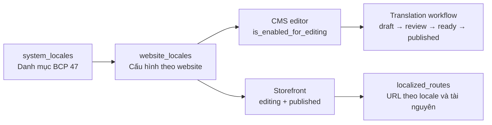

# Localization foundation

Tài liệu này mô tả hợp đồng đa ngôn ngữ hiện hành sau khi đã chuyển đổi nền
tảng, CMS Pages, 17 nhóm Nội dung, Landing Page và theme. Mục tiêu là giữ tương
thích với website/theme cũ, đồng thời tạo một kiến trúc ổn định để mở rộng nội
dung, thị trường và quy trình dịch mà không phải thiết kế lại từng module.

## Các nguyên tắc bắt buộc

1. `system_locales` là danh mục locale dùng chung, không phải cấu hình storefront
   của một website.
2. `website_locales` mới là nguồn sự thật về locale của từng website.
3. Admin không được gửi `website_key` trong payload. Website hiện tại luôn được
   lấy từ `SiteContext`, do middleware `ResolveCurrentSite` thiết lập.
4. Locale được phép biên tập và locale được công khai là hai trạng thái độc lập:
   - `is_enabled_for_editing`: xuất hiện trong CMS và có thể nhập bản dịch.
   - `is_published`: được phép truy cập trên storefront.
   - Storefront chỉ chấp nhận locale có cả hai cờ trên.
5. Locale mặc định luôn được bật biên tập và publish. Locale nguồn luôn được bật
   biên tập, nhưng có thể không publish nếu website không phục vụ locale đó.
6. Mã locale tuân theo BCP 47, được chuẩn hóa trước khi lưu, với độ dài tối đa
   35 ký tự. Ví dụ: `vi`, `en-US`, `zh-Hant-HK`.
7. Bản dịch draft không được rò rỉ ra storefront. Chỉ trạng thái `published`
   được dùng trong luồng public.

## Mô hình dữ liệu

### `website_locales`

Khóa duy nhất là `website_key + locale`. Ngoài default/editing/published, bảng
còn có các điểm mở rộng cho từng thị trường:

- fallback locale;
- domain hoặc path prefix riêng;
- tiền tệ, timezone, định dạng ngày và số.

Những trường này đã có trong schema để giai đoạn sau không phải thay đổi hợp
đồng nền tảng, nhưng chưa phải tất cả đều có UI quản trị.

### `localized_routes`

Đây là registry URL chuẩn hóa theo `website + locale + resource`.
`LocalizedRouteRegistry` được dùng để:

- phát hiện trùng đường dẫn trong cùng website và locale;
- quản lý canonical route;
- chỉ resolve route đã publish;
- tìm đường dẫn theo fallback chain mà không đi qua locale chưa public.

CMS Pages và mọi resource trong `config/localized-content.php` có `slug_field`
đã dùng registry này. URL cũ của slug đã publish được giữ làm redirect theo
workflow thay vì bị ghi đè âm thầm.

### Các lớp dữ liệu dịch

- `cms_page_translations`: title, slug, nội dung, SEO và trạng thái của CMS Page.
- `content_translations`: bản dịch generic, phân biệt bằng
  `resource_type + resource_id + locale`. Resource contract nằm trong
  `config/localized-content.php`.
- `landing_page_data`: slug, status, SEO và metadata Landing Page theo locale.
- `landing_page_block_data`: payload của từng Landing Page block theo locale.
- `theme_translations` và `themes/{theme}/lang/{locale}.json`: override và
  static copy của theme; không thay thế business translation.

### Trạng thái bản dịch

`cms_page_translations`, `content_translations`, `theme_translations`,
`landing_page_data` và `landing_page_block_data` dùng chung các trường workflow:

- `translation_status`;
- `source_revision` và `translation_revision`;
- dấu hiệu dịch máy và metadata;
- thời điểm dịch, review và publish.

Các trạng thái chuẩn là:

`missing/needs_translation → draft/machine_draft → in_review → ready → published`

Khi nội dung nguồn đổi, bản dịch đã có phải chuyển sang `outdated`. Dấu vân tay
nguồn được tạo bằng SHA-256 trên payload đã chuẩn hóa nên không phụ thuộc thứ tự
key hoặc kiểu xuống dòng.

Chỉ `published` được public. `machine_draft` không bao giờ được tự động chuyển
thẳng thành `published`.

## Hợp đồng Admin editor

- Form biên tập business content phải đặt tab của toàn bộ locale được bật
  editing ngay trong Drawer. Locale selector ở màn hình danh sách chỉ dùng để
  lọc/xem dữ liệu, không thay thế tab nhập liệu trong form.
- `CmsPageFormModal` là mẫu UX gốc. Các form Products/Catalog, Tin tức, Dịch vụ,
  Dự án, Đội ngũ nhân sự, Đối tác và Testimonials dùng cùng pattern qua
  `LocalizedContentTabs`.
- Khi chọn locale chưa có translation, chỉ các field khai báo trong
  `config/localized-content.php` được làm rỗng để nhập. Field dùng chung như
  trạng thái, danh mục, media, giá/kho, thông tin liên hệ, thứ tự và cờ nổi bật
  phải giữ giá trị nguồn và bị khóa.
- Tab phải hiển thị trạng thái translation (`missing`, `draft`, `published`,
  `outdated`...), đánh dấu locale nguồn và cảnh báo trước khi bỏ thay đổi chưa
  lưu để chuyển tab.
- Slug là nội dung theo locale đối với resource có `slug_field`; form phải cho
  nhập slug và có thể tự sinh từ tiêu đề/tên của chính locale đang biên tập.
- Rich editor phải thay `recordKey`/instance key khi đổi locale để nội dung cũ
  không rò sang form của locale mới.
- Khi tạo entity mới, Admin cho phép chuyển qua các tab locale đích và giữ tạm
  draft riêng của từng locale ở client. Nút lưu chỉ hoạt động tại locale nguồn:
  hệ thống tạo master record trước, sau đó lưu các locale đích đã nhập thành
  `draft` qua translation API. Không được tạo master record từ payload locale
  đích hoặc tự publish các draft này.

## Runtime và cache

### Hợp đồng đa ngôn ngữ của Menu

- `cms_menus.items` là cây chuẩn duy nhất. Mỗi node có `item_key` ổn định; không dùng vị trí mảng làm identity.
- Bản dịch Menu chỉ chứa `label`, lưu trong `content_translations` theo schema v2:
  `payload.items.schema_version=2` và `payload.items.by_key.<item_key>.label`.
- URL, target, icon, thứ tự và quan hệ cha/con không được sao chép sang bản dịch.
- Link nội bộ lưu `resource_type + resource_id` làm identity chuẩn. Cặp
  `link_type + link_value` được giữ cho editor và `url` được giữ làm fallback
  tương thích; slug nguồn không phải identity.
- Admin quản trị bản dịch tại `/admin/cms/menus`. Entity `menu` đã được gỡ khỏi drawer “Bản dịch frontend” để không có hai writer cho cùng dữ liệu.
- `CmsMenuResolver` là public reader duy nhất cho controller, Landing Page và theme. Reader chỉ lấy bản `published`; draft/outdated không được public.
- Bản dịch v2 đã publish luôn thắng. `theme_translations` với key theo vị trí chỉ là fallback tương thích khi chưa có v2 và `LOCALIZATION_CONTENT_LEGACY_FALLBACK=true`.
- Rollout Menu có ba stage `legacy | canary | all` qua
  `LOCALIZATION_MENU_ROLLOUT_STAGE`. `LocalizationRollout` quyết định theo
  module, website và theme; website override thắng theme override để có thể
  rollback khẩn cấp cả website. `BOOK920`, `DN302`, `BDS701` là canary.
- Cache của `CmsMenuResolver` phải tách theo website, locale, theme, reader và
  fallback. Khi reader là `legacy`, dữ liệu Menu cũ là nguồn chính chứ không phụ
  thuộc cờ fallback của reader mới.
- `CmsMenuTranslationBackfill` là writer chuyển đổi duy nhất cho dữ liệu Menu cũ. Nó chạy lặp an toàn, không ghi đè payload v2 đã biên tập, không xóa `theme_translations`, không tạo row rỗng cho locale chưa dịch và không tự publish bản sao nguyên nguồn.
- `localization:audit --strict` kiểm tra riêng Menu: source snapshot/revision, schema v2 của locale đích, `item_key` mồ côi, resource identity lệch/thiếu, published payload thiếu nhãn, published payload trùng hoàn toàn nguồn và legacy override chưa được chuyển.
- Link nội bộ được đổi locale lúc render. Nếu resource có canonical path public
  của locale đích thì bắt buộc dùng path đó. Nếu locale đích chưa có bản dịch
  public thì về homepage locale đích; không ghép locale đích với slug nguồn và
  không redirect người dùng về fallback locale. Anchor, email, điện thoại và
  link ngoài giữ nguyên.
- `CmsMenuLinkIdentityBackfill` và `CmsPageRouteRepair` là các writer sửa dữ
  liệu chạy lặp an toàn. Có thể kiểm tra/sửa bằng
  `localization:repair-navigation`; cả hai được chạy tự động trong migration
  `2026_07_31_000003_repair_localized_navigation_contract.php`.
- Theme không query `CmsMenu`, `ContentTranslation` hoặc `ThemeTranslation` trực tiếp.

`LocaleContext` là API lõi, nhận website hiện tại từ `SiteContext` và cung cấp:

- `options()`;
- `editableLocales()` và `publicLocales()`;
- default, source và fallback locale;
- kiểm tra/resolve locale cho editor hoặc storefront;
- fallback chain.

`FrontendLocalization` là facade tương thích ngược. Quy ước sử dụng:

- code public dùng `supportedLocales()` hoặc `publicLocales()`;
- code admin/editor dùng `editableLocales()`;
- code domain mới nên inject `LocaleContext` và truyền website rõ ràng khi xử
  lý dữ liệu nền.

Cache locale được phân vùng theo website và được xóa khi `SystemLocale` hoặc
`WebsiteLocale` thay đổi. Cache bản dịch theme cũng chứa `website_key`; không
được bỏ thành phần này vì sẽ gây rò bản dịch giữa hai website dùng cùng theme.

## Routing storefront

Route collection dùng pattern BCP 47 ổn định thay vì đóng băng danh sách locale
từ database lúc ứng dụng boot. `SetFrontendLocale` thực hiện kiểm tra thứ hai
theo website hiện tại:

- locale sai cấu trúc không match route;
- locale hợp lệ nhưng chưa publish trả về 404;
- locale vừa publish có hiệu lực sau khi cache locale được xóa, không cần build
  lại route.

Route segment (`login`, `account`, `products`...) ưu tiên locale đầy đủ, sau đó
locale ngôn ngữ gốc, tiếng Anh và fallback. Ví dụ `en-US` có thể kế thừa segment
và file dịch của `en`.

## Landing page và theme

- Editor landing page đọc/ghi toàn bộ locale được bật biên tập.
- Payload public chỉ chứa các locale public.
- Identity/layout của Landing Page nằm ở master record; slug, SEO, trạng thái và
  nội dung nằm ở các bảng dữ liệu theo locale.
- Mỗi block có `schema_version`. Thay đổi payload không tương thích phải tăng
  version và có migration/upcaster.
- Khi theme chưa có dữ liệu cho locale mới, block mặc định lần lượt fallback về
  source locale, fallback locale, rồi bản định nghĩa đầu tiên.
- File dịch theme hỗ trợ chuỗi kế thừa tăng dần, ví dụ:
  `vi → zh → zh-Hant → zh-Hant-HK`.
- Controller/builder phải localize dữ liệu trước khi truyền vào theme. Theme
  không tự query các bảng translation.
- Override cũ vẫn được hỗ trợ qua legacy fallback trong thời gian rollout.
  Luồng dịch mới phải dùng `TranslationWorkflowManager`.

## Cách mở rộng một loại nội dung mới

1. Nếu entity có workflow/SEO đặc thù như CMS Page, tạo bảng translation riêng.
   Với entity thông thường, đăng ký resource contract mới trong
   `config/localized-content.php`; không thêm cột kiểu `title_en` vào bảng nguồn.
2. Dùng khóa duy nhất theo entity/resource + locale và locale dài 35 ký tự.
3. Áp dụng `HasTranslationWorkflow` hoặc repository/workflow dùng chung.
4. Khi đọc public, bắt buộc chỉ lấy bản `published` có source revision hợp lệ.
5. Khi nguồn thay đổi, tính lại `TranslationRevision` và đánh dấu bản dịch cũ
   là `outdated`.
6. Đăng ký slug/canonical URL qua `LocalizedRouteRegistry`.
7. Cache phải chứa `website_key`, locale, loại tài nguyên và revision liên quan.
8. Cập nhật Admin/API, dynamic source resolver, audit/backfill và theme data
   source liên quan.
9. Viết tối thiểu các test: cách ly website, draft không public, fallback,
   route trùng, stale revision và locale BCP 47 có region/script.

## Trạng thái triển khai chốt ngày 2026-07-31

- Sáu migration `2026_07_30_000001` đến `2026_07_30_000006` và ba migration Menu/navigation
  `2026_07_31_000001_add_stable_item_keys_to_cms_menus.php`,
  `2026_07_31_000002_backfill_cms_menu_translations.php`,
  `2026_07_31_000003_repair_localized_navigation_contract.php` đã chạy trên database local.
- CMS Pages, 17 resource generic, Landing Page và theme contract đã chuyển sang
  kiến trúc này.
- Structural audit của `website-main` có 0 issue.
- Release-readiness EN hiện là 7/112 mục (6,3%); 105 mục còn thiếu hoặc chưa
  đạt trạng thái/revision yêu cầu.
- 7 mục EN vượt gate tự động vẫn cần human/visual QA.
- Validation Menu Bước 5 gần nhất: 69 test liên quan, 3.333 assertions pass;
  contract theo nhóm theme và smoke test Menu của ba canary đều pass; các stage
  `all`, `canary`, `legacy`, override và cache isolation có regression test;
  backfill dry-run sau migration không tạo thêm thay đổi; strict audit có
  `issue_count=0`; Blade compile và Admin build đều pass.

Kiến trúc đã sẵn sàng mở rộng, nhưng dữ liệu EN chưa sẵn sàng kinh doanh. Đọc
`docs/architecture/localization-rollout-runbook.md` và bắt buộc chạy
`localization:audit --require-ready` trước khi public locale mới.
