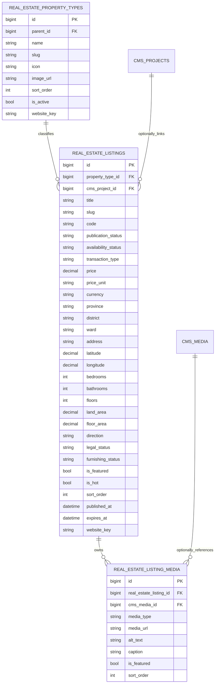

# Kiến trúc bất động sản và theme BDS701

Tài liệu này là điểm bắt đầu bắt buộc cho session AI/dev làm việc với module bất động sản hoặc theme `BDS701`. Đọc cùng:

1. `docs/ai-session-bootstrap-prompt.md`
2. `docs/theme-starter-checklist.md`
3. `docs/landing-page-builder.md`
4. Tài liệu này

## 1. Quyết định kiến trúc

Dữ liệu bất động sản **được tách thành module và bảng nghiệp vụ riêng**, không ánh xạ vào sản phẩm CMS.

Lý do:

- Tin bất động sản có vòng đời riêng: bán/cho thuê, đang giao dịch/giữ chỗ/đã bán/đã thuê.
- Cần bộ lọc riêng theo loại hình, vị trí, giá, phòng ngủ, phòng tắm.
- Có thông số chuyên ngành: diện tích đất/sàn, số tầng, hướng, pháp lý, nội thất.
- Một tin có gallery nhiều ảnh, video và tour 360.
- Dữ liệu phải tồn tại độc lập với theme để có thể đổi theme cùng `website_type=real_estate`.

Ranh giới:

- Module `real-estate`: schema, model, API, quyền, admin và truy vấn storefront.
- Theme `BDS701`: layout, landing blocks và các view trình bày.
- CMS vẫn cung cấp tin tức, page giới thiệu, menu, media và landing page.
- `website_key` tách dữ liệu giữa các website demo trong cùng source. Đây không phải shared-runtime multi-tenant.

## 2. Sơ đồ dữ liệu



Ràng buộc quan trọng:

- `real_estate_property_types`: unique `(website_key, slug)`.
- `real_estate_listings`: unique `(website_key, slug)` và `(website_key, code)`.
- Xóa listing sẽ cascade xóa `real_estate_listing_media`.
- Xóa `cms_media` chỉ null `cms_media_id`; `media_url` vẫn là nguồn render.
- Ảnh đầu tiên trong gallery được đánh dấu `is_featured`.

Migration gốc:

- `Modules/RealEstate/database/migrations/2026_07_24_000001_create_real_estate_tables.php`

Không sửa migration đã chạy. Mọi thay đổi schema phải tạo migration mới.

## 3. Module `real-estate`

Manifest:

- `Modules/RealEstate/module.json`
- `website_type`: `real_estate`
- dependency: `cms`
- menu admin: `/admin/real-estate/listings`

Quyền:

- `real-estate.view`
- `real-estate.create`
- `real-estate.update`
- `real-estate.delete`
- `real-estate.type.manage`

Model:

- `app/Models/RealEstatePropertyType.php`
- `app/Models/RealEstateListing.php`
- `app/Models/RealEstateListingMedia.php`

`RealEstatePropertyType` và `RealEstateListing` dùng `HasWebsiteScope`; không tự thêm query `website_key` rải rác nếu global scope đã xử lý đúng context.

## 4. Admin và API

UI chính:

- `resources/admin/src/modules/real-estate/pages/RealEstateManagerPage.jsx`
- Route React được nạp qua `resources/admin/src/pages/modules/ModuleRoutePage.jsx`.
- URL API phải sinh bằng `adminApi(...)` từ `resources/admin/src/shared/config/routes`, không nối prefix `/admin/api` thủ công.

Form tin đăng dùng drawer rộng và chia card:

1. Thông tin cơ bản
2. Giá và điều kiện giao dịch
3. Vị trí
4. Thông số và đặc điểm
5. Hình ảnh/multimedia
6. Nội dung
7. Thiết lập hiển thị
8. SEO

Gallery dùng `MultiMediaPicker`; payload lưu ở `gallery_images: string[]`.

API:

- `GET adminApi('real-estate/listings')`
- `POST adminApi('real-estate/listings')`
- `PUT adminApi('real-estate/listings/{id}')`
- `DELETE adminApi('real-estate/listings/{id}')`
- CRUD loại hình dưới `adminApi('real-estate/property-types')`

Controller:

- `app/Http/Controllers/Admin/Api/RealEstate/RealEstateIndexController.php`
- `app/Http/Controllers/Admin/Api/RealEstate/RealEstateListingManagementController.php`
- `app/Http/Controllers/Admin/Api/RealEstate/RealEstatePropertyTypeManagementController.php`

Presenter dùng chung:

- `app/Support/RealEstate/RealEstateListingPresenter.php`

Presenter là nguồn chuẩn để trả `gallery_images`, `image_url`, `public_url`, thông số và metadata cho admin/landing builder. Không dựng lại payload khác nhau ở nhiều controller.

## 5. Route storefront

Named routes:

- `site.real-estate.index`
- `site.real-estate.show`

Controller:

- `app/Http/Controllers/Site/RealEstateController.php`

Mọi PHP/Blade phải dùng named route hoặc helper tập trung:

```php
route('site.real-estate.index')
route('site.real-estate.show', ['slug' => $listing->slug])
FrontendRouteUrl::realEstate()
FrontendRouteUrl::realEstateListing($listing->slug)
```

React phải dùng cấu hình route tập trung; admin dùng `adminApi(...)`.

Không hardcode `/vi/...`, `/admin/api/...` hoặc tự ghép prefix locale.

Danh sách storefront hỗ trợ:

- `q`
- `transaction_type= sale|rent`
- `property_type= id|slug`
- `province`
- `district`
- `min_price`, `max_price`
- `bedrooms`, `bathrooms`

Chỉ render listing `publication_status=published` và, ở trang danh sách, `availability_status=available`.

## 6. Theme BDS701

Manifest:

- `themes/BDS701/theme.json`
- `website_type`: `real_estate`
- namespace Blade: `theme-bds701::`
- locale built-in: `vi`, `en`
- preset demo: `bds701-delta-platinum`

View chính:

- `views/layout.blade.php`
- `views/home.blade.php`
- `views/listings.blade.php`
- `views/listing.blade.php`
- `views/partials/header.blade.php`
- `views/partials/footer.blade.php`
- `views/partials/listing-card.blade.php`
- `views/partials/styles.blade.php`
- `views/partials/scripts.blade.php`

Header:

- Logo đọc từ `site_profiles.branding.logo_url`; chỉ dùng logo fallback nếu chưa upload.
- Topbar đọc hotline/email từ branding.
- Link tài khoản dùng named route.

Trang chủ là landing page, không phải nội dung hardcode. Các block hiện hành:

| Block type | Vai trò | Nguồn động |
|---|---|---|
| `bds701_hero_search` | Hero, form tìm kiếm, shortcut loại hình | property types |
| `bds701_latest_listings` | Tin rao mới nhất | listings |
| `bds701_property_types` | Mosaic loại hình | property types |
| `bds701_rental_listings` | Tin cho thuê | listings, ép `transaction_type=rent` |
| `bds701_market_news` | Tin thị trường dạng feature/list | CMS posts |
| `bds701_latest_news` | Tin mới dạng cards | CMS posts |
| `bds701_newsletter` | Form nhận tin | dữ liệu block |

Quy tắc:

- `home.blade.php` ưu tiên `dynamic_items`, fallback `data.content.items`.
- Không thêm tab/bộ lọc hardcode vào block nếu không có schema quản trị tương ứng.
- Bộ lọc thật nằm ở hero và trang `listings`.
- Mỗi section landing có class/attribute editor và nút `data-xd-edit-block` trong admin mode.
- Layout phải nạp editor styles/scripts dùng chung khi `?mod=admin`.
- Dữ liệu business không được đặt trong `lang/*.json`; file ngôn ngữ chỉ chứa static copy.

## 7. Landing Page Builder

Điểm tích hợp:

- `app/Support/LandingPages/LandingPageBuilder.php`
  - `supportsTheme('BDS701')`
  - `defaultBlocksForTheme()`
  - `bds701DefaultBlocks()`
  - số lượng item theo block
  - resolve nguồn listing/property type/post

Khi thêm block mới:

1. Thêm block vào `themes/BDS701/theme.json`.
2. Khai báo default block trong `bds701DefaultBlocks()`.
3. Thêm source/schema nếu block lấy dữ liệu động.
4. Resolve `dynamic_items` tập trung trong builder.
5. Render block trong `themes/BDS701/views/home.blade.php`.
6. Kiểm tra sửa nhanh bằng `/vi?mod=admin`.
7. Bổ sung test `Bds701ThemeTest`.

Không query Eloquent trực tiếp trong Blade.

## 8. Demo data

Provider:

- `app/Core/Themes/Demo/Bds701DemoContentProvider.php`

Provider tạo:

- 5 loại hình
- 8 listings
- 2 ảnh/listing
- 1 danh mục tin
- 6 bài viết
- menu chính
- page giới thiệu
- `SiteProfile`
- landing page BDS701

Provider phải idempotent:

- Tìm record theo `(website_key, slug)` trước khi tạo.
- Chạy lặp lại không gây lỗi unique.
- Chỉ ghi `ThemeDemoRecord` cho record thật sự do provider tạo mới.
- `delete()` chỉ xóa record được provider theo dõi; không xóa dữ liệu user hoặc loại hình có sẵn từ module seeder.

Không quay lại cách `create()` mù cho slug cố định; đây là nguyên nhân lỗi duplicate khi kích hoạt/tạo data nhiều lần.

## 9. Checklist tạo theme bất động sản tiếp theo

- [ ] Theme mới có `website_type=real_estate`.
- [ ] Module `real-estate` là dependency runtime; không tạo lại bảng listing riêng cho từng theme.
- [ ] Dùng `RealEstateController` và các named route hiện có.
- [ ] Dùng presenter/landing builder để lấy payload; không query trong Blade.
- [ ] Có `listings.blade.php` và `listing.blade.php`.
- [ ] Detail render gallery nhiều ảnh, không chỉ ảnh đại diện.
- [ ] Filter giữ query string khi phân trang.
- [ ] Logo/hotline/email đọc từ branding.
- [ ] Homepage là landing page và mọi block sửa được trong admin mode.
- [ ] Không có filter/tab hardcode không quản trị được.
- [ ] Demo provider idempotent và chạy được nhiều lần.
- [ ] Không xóa dữ liệu user khi xóa demo.
- [ ] Route PHP/Blade dùng named route; React dùng route config tập trung.
- [ ] Kiểm tra UTF-8 và không có mojibake.

## 10. Kiểm thử và lệnh bàn giao

Tối thiểu:

```bash
php artisan migrate:status
php artisan test tests/Feature/Bds701ThemeTest.php
php artisan test tests/Feature/LandingAdminEditorCoverageTest.php
npm run build
php artisan view:clear
php artisan view:cache
```

Kiểm tra thủ công:

- `/admin/real-estate/listings`: tạo/sửa/xóa, gallery nhiều ảnh, permission.
- `/vi`: landing render và không lỗi.
- `/vi?mod=admin`: mọi nút **Sửa khối** click được.
- Trang danh sách: tìm kiếm/lọc/phân trang.
- Trang chi tiết: gallery, thông số, liên quan, SEO.
- `/admin/themes`: kích hoạt BDS701 và tạo demo nhiều lần không duplicate.

Test neo:

- `tests/Feature/Bds701ThemeTest.php`

## 11. Trạng thái hiện tại và điểm mở rộng

Đã có:

- Schema nghiệp vụ riêng, website scope, CRUD admin.
- Gallery nhiều ảnh.
- List/detail storefront và filter.
- Theme BDS701 dạng landing page.
- Demo provider idempotent.
- Admin mode sửa block.
- Logo/topbar lấy từ branding.

Có thể mở rộng bằng migration/API mới:

- Tiện ích nội/ngoại khu dạng quan hệ.
- Liên hệ môi giới/đơn vị phân phối.
- Bản đồ và tìm kiếm theo bán kính.
- Lưu tin, so sánh tin, lịch hẹn xem.
- Workflow duyệt tin và lịch sử thay đổi giá.
- Import/export feed.

Không nhét các phần mở rộng này vào JSON tùy ý nếu cần lọc, index hoặc báo cáo; hãy thiết kế bảng/quan hệ nghiệp vụ rõ ràng.
